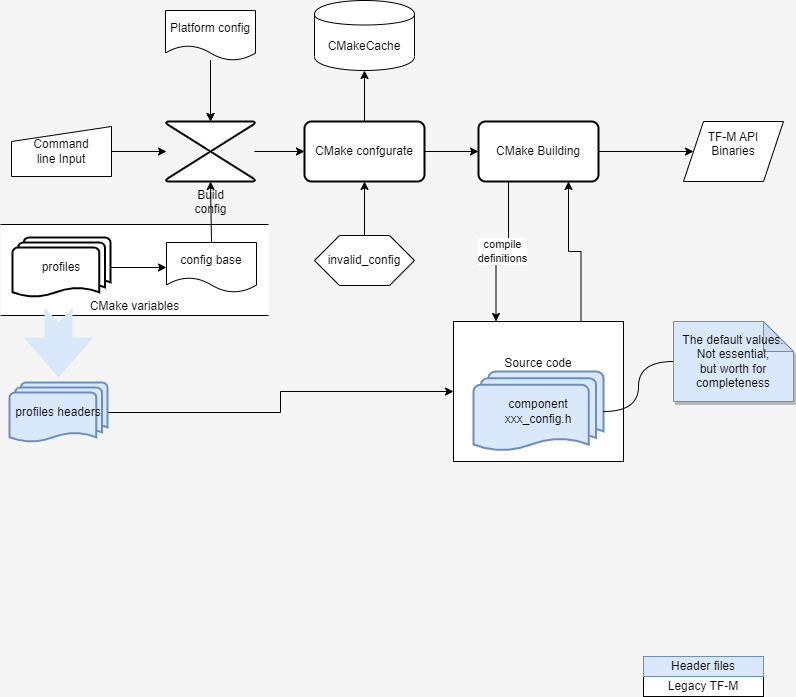

.. _Header_configuration:

#############################
The Header File Config System
#############################

The header file configurations system is used to fine-tune component options.

The following diagram shows how the system works.

A ``config_tfm.h`` file collects customized configurations, including platform customized and
project specific settings.
Each component has a ``config_<comp_name>.h`` which includes the ``config_tfm.h`` first and then
provides default values for each config option of the component as well as necessary validations
on config dependencies.
Source files then include component header files when necessary.

The ``config_tfm.h`` includes a customized project config file provided via compile definition
``PROJECT_CONFIG_HEADER_FILE``.
Users set the corresponding CMake variable ``PROJECT_CONFIG_HEADER_FILE`` with the full path of the
configuration header file.
A platform can adjust or place restriction on config options by providing a ``config_tfm_target.h``
under the root folder of their platforms.
If the build system finds the file, it sets the ``TARGET_CONFIG_HEADER_FILE`` compile definition.

.. code-block:: c

    #ifdef PROJECT_CONFIG_HEADER_FILE
    #include PROJECT_CONFIG_HEADER_FILE
    #endif

    #ifdef TARGET_CONFIG_HEADER_FILE
    #include TARGET_CONFIG_HEADER_FILE
    #endif

The project config header file can be

- Generated by the TF-M Kconfig system <kconfig_system>
- One of the header files of Profiles <tf-m_profiles>, set via the ``TFM_PROFILE`` build option.
- Manually customized profile based on pre-set profiles.

It is expected that all Component options are included in the header file to explicitly set values
for each option.
Refer to :ref:`Base_configuration` for details the base configurations.

--------------

*Copyright (c) 2022, Arm Limited. All rights reserved.*
