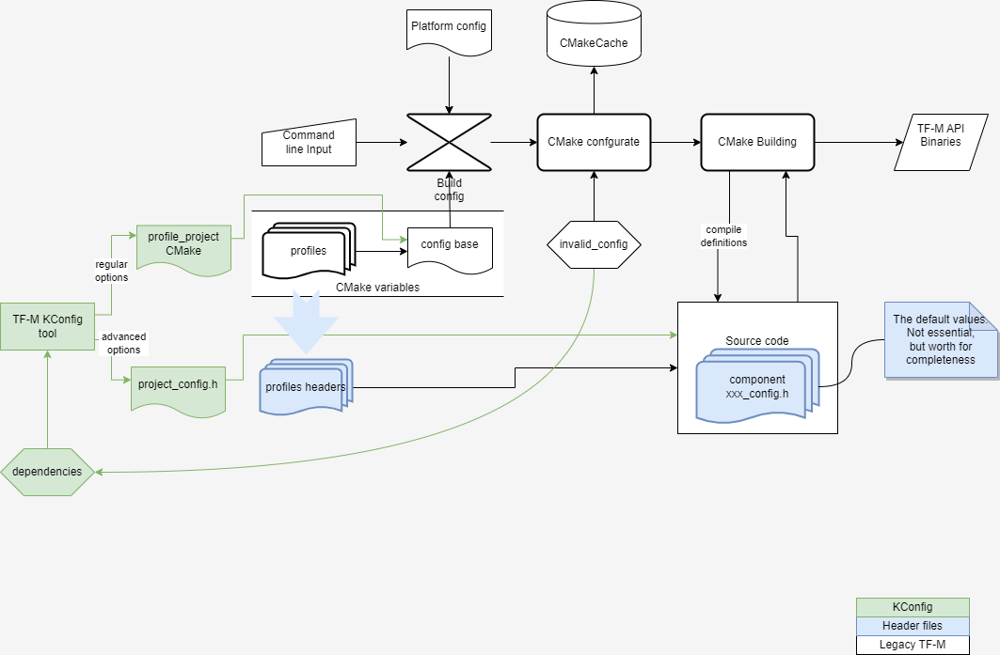

.. _Kconfig_system:

##################
The Kconfig System
##################
The Kconfig system is an additional tool for users to change configuration options of TF-M.

It handles dependencies and validations automatically when you change configurations so that the
generated configuration options are always valid.

It consists of `The Kconfig tool`_ and the `The Kconfig files`_.

****************
The Kconfig tool
****************
The Kconfig tool is a python script based on `Kconfiglib <https://github.com/ulfalizer/Kconfiglib>`__
to launch the menuconfig interfaces and generate the following config files:

- CMake config file

  Contains CMake cache variables of building options.
  This file should be passed to the build system via command line option ``TFM_EXTRA_CONFIG_PATH``.

- Header file

  Contains component options in the header file system.
  This file should be passed to the build system via the command line option ``PROJECT_CONFIG_HEADER_FILE``.
  Component options are gathered together in a seperate menu ``TF-M component configs`` in
  `The Kconfig files`_.

- The .config and .config.old files

  The ``.config`` file which contains all the above configurations in the Kconfig format.
  It will be created after the first execution of the script. It is only used to allow
  users to make adjustments basing on the previous settings.
  The Kconfig tool will load it if it exists and ``.config.old`` will be created to
  save the previous configurations.

How To Use
==========
The script takes four arguments at maximum.

- '-k', '--kconfig-file'

  Required. The root Kconfig file.

- '-u', '--ui'

  Optional. The menuconfig interface to launch, ``gui`` or ``tui``.
  Refer to `Menuconfig interfaces <https://github.com/ulfalizer/Kconfiglib#menuconfig-interfaces>`__
  for interface details. Only the first two are supported.
  If no UI is selected, the tool generates config files with default values.

- '-o', '--output_path'

  Required. The output directory to hold the generated files.

- '-p', '--platform-path'

  Optional. The platform specific Kconfig or defconfig files.

Here is an example:

.. code-block:: bash

  cd trusted-firmware-m
  python3 tools/kconfig/tfm_kconfig.py -k Kconfig -o <output_path> -u tui

  # If the platform path has defconfig or Kconfig, use '-p' to load them.
  python3 tools/kconfig/tfm_kconfig.py -k Kconfig -o <output_path> -p platform/ext/target/arm/mps2/an521

The script can be used as a standalone tool. You can pass the config files to
build system via command line option ``TFM_EXTRA_CONFIG_PATH`` and
``PROJECT_CONFIG_HEADER_FILE`` respectively, as mentioned above.

.. code-block:: bash

  # Pass the files generated by script.
  <cmake build command> -DTFM_EXTRA_CONFIG_PATH=<output_path>/project_config.cmake \
                        -DPROJECT_CONFIG_HEADER_FILE=<output_path>/project_config.h

The TF-M build system has also integrated the tool.
You only need to set ``USE_KCONFIG_TOOL`` to ``ON/TRUE/1`` in commande line and CMake will launch
the GUI menuconfig for users to adjust configurations and automatically load the generated config
files.

.. note::

  - Only GUI menuconfig can be launched by CMake for the time being.
  - Due to the current limitation of the tool, you are not allowed to change the values of build
    options that of which platforms have customized values. And there is no prompt messages either.

*****************
The Kconfig files
*****************
The Kconfig files are the files written by the
`Kconfig language <https://www.kernel.org/doc/html/latest/kbuild/kconfig-language.html#kconfig-language>`__
to describe config options.
They also uses some Kconfiglib extensions such as optional source ``osource`` and relative source ``rsource``
so they can only work with the Kconfiglib.

--------------

*Copyright (c) 2022, Arm Limited. All rights reserved.*
