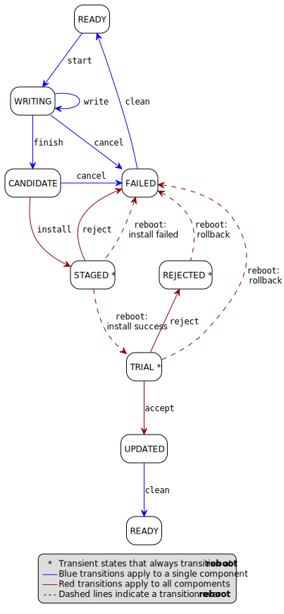

#######################
Firmware Update Service
#######################

:Author: Sherry Zhang
:Organization: Arm Limited
:Contact: Sherry Zhang <Sherry.Zhang2@arm.com>

.. contents:: Table of Contents

***************************************
Introduction of Firmware Update service
***************************************
The Firmware Update(FWU) service provides the functionality of updating firmware
images. It provides a standard interface for updating firmware and it is
platform independent. TF-M defines a shim layer to support cooperation between
bootloader and FWU service.

This partition supports the following features:

- Query the firmware store information.
- Image preparation: prepare a new firmware image in the component's firmware store.
- Image installation: install prepared firmware images on all components that have been prepared for installation.
- Image trial: manage a trial of new firmware images atomically on all components that are in TRIAL state.

A typical flow through the component states is shown below [1]_.

**********
Components
**********
The structure of the TF-M Firmware Update service is listed below:
   +-----------------------------+---------------------------------------------------------------+---------------------------------------------------------------------------------------+
   | **Component name**          | **Description**                                               | **Location**                                                                          |
   +=============================+===============================================================+=======================================================================================+
   | Client API interface        | This module exports the client API of PSA Firmware Update to  | ``./interface/src/tfm_fwu_api.c``                                                     |
   |                             | the users.                                                    |                                                                                       |
   +-----------------------------+---------------------------------------------------------------+---------------------------------------------------------------------------------------+
   | Manifest                    | The manifest file is a description of the service components. | ``./secure_fw/partitions/firmware_update/tfm_firmware_update.yaml``                   |
   +-----------------------------+---------------------------------------------------------------+---------------------------------------------------------------------------------------+
   | NSPE client API interface   | This module exports the client API of PSA Firmware Update to  | ``./interface/src/tfm_fwu_api.c``                                                     |
   |                             | the NSPE(i.e. to the applications).                           |                                                                                       |
   +-----------------------------+---------------------------------------------------------------+---------------------------------------------------------------------------------------+
   | IPC request handlers        | This module handles all the secure requests in IPC model.     | ``./secure_fw/partitions/firmware_update/tfm_fwu_req_mngr.c``                         |
   |                             | It maitains the image state context and calls the image ID    |                                                                                       |
   |                             | converter to achieve the firmware update functionalities.     |                                                                                       |
   +-----------------------------+---------------------------------------------------------------+---------------------------------------------------------------------------------------+
   | Shim layer between FWU and  | This module provides the APIs with the functionality of       | ``./secure_fw/partitions/firmware_update/bootloader/tfm_bootloader_fwu_abstraction.h``|
   | bootloader                  | operating the bootloader to cooperate with the Firmware Update|                                                                                       |
   |                             | service                                                       |                                                                                       |
   +-----------------------------+---------------------------------------------------------------+---------------------------------------------------------------------------------------+
   | Shim layer example based on | This module is the implementation of the shim layer between   | ``./secure_fw/partitions/firmware_update/bootloader/mcuboot/tfm_mcuboot_fwu.c``       |
   | MCUboot                     | FWU and bootloader based on MCUboot.                          |                                                                                       |
   |                             |                                                               |                                                                                       |
   +-----------------------------+---------------------------------------------------------------+---------------------------------------------------------------------------------------+

***********************
Service API description
***********************
This service follows the PSA Firmware Update API spec of version 1.0 [1]_. Please refer to
Firmware Update spec for the detailed description.

*************************************
Shim Layer between FWU and bootloader
*************************************
The firmware update operations are achieved by calling the shim layer APIs
between bootloader and FWU.

Shim layer introduction
=======================
This shim layer provides the APIs with the functionality of operating the
bootloader to cooperate with the Firmware Update service. This shim layer
is decoupled from bootloader implementation. Users can specify a specific
bootloader by setting ``TFM_FWU_BOOTLOADER_LIB`` build configuration and
adding the specific build scripts into that file. By default, the MCUboot
is chosen as the bootloader.

Interfaces of the shim Layer
============================

fwu_bootloader_init(function)
-----------------------------
Prototype
^^^^^^^^^
.. code-block:: c

    psa_status_t fwu_bootloader_init(void);

Description
^^^^^^^^^^^
Bootloader related initialization for the firmware update. It reads
some necessary shared data from the memory if needed. It initializes
the flash drivers defined in FLASH_DRIVER_LIST. Platform can define
FLASH_DRIVER_LIST in flash_layout.h to overload the default driver list.

Parameters
^^^^^^^^^^
    N/A

fwu_bootloader_staging_area_init(function)
------------------------------------------
**Prototype**

.. code-block:: c

    psa_status_t fwu_bootloader_staging_area_init(psa_fwu_component_t component,
                                                  const void *manifest,
                                                  size_t manifest_size);

**Description**

The component is in READY state. Prepare the staging area of the component for image download.
For example, initialize the staging area, open the flash area, and so on.

**Parameters**

- ``component``: The identifier of the target component in bootloader.
- ``manifest``: A pointer to a buffer containing a detached manifest for the update.
  If the manifest is bundled with the firmware image, manifest must be NULL.
- ``manifest_size``: Size of the manifest buffer in bytes.

fwu_bootloader_load_image(function)
-----------------------------------
**Prototype**

.. code-block:: c

    psa_status_t fwu_bootloader_load_image(psa_fwu_component_t component,
                                           size_t        image_offset,
                                           const void    *block,
                                           size_t        block_size);

**Description**

Load the image into the target component.

**Parameters**

- ``component``: The identifier of the target component in bootloader.
- ``image_offset``: The offset of the image being passed into block, in bytes.
- ``block``: A buffer containing a block of image data. This might be a complete image or a subset.
- ``block_size``: Size of block.

fwu_bootloader_install_image(function)
---------------------------------------------
**Prototype**

.. code-block:: c

    psa_status_t fwu_bootloader_install_image(psa_fwu_component_t *candidates,
                                              uint8_t number);

**Description**

Check the authenticity and integrity of the image. If a reboot is required to
complete the check, then mark this image as a candidate so that the next time
bootloader runs it will take this image as a candidate one to bootup. Return
the error code PSA_SUCCESS_REBOOT.

**Parameters**

- ``candidates``: A list of components in CANDIDATE state.
- ``number``: Number of components in CANDIDATE state.

fwu_bootloader_mark_image_accepted(function)
--------------------------------------------
**Prototype**

.. code-block:: c

    psa_status_t fwu_bootloader_mark_image_accepted(const psa_fwu_component_t *trials,
                                                    uint8_t number);

**Description**

Call this API to mark the TRIAL(running) image in component as confirmed to avoid
revert when next time bootup. Usually, this API is called after the running
images have been verified as valid.

**Parameters**

- ``trials``: A list of components in TRIAL state.
- ``number``: Number of components in TRIAL state.

fwu_bootloader_reject_staged_image(function)
--------------------------------------------
**Prototype**

.. code-block:: c

    psa_status_t fwu_bootloader_reject_staged_image(psa_fwu_component_t component);

**Description**

The component is in STAGED state. Call this API to Uninstall the staged image in the
component so that this image will not be treated as a candidate next time bootup.

**Parameters**

- ``component``: The identifier of the target component in bootloader.

fwu_bootloader_reject_trial_image(function)
--------------------------------------------
**Prototype**

.. code-block:: c

    psa_status_t fwu_bootloader_reject_trial_image(psa_fwu_component_t component);

**Description**

The component is in TRIAL state. Mark the running image in the component as rejected.

**Parameters**

- ``component``: The identifier of the target component in bootloader.

fwu_bootloader_clean_component(function)
----------------------------------------
**Prototype**

.. code-block:: c

    psa_status_t fwu_bootloader_clean_component(psa_fwu_component_t component);

**Description**

The component is in FAILED or UPDATED state. Clean the staging area of the component.

**Parameters**

- ``component``: The identifier of the target component in bootloader.

fwu_bootloader_get_image_info(function)
---------------------------------------
**Prototype**

.. code-block:: c

    psa_status_t fwu_bootloader_get_image_info(psa_fwu_component_t component,
                                               bool query_state,
                                               bool query_impl_info,
                                               psa_fwu_component_info_t *info);

**Description**

Get the image information of the given bootloader_image_id in the staging area
or the running area.

**Parameters**

    - ``component``: The identifier of the target component in bootloader.
    - ``query_state``: Whether query the 'state' field of psa_fwu_component_info_t.
    - ``query_impl_info``: Whether Query 'impl' field of psa_fwu_component_info_t.
    - ``info``: Buffer containing return the component information.

******************************************
Additional shared data between BL2 and SPE
******************************************
An additional TLV area "image version" is added into the shared memory between
BL2 and TF-M. So that the firmware update partition can get the image version.
Even though the image version information is also included in the ``BOOT RECORD``
TLV area which is encoded by CBOR, adding a dedicated ``image version`` TLV area
is preferred to avoid involving the CBOR encoder which can increase the code
size. The FWU partition will read the shared data at the partition
initialization.

*********************************************
Build configurations related to FWU partition
*********************************************
- ``TFM_PARTITION_FIRMWARE_UPDATE`` Controls whether FWU partition is enabled or not.
- ``TFM_FWU_BOOTLOADER_LIB`` Bootloader configure file for FWU partition.
- ``TFM_CONFIG_FWU_MAX_WRITE_SIZE`` The maximum permitted size for block in psa_fwu_write, in bytes.
- ``TFM_FWU_BUF_SIZE`` Size of the FWU internal data transfer buffer (defaults to
  TFM_CONFIG_FWU_MAX_WRITE_SIZE if not set).
- ``FWU_STACK_SIZE`` The stack size of FWU Partition.
- ``FWU_DEVICE_CONFIG_FILE`` The device configuration file for FWU partition. The default value is
  the configuration file generated for MCUboot. The following macros should be defined in the
  configuration file:

  - ``FWU_COMPONENT_NUMBER`` The number of components on the device.

    .. Note::

        In this design, component ID ranges from 0 to ``FWU_COMPONENT_NUMBER`` - 1.

  - ``FWU_SUPPORT_TRIAL_STATE`` Whether TRIAL component state is supported.
- ``TEST_NS_FWU`` FWU nonsecure tests switch.
- ``TEST_S_FWU`` FWU secure tests switch.

    .. Note::

        The running image which supports revert mechanism should be confirmed before initiating a
        firmware update process. For example, if the running image is built with
        ``-DMCUBOOT_UPGRADE_STRATEGY=SWAP_USING_MOVE``, the image should be confirmed either by
        adding ``-DMCUBOOT_CONFIRM_IMAGE=ON`` build option or by calling ``psa_fwu_accept()`` API
        before initiating a firmware update process. Otherwise, ``PSA_ERROR_BAD_STATE`` will be
        returned by ``psa_fwu_start()``.

*************************************
Limitations of current implementation
*************************************
Currently, the MCUboot based implementation does not record image update results like failure or
success. And FWU partition does not detect failure errors in bootloader installation. If an image
installation fails in the bootloader and the old image still runs after reboot, ``PSA_FWU_READY``
state will be returned by ``psa_fwu_query()`` after reboot.

Currently, image download recovery after a reboot is not supported. If a reboot happens in image
preparation, the downloaded image data will be ignored after the reboot.

***********************************
Benefits Analysis on this Partition
***********************************

Implement the FWU functionality in the non-secure side
======================================================
The APIs listed in PSA Firmware Update API spec [1]_ can also be implemented in
the non-secure side.

Pros and Cons for implementing FWU APIs in secure side
======================================================

Pros
----
- It protects the image in the passive or staging area from being tampered with
  by the NSPE. Otherwise, a malicious actor from NSPE can tamper the image
  stored in the non-secure area to break image update.

- It protects secure image information from disclosure. In some cases, the
  non-secure side shall not be permitted to get secure image information.

- It protects the active image from being manipulated by NSPE. Some bootloader
  supports testing the image. After the image is successfully installed and
  starts to run, the user should set the image as permanent image if the image
  passes the test. To achieve this, the area of the active image needs to be
  accessed. In this case, implementing FWU service in SPE can prevent NSPE
  from manipulating the active image area.

- On some devices, such as the Arm Musca-B1 board, the passive or staging area
  is restricted as secure access only. In this case, the FWU partition should
  be implemented in the secure side.

Cons
----
- It increases the image size of the secure image.
- It increases the execution latency and footprint. Compared to implementing
  FWU in NSPE directly, calling the Firmware Update APIs which are implemented
  in the secure side increases the execution latency and footprint.
- It can increase the attack surface of the secure runtime.

Users can decide whether to call the FWU service in TF-M directly or implement
the Firmware Update APIs in the non-secure side based on the pros and cons
analysis above.

*********
Reference
*********

.. [1] `PSA Firwmare Update API <https://arm-software.github.io/psa-api/fwu/1.0/>`_

--------------

*Copyright (c) 2021-2022, Arm Limited. All rights reserved.*
