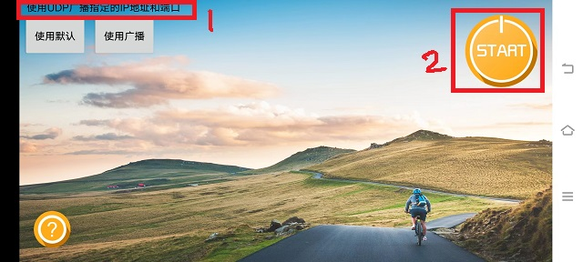

DVP Video_transfer
========================

:link_to_translation:`zh_CN:[Chinese]`

1 Overview
-------------------------------------
	The function of image transmission is mainly to compress and encode the original data collected by the dvp sensor through
	the jpeg encode module, and then send the data to the mobile phone by means of WiFi connection. The packet is parsed, and then the encoded video data stream is displayed in real time.

2 Code Path
--------------------------------
	demo path：``./components/demos/media/video/video_transfer/video_transfer.c``

3 Client command
---------------------------------------
	The commands support by demo

	+----------------------------------------+--------------------------+----------------------+
	|             Command                    |      Param               |   Description        |
	+========================================+==========================+======================+
	|                                        | param1:dev_id            |the type of using dvp |
	|                                        +--------------------------+----------------------+
	| dvp set_cfg param1 param2 param3       | param2:image resolution  |the resolution output |
	|                                        +--------------------------+----------------------+
	|                                        | param3:frame rate        |the frame rate output |
	+----------------------------------------+--------------------------+----------------------+
	|                                        | param1:connect method    |wifi connecttion type |
	|                                        +--------------------------+----------------------+
	| video_transfer param1 param2 [param3]  | param2:ssid              |ssid                  |
	|                                        +--------------------------+----------------------+
	|                                        | param3:ssid_key          |key                   |
	+----------------------------------------+--------------------------+----------------------+

	The macro configuration that the demo runs depends on:

	+--------------------------------------+------------------------+--------------------------------------------+---------+
	|                 NAME                 |      Description       |                  File                      |  value  |
	+======================================+========================+============================================+=========+
	|CONFIG_JPEG_ENCODE                    |support hw jpeg encode  |``middleware\soc\bk7256\bk7256.defconfig``  |    y    |
	+--------------------------------------+------------------------+--------------------------------------------+---------+
	|CONFIG_CAMERA                         |suport use dvp camera   |``middleware\soc\bk7256\bk7256.defconfig``  |    y    |
	+--------------------------------------+------------------------+--------------------------------------------+---------+
	|CONFIG_USE_APP_DEMO_VIDEO_TRANSSER    |support video transfer  |``middleware\soc\bk7256\bk7256.defconfig``  |    y    |
	+--------------------------------------+------------------------+--------------------------------------------+---------+
	|CONFIG_NET_WORK_VIDEO_TRANSFER        |support wifi transfer   |``middleware\soc\bk7256\bk7256.defconfig``  |    y    |
	+--------------------------------------+------------------------+--------------------------------------------+---------+
	|CONFIG_COMPONENTS_P2P                 |support p2p transfer    |``middleware\soc\bk7256\bk7256.defconfig``  |    n    |
	+--------------------------------------+------------------------+--------------------------------------------+---------+
	|CONFIG_CAMERA_USE_I2C1                |suport use I2C1         |``middleware\soc\bk7256\bk7256.defconfig``  |    y    |
	+--------------------------------------+------------------------+--------------------------------------------+---------+

4 Presentation Introduction
-------------------------------------
	The steps performed by the demo are as follows:

	1. Prepare the dvp camera, the connection method is shown in Figure 1:

		The camera used in position 1 in the figure is gc0328c, dev_id=3, and supports a resolution of 640*480

	(1) When only the app image transmission command is executed, the operation is as follows:

	2. Send the following commands in sequence:

		dvp set_cfg 3 480 20

		video_transfer -a test 12345678

	3. Connect the mobile phone wifi to the route of the test name, the password is: 12345678

	4. After the connection is successful, open the image transmission app.

	The camera used in position 2 in the above picture is hm1055, dev_id=6, and supports 1280*720 resolution

	1. If you use the hm1055 camera to start image transmission, send the following commands in sequence:

		dvp set_cfg 6 720 15

		video_transfer -a test 12345678

	2. The mobile phone wifi is connected to the route of the test name, the password is: 12345678

	3. After the connection is successful, open the app of the image transmission. The operation of the image transmission app is shown in Figures 2, 3 and 4.

.. figure:: ../../../../../common/_static/video_transfer_evb.png
    :align: center
    :alt: sensor connect evb
    :figclass: align-center

    Figure 1. sensor connect evb

    Figure 2. WiFi Camera app

    Figure 3. WiFi Camera app set

	As shown in the figure above, when you want to perform image transmission, after connecting to the ssid set in the image upload command,
	position 1 will prompt ``使用UDP广播指定的IP地址和端口``, otherwise the image transmission will not take effect;
	After seeing prompt 1, click position 2 to enable image transmission. The effect of image transmission is shown in Figure 4.

.. figure:: ../../../../../common/_static/wifi_camera_start.jpg
    :align: center
    :alt: app using
    :figclass: align-center

    Figure 4. WiFi Camera effect drawing

5 Detailed configuration and its description
--------------------------------------------------
	1. Set dvp parameters: dvp set_cfg param1 param2 param3

	- param1:0-7, corresponding to the following types of dvp cameras, currently only 3 and 6 are supported.

		PAS6329_DEV             0

		OV_7670_DEV             1

		PAS6375_DEV             2

		GC0328C_DEV             3

		BF_2013_DEV             4

		GC0308C_DEV             5

		HM_1055_DEV             6

		GC_2145_DEV             7

	param2:resoultion

		GC0328C_DEV：480(640*480)，240(320*240), 272(480*272)

		HM_1055_DEV: 720(1280*720)

	param3:frame rate

		GC0328C_DEV：5、10、20、25

		HM_1055_DEV：5、10、15、20

	2、wifi connection type

		1.video_transfer -a ssid key

		- The development board is used as an AP, and the mobile phone is connected to this AP, which is similar to the mobile phone connecting to other wifi devices.

		2.video_transfer -s ssid key

		- Use the development board as a station to connect to the mobile phone. The mobile phone needs to open the wifi hotspot. At this time, the mobile phone is equivalent to a router.

		3.video_transfer -p ssid key

		- Use the direct connection method of the mobile phone, similar to the AP, on the mobile phone: WLAN-->Advanced settings-->WLAN direct connection, after searching for the device of the board, click connect.

.. note::

	Note: In the first method, the bandwidth of the board may be insufficient, and the displayed video is not clear enough;
	in the second method, the effect of image transmission is the best because the bandwidth of the mobile phone is very sufficient;
	the third method has not yet been implemented.

	3. Supports dynamic setting of resolution and frame rate, and does not support setting and replacing dvp devices

	- After exiting the video transmission, send the dvp set_cfg param1 param2 param3 command, param1 cannot be changed, but param2 and param3 can be modified.

	4、video transfer software process

.. figure:: ../../../../../common/_static/video_transfer_function_call.png
    :align: center
    :alt: video_transfer software process
    :figclass: align-center

    Figure 5. video transfer function call

	5、Calling between video transfer modules

.. figure:: ../../../../../common/_static/video_transfer_message.png
    :align: center
    :alt: video_transfer modules called
    :figclass: align-center

    Figure 6. video transfer modules communicate
