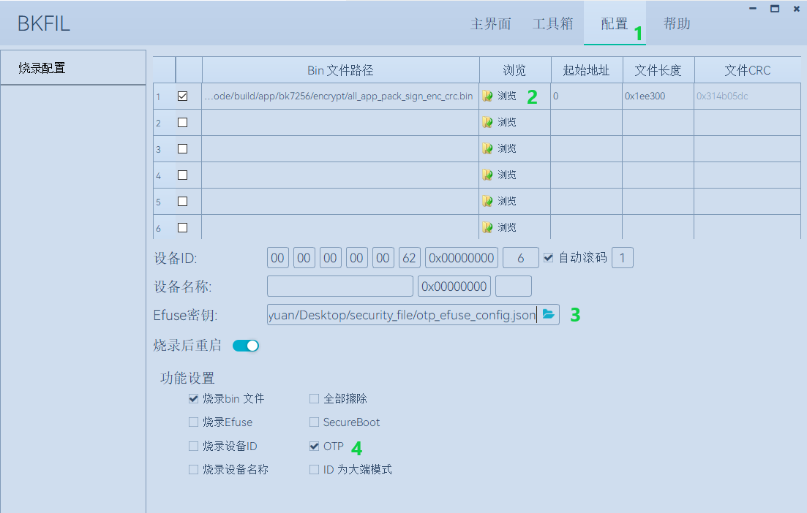

安全功能应用指南
=====================

:link_to_translation:`en:[English]`

一、工具下载
+++++++++++++++++++++
  相关工具 `下载地址 </dl.bekencorp.com/tools/flash/>`_

二、安全相关配置文件
+++++++++++++++++++++

用于自动化编译生成安全相关镜像的配置文件在middleware/boards/bk7235下：

 1. security_ctrl.csv

    该文件控制安全相关镜像是否编译生成。

    "#Project"列对应所编译的project工程名称，"Enable"列对应自动编译状态，配置为"TRUE"时会生成安全相关镜像，配置为"FALSE"时不生成。
    "#Project"列第一项"security"为总开关，配置为"FALSE"时所有工程都不编译生成安全相关镜像。

    默认"app"工程会生成安全相关的镜像。

    客户自定义project且需要生成安全镜像时，可将project工程名称添加到"#Project"列中并配置为"TRUE"。

       +------------------------------+-----------+
       | #Project                     | Enable    |
       +==============================+===========+
       | security                     | TRUE      |
       +------------------------------+-----------+
       | app                          | TRUE      |
       +------------------------------+-----------+

 2. key_pair_selection.csv

    该文件用于指定bootloader和app签名的密钥对。

    编译系统在对镜像进行签名时，会按照以下路径优先级查找"key_pair"中指定的密钥对文件，当查找失败时会默认使用tools/env_tools/beken_packager下的用于测试的ecdsa384.der密钥对。

    支持bootloader和app使用不同的密钥对进行签名，首先配置"key_pair"为不同名称如ecdsa384_bootloader.der和ecdsa384_app.der，
    然后使用签名工具生成同名密钥对文件并放置到指定路径下。

.. _查找路径优先级:

    编译系统查找密钥文件指定路径和优先级：

        1. projects/"project"/config/bk7235
        2. middleware/boards/bk7235
        3. tools/env_tools/beken_packager （默认放置了测试使用的密钥文件）

       +--------------+--------------------+
       | firmware     | key_pair           |
       +==============+====================+
       | bootloader   | ecdsa384.der       |
       +--------------+--------------------+
       | app          | ecdsa384.der       |
       +--------------+--------------------+

 3. version_anti_rollback.csv

    该文件用于版本防回滚功能的固件版本管理。

    "version"取值范围为0--255，默认版本号为0.
    开启安全之后，当前bootloader不支持版本升级，因此bootloader的版本号固定为0.

       +--------------+---------------+
       | firmware     | version       |
       +==============+===============+
       | bootloader   | 0             |
       +--------------+---------------+
       | app          | 0             |
       +--------------+---------------+

三、安全镜像生成步骤
+++++++++++++++++++++

 生成安全镜像需要以下四个步骤，为方便开发，以下步骤1到4已经集成到编译系统当中：

 - 1.镜像签名
 - 2.镜像打包
 - 3.镜像加密
 - 4.添加CRC

以"app"工程为例，执行"make bk7235"命令编译结束后，会在build/app/bk7235/encrypt路径下生成用于安全的bin文件：

   ::

    all_app_pack_enc_crc.bin      //包含bootloader，用于仅开启flash加密时烧写
    all_app_pack_sign_crc.bin     //包含bootloader，用于仅开启secureboot时首次烧写
    all_app_pack_sign_enc_crc.bin //包含bootloader，用于开启secureboot和flash加密时首次烧写
    app_pack.rbl                  //用于未开启安全后的OTA升级
    app_pack_sign.rbl             //用于开启安全后的OTA升级
    app_pack_sign_enc_crc.bin     //不包含bootloader，用于开启了secureboot和flash加密后通过uart更新app
    bootloader_sign_enc_crc.bin   //经过签名和加密后的bootloader镜像

工具使用方法
+++++++++++++++++++++

    本小节为使用工具手动生成安全镜像的方法，当使用编译系统自动生成安全镜像时只需要关心签名密钥对和flash加密密钥生成方法。

1. 镜像签名
----------------------------------

签名算法
********************
		 - ECDSA P384
		 - SHA384

签名指令
********************
	提供签名工具SignTool.exe和示例脚本，用于生成ECDSA密钥对和镜像签名，相关指令如下表。

+-------------+----------+-------------+--------------------------------------------+
|   Command   |  Options |  Value      | Description                                |
+=============+==========+=============+============================================+
|             | -prikey  | file.der    | File containing ECDSA keypair              |
|             +----------+-------------+--------------------------------------------+
|             | -infile  | infile.img  | Input file with the image to sign          |
|    sign     +----------+-------------+--------------------------------------------+
|             | -outfile | outfile.img | Output file containing the signed image    |
|             +----------+-------------+--------------------------------------------+
|             | -length  | hex         | Size of image for ECDSA process            |
+-------------+----------+-------------+--------------------------------------------+
|             | -type    |BLKey BLKeyC | As binary or C array                       |
|             +----------+-------------+--------------------------------------------+
|   getkey    | -key     | file.der    | File containing ECDSA keypair (or pubkey)  |
|             +----------+-------------+--------------------------------------------+
|             | -outfile | outfile     | Output file containing exported public key |
+-------------+----------+-------------+--------------------------------------------+
|             | -algo    | ecdsa384    | ECDSA bit-length                           |
| genkeypair  +----------+-------------+--------------------------------------------+
|             | -outfile | outfile.der | Output file containing ECDSA keypair       |
+-------------+----------+-------------+--------------------------------------------+
|   version   | To print the current version of this utility                        |
+-------------+---------------------------------------------------------------------+
|    help     | To print this help message                                          |
+-------------+---------------------------------------------------------------------+

签名过程
********************

		 - 运行脚本Signtool_GenKeypair.bat生成ECDSA密钥对。
		 - 运行脚本Signtool_GetKey.bat获取该密钥对中的公钥。
		 - 将需要签名的镜像和签名工具放置在同一目录下，运行脚本Signtool_Sign.bat，使用生成的密钥对对镜像签名。

.. _提取的公钥:

   ::

     //从密钥对中获取到的公钥
     uint32_t secure_boot_public_key[] =
     {
      /* the Qall value */
      6ce8840b90c31a00542e07e9d608920eee7b8b363123d706c668bc1127b6b4a6278d2eddb7ccd83d32d6d094b528213e0bf6907209a13d6ecaa312a59c622372bfc511faab9b0f291b2cb7b17a7259c63d8453946a0969e0a070770973bd47e6,
     }

.. figure:: ../../../../common/_static/BK_SignTool.png
    :align: center
    :alt: BK_SignTool
    :figclass: align-center

    BK_SignTool

举例说明::

    生成密钥对：SignTool.exe genkeypair -algo ecdsa384 -outfile ecdsa384.der
    获取公钥：SignTool.exe getkey -type BLKeyC -key ecdsa384.der -outfile ecdsa384.c
    镜像签名：SignTool.exe sign -prikey ecdsa384.der -infile bootloader.bin  -outfile bootloader_sign.bin -len 0x10000

.. important::
    ECDSA密钥对生成脚本执行一次则生成一组密钥对，生成的密钥对请妥善保管；
    获取的公钥存储在ecdsa384.c文件中，需要拷贝到otp_efuse_config.json中供BKFIL工具烧写密钥到OTP时使用。

    客户自定义签名的密钥对时，请将生成的密钥对文件ecdsa384.der放在 :ref:`指定路径 <查找路径优先级>` 下，编译系统会按照路径优先级查找密钥对文件；
    当系统在指定路径下找不到密钥文件时，默认使用tool下的测试密钥对文件。

2. 镜像打包
----------------------------------

    镜像打包是根据flash分区文件configuration.json将2个或者多个镜像打包成一个镜像。

镜像打包指令
********************

    提供镜像打包工具cmake_Gen_image.exe用于打包。

+-----------+---------------+--------------------+---------------------------------+
|  Command  |  Options      | Value              | Description                     |
+===========+===============+====================+=================================+
|           | -injsonfile   | configuration.json | input json file                 |
|           +---------------+--------------------+---------------------------------+
|  genfile  | -infile       | xx1.bin xx2.bin    | input bin file                  |
|           +---------------+--------------------+---------------------------------+
|           | -outfile      | all bin            | Output all bin file             |
+-----------+---------------+--------------------+---------------------------------+
|  version  | To print the current version of this utility                         |
+-----------+----------------------------------------------------------------------+
|  help     | To print this help message                                           |
+-----------+----------------------------------------------------------------------+

.. important::
    镜像可以在签名之后进行打包，也可以在签名、加密和添加CRC完成后再进行打包；
    对没有添加CRC的镜像进行打包，configuration.json文件请使用逻辑地址；
    对添加CRC后的镜像进行打包，configuration.json文件请使用物理地址。

举例说明::

    将bootloader_sign.bin和app_sign.bin打包成all_app.bin：
    cmake_Gen_image.exe  genfile -injsonfile configuration.json -infile bootloader_sign.bin app_sign.bin -outfile all_app.bin

3. 镜像加密
----------------------------------

	镜像加密使用AES-XTS256加密方式，保证镜像的机密性。

加密算法
********************

	AES-XTS256

加密指令
********************

    提供加密工具beken_aes.exe，用于密钥生成和镜像加密。

+-----------+---------------+----------------------+------------------------------------------------------+
|  Command  |  Options      |  Value               | Description                                          |
+===========+===============+======================+======================================================+
|           | -outfile      | aes_encrypt_key.json | falsh encrypt key is saved in aes_encrypt_key.json   |
|  genkey   +---------------+----------------------+------------------------------------------------------+
|           | -aes_cbc      | aes_encrypt_key.json | Key and IV for OTA are saved in aes_encrypt_key.json |
+-----------+---------------+----------------------+------------------------------------------------------+
|           | -keyfile      | aes_encrypt_key.json | File containing AES key                              |
|           +---------------+----------------------+------------------------------------------------------+
|           | -infile       | infile               | the image to be encrypted                            |
|  encrypt  +---------------+----------------------+------------------------------------------------------+
|           | -startaddress | Hex                  | encrypt with logical start address                   |
|           +---------------+----------------------+------------------------------------------------------+
|           | -outfile      | outfile              | encrypted image                                      |
+-----------+---------------+----------------------+------------------------------------------------------+
|  version  |  To print the current version of this utility                                               |
+-----------+---------------------------------------------------------------------------------------------+
|  help     | To print this help message                                                                  |
+-----------+---------------------------------------------------------------------------------------------+

加密过程
********************

 - 运行脚本genkey_random.bat，生成用于flash加密的密钥；
 - 将需要加密的镜像和加密工具放置在同一目录下，运行脚本encrypt_bin_in_aes_file.bat完成对镜像的加密。

举例说明::

    生成AES密钥：beken_aes.exe genkey -aes_cbc -outfile aes_encrypt_key.json
    app镜像加密：beken_aes.exe encrypt -infile app.bin -startaddress 0x10000 -keyfile aes_encrypt_key.json -outfile app_enc.bin
    all_app.bin加密：beken_aes.exe encrypt -infile all_app.bin -startaddress 0x0 -keyfile aes_encrypt_key.json -outfile all_app_enc.bin

.. _对称密钥:

生成的密钥内容：

   ::

        {
            "name":               "aes_key",   //flash加密密钥的密文，将data部分复制到otp_efuse_config.json的Security_data的aes_key的data中
            "mode":              "write",
            "start_addr":         "",
            "last_valid_addr":    "",
            "byte_len":           "0x20",
            "data":              "cbdzcdbwdscacjdyccbxbzbwdzducddvbxeeeecjedcgceeeegeecfehclcleacgciebckcledclecefcibobpbpbobibpboeienbgeibjeoejeneobkenepbnbgbten",
            "data_type":          "ascii",
            "status":            "true"
        },
        {
            "name":               "aes_key_plaintext", //flash加密密钥的明文
            "mode":              "write",
            "start_addr":         "",
            "last_valid_addr":    "",
            "byte_len":           "0x20",
            "data":              "6d34d08c3756ad0d6dd4b31fdf2d33d61d31e1db38998298ad2b1dbfb0ab258c",
            "data_type":          "ascii",
            "status":            "true"
        },
        {
            "name":               "OTA_key", //用于OTA升级的密钥的密文，将data部分复制到otp_efuse_config.json的Security_data的OTA_key的data中
            "mode":              "write",
            "start_addr":         "",
            "last_valid_addr":    "",
            "byte_len":           "0x20",
            "data":              "cbbwbxctcadgbxdibzcjccdicteadsbzejeccicqcqddeachetdyelcucredcuce",
            "data_type":          "ascii",
            "status":            "true"
        },
        {
            "name":               "OTA_key_plaintext", //用于OTA升级的密钥的明文
            "mode":              "write",
            "start_addr":         "",
            "last_valid_addr":    "",
            "byte_len":           "0x20",
            "data":              "632C0P5S683PAng4vb4LMXa1qlxCNgD4",
            "data_type":          "ascii",
            "status":            "true"
        },
        {
            "name":               "OTA_IV", ////用于OTA升级的IV的密文，将data部分复制到otp_efuse_config.json的Security_data的OTA_IV的data中
            "mode":              "write",
            "start_addr":         "",
            "last_valid_addr":    "",
            "byte_len":           "0x10",
            "data":              "dcemcdcybwcnbydrccckcuccewdwdtcl",
            "data_type":          "ascii",
            "status":            "true"
        },
        {
            "name":               "OTA_IV_plaintext", //用于OTA升级的IV的明文
            "mode":              "write",
            "start_addr":         "",
            "last_valid_addr":    "",
            "byte_len":           "0x10",
            "data":              "Sw3H4D7Z38N0xcf7",
            "data_type":          "ascii",
            "status":            "true"
        },

.. important::
    AES-XTS模式加密结果与被加密文件的地址相关，在需要手动单独加密app镜像时-startaddress应设置为该镜像的逻辑地址。

    客户自定义flash加密密钥时，请将生成的密钥文件aes_encrypt_key.json放在 :ref:`指定路径 <查找路径优先级>` 下，编译系统会按照路径优先级查找密钥文件；
    当系统在指定路径下找不到密钥文件时，默认使用tool下的测试密钥文件。

4. 添加CRC校验
----------------------------------

    CPU在读取FLASH上镜像时硬件会进行CRC校验，因此镜像需要添加CRC之后才可以烧写到flash中。

    CRC插入规则：每32个字节计算出2个字节的CRC值，插入到该32字节之后；插入CRC之前的地址对应逻辑地址，插入CRC之后的地址对应物理地址。

    上一步镜像加密后会输出对应添加CRC后的版本，可直接用于烧写。

    提供工具cmake_encrypt_crc.exe用于添加CRC。

- 将需要添加CRC镜像和工具放置在同一目录下，运行脚本add_crc.bat即可。

举例说明::

    添加CRC： cmake_encrypt_crc.exe -crc all_enc.bin

四、烧写安全镜像和密钥，使能安全功能
+++++++++++++++++++++++++++++++++++++++++

.. important::
    *Note：OTP和eFuse只能烧写一次，一但烧写后不可更改，需要谨慎操作！*
    在使能efuse的secure boot和encrypt之前，请确保flash中烧写有经过加签、加密、加CRC后的镜像，否则该芯片将无法更新镜像。

1. 配置otp_efuse_config.json
----------------------------------------

生成的密钥对文件和flash加密密钥文件，除了用于生成安全镜像，还需要烧写到芯片的OTP中。

将3.1节生成的 :ref:`ecdsa384.c <提取的公钥>` 中的publickey和3.3节生成的 :ref:`aes_encrypt_key.json <对称密钥>` 中的aes_key、OTA_key、OTA_IV拷贝到otp_efuse_config.json的安全数据配置区，方法见 :doc:`bk_OTP_and_eFuse_usermenu` 中安全数据配置区参数说明。

BKFIL.exe会根据配置文件otp_efuse_config.json，将其中的签名的公钥、加密的密钥烧写到OTP中，并根据eFuse的配置来使能安全功能。

2. 烧写安全镜像并使能安全
----------------------------------

 - 1.BKFIL工具选择配置界面
 - 2.选择第一次烧写对应的安全镜像
 - 3.选择"eFuse密钥"文件选择按钮,选择配置好的otp_efuse_config.json
 - 4.勾选"OTP"或者"烧录eFuse"选项
 - 5.BKFIL工具选择主界面，点击"烧录"按钮

    首次烧写安全镜像

四、开启安全后镜像升级方式
+++++++++++++++++++++++++++++

    开启安全后，当前bootloader将不可更新，只能对app镜像进行更新升级。

     - 方式一：使用BKFIL.exe工具将build/app/project/encrypt下的app_pack_sign_enc_crc.bin烧写到对应的物理分区上。
     - 方式二: 使用OTA升级方式，使用build/app/project/encrypt下的app_pack_sign.rbl升级，升级方法和非安全版本一样，见OTA升级。