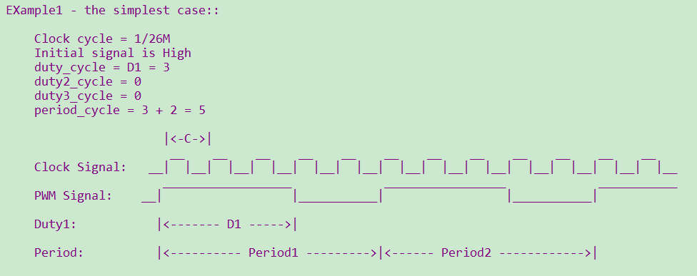
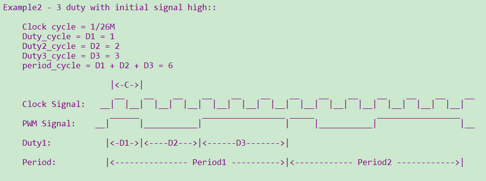
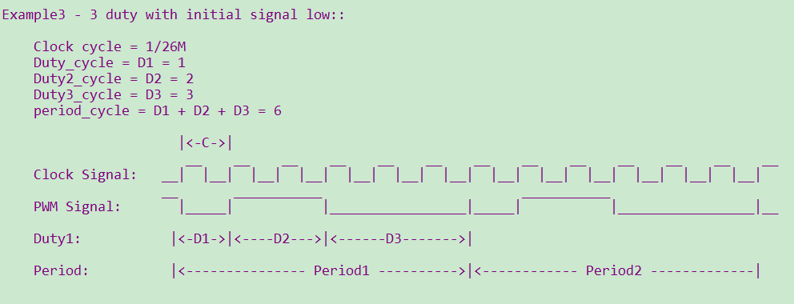
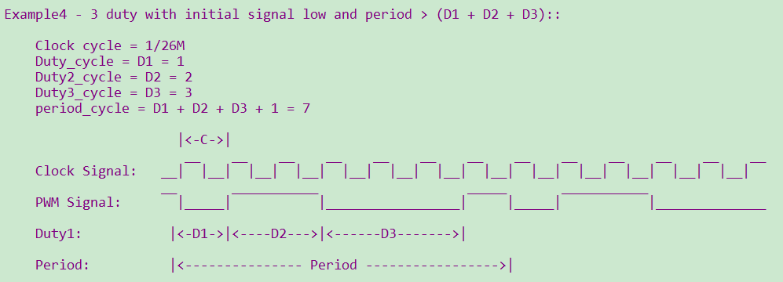
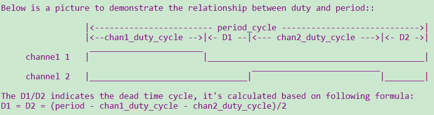

PWM
==========================

:link_to_translation:`en:[English]`

1 功能概述
-------------------------------------
	介绍的PWM模块包含三部分，分别为独立输出模式、互补输出模式以及PWM输入信号捕捉三个模式，
	其中独立输出与互补输出都是芯片信号输出，信号捕捉是获得外部信号。

	bk7256具有12路PWM输出，输出时其时钟源选择的是26M，每一路的周期及占空比都可以单独配置；互补输出模式时必须相邻2个pwm配对输出。channel如下:

	+---------+----------------+--------------+----------+-------------+--------------+
	| channel |     GPIO       | base address | channel  |     GPIO    | base address |
	+=========+================+==============+==========+=============+==============+
	|   0     |     GPIO6      |              |    6     |    GPIO32   |              |
	+---------+----------------+ 0x44840000   +----------+-------------+ 0x45860000   |
	|   1     |     GPIO7      |              |    7     |    GPIO33   |              |
	+---------+----------------+--------------+----------+-------------+--------------+
	|   2     |     GPIO8      |              |    8     |    GPIO34   |              |
	+---------+----------------+ 0x44840040   +----------+-------------+ 0x45860040   |
	|   3     |     GPIO9      |              |    9     |    GPIO35   |              |
	+---------+----------------+--------------+----------+-------------+--------------+
	|   4     |     GPIO24     |              |    10    |    GPIO36   |              |
	+---------+----------------+ 0x44840080   +----------+-------------+ 0x45860080   |
	|   5     |     GPIO25     |              |    11    |    GPIO37   |              |
	+---------+----------------+--------------+----------+-------------+--------------+

2 代码路径
-------------------------------------
	demo路径：``components\bk_cli\cli_pwm.c``

3 cli命令简介
-------------------------------------

	demo运行依赖的宏配置：

	+--------------------------------------+------------------------+--------------------------------------------+---------+
	|                 NAME                 |      Description       |                  File                      |  value  |
	+======================================+========================+============================================+=========+
	| CONFIG_PWM                           | support PWM            | ``middleware\soc\bk7256\bk7256.defconfig`` |    y    |
	+--------------------------------------+------------------------+--------------------------------------------+---------+

	demo支持的命令如下表：

	+----------------------------------------+----------------------------------+---------------------------------------+
	|             Command                    |            Param                 |              Description              |
	+========================================+==================================+=======================================+
	| pwm_driver init {26M|DCO}              | 26M|DCO:clk source,default 26M   |  init the resoure common to all PWM   |
	|                                        |                                  |  channels                             |
	+----------------------------------------+----------------------------------+---------------------------------------+
	| pwm_driver deinit                      | none                             | free all resource related to pwm      |
	+----------------------------------------+----------------------------------+---------------------------------------+
	|                                        | chan: pwm channel                |                                       |
	|                                        +----------------------------------+                                       |
	|                                        | period_v:pwm periord             | power up and config the pwm channel,  |
	|                                        +----------------------------------+ set the period and duty cycle         |
	| pwm {chan} init {period_v} {duty_v}    | duty_v: duty cycle               |                                       |
	|                                        +----------------------------------+ note: this chip supports 3 duty cycle |
	| [duty2_v][duty3_v]                     | duty2_v: second level reversal   | , parameter duty2_v and duty3_v are   |
	|                                        +----------------------------------+ optional                              |
	|                                        | duty3_v: third level reversal    |                                       |
	+----------------------------------------+----------------------------------+---------------------------------------+
	|                                        | chan: pwm channel                |                                       |
	|                                        +----------------------------------+                                       |
	|                                        | period_v:pwm periord             | configure the period and duty cycle.  |
	|                                        +----------------------------------+                                       |
	| pwm {chan} duty {period_v} {duty_v}    | duty_v: duty cycl                |                                       |
	|                                        +----------------------------------+                                       |
	| [duty2_v] [duty3_v]                    | duty2_v: second level reversal   | note: parameter duty2_v and duty3_v   |
	|                                        +----------------------------------+ are option.                           |
	|                                        | duty3_v: third level reversal    |                                       |
	+----------------------------------------+----------------------------------+---------------------------------------+
	|                                        | chan: pwm channel                |                                       |
	| pwm {chan} {start|stop|deinit}         +----------------------------------+ read data_size bytes of data from     |
	|                                        | start|stop|deinit:               |                                       |
	+----------------------------------------+----------------------------------+---------------------------------------+
	|                                        | chan: pwm channel                |                                       |
	| pwm {chan} signal {low|high}           +----------------------------------+  set the initial signal to high|low   |
	|                                        | low|high: initial signal level   |                                       |
	+----------------------------------------+----------------------------------+---------------------------------------+
	|                                        | chan1: pwm channel               |                                       |
	|                                        +----------------------------------+ init the PWM group                    |
	|                                        | chan2: pwm channel               |                                       |
	|                                        +----------------------------------+ The PWM group is a channel pair that  |
	| pwm_group init {chan1} {chan2}         | period: pwm periord              | has following attributes:             |
	|                                        +----------------------------------+ -The period is same                   |
	| {period} {chan1_duty} {chan2_duty}     | chan1_duty: chan1 duty cycle     | -The initial signal level is opposite |
	|                                        +----------------------------------+ -Start and stop at the same time      |
	|                                        | chan2_duty: chan2 duty cycle     |                                       |
	+----------------------------------------+----------------------------------+---------------------------------------+
	|                                        | chan: pwm channel                |                                       |
	| pwm_group {start|stop|deinit}          +----------------------------------+ start|stop|deinit the PWM group       |
	|                                        | start|stop|deinit:               |                                       |
	+----------------------------------------+----------------------------------+---------------------------------------+
	|                                        | group: pwm channel               |                                       |
	|                                        +----------------------------------+                                       |
	|                                        | period: pwm periord              | Configure the duty and period of      |
	| pwm_group config {group} {period}      +----------------------------------+ a PWM group                           |
	|                                        | chan1_duty: chan1 duty cycle     |                                       |
	| {chan1_duty} {chan2_duty}              +----------------------------------+                                       |
	|                                        | chan2_duty: chan2 duty cycle     |                                       |
	+----------------------------------------+----------------------------------+---------------------------------------+
	|                                        | chan: pwm channel                |                                       |
	| pwm_capture {chan} init {pos|neg|edge} +----------------------------------+ calculate the cycles between two      |
	|                                        | pos|neg|edge: counting mode      | different pos-edge|neg-edge|edges     |
	+----------------------------------------+----------------------------------+---------------------------------------+
	|                                        | chan: pwm channel                |                                       |
	| pwm_capture {chan} {start|stop|deinit} +----------------------------------+ start|stop|deinit pwm capture func    |
	|                                        | start|stop|deinit                |                                       |
	+----------------------------------------+----------------------------------+---------------------------------------+

4 演示介绍
-------------------------------------
	demo执行的步骤如下：

1、准备好逻辑分析仪，连接方式如下：

   ::

		pwm通道0----GPIO6

		pwm通道1----GPIO7

2、PWM独立输出模式

	对PWM驱动进行初始化：

	   ::

		pwm_driver init

2.1 普通输出

	   ::

		pwm 0 init 5 3 0 0  //占空比60%
		pwm 0 start

波形如下：

    Figure 1. 输出60%占空比的PWM

2.2 一个周期内3次翻转电平

		  ::

			pwm 0 duty 6 1 2 3
			pwm 0 start
			
波形如下：

    Figure 2. 一个周期内3次翻转电平，初始电平为高

2.3 设置初始电平为低

    	   ::

			pwm 0 signal low
			pwm 0 duty 6 1 2 3
			pwm 0 start
			
波形如下：

    Figure 3. 一个周期内3次翻转电平，初始电平为低

2.4 period > (D1+D2+D3)

    	   ::

			pwm 0 duty 7 1 2 3

波形如下：

    Figure 4. period > (D1+D2+D3)

3、PWM互补模式

	互补模式可以避免死区产生的问题。互补输出其作用是为了避免关闭前一个设备和打开后一个设备时
	因为开关速度的问题出现同时开启状态而增加负荷的情况（在没有彻底关闭前打开了后一个设备），
	尤其是电流过大时容易造成短路等损坏设备。

		依次执行以下命令：

		   ::

			pwm_driver init
			pwm_group init 0 1 15 5 6
			pwm_group start

波形如下：

    Figure 5. 互补输出+死区控制

4、输入捕获模式

	PWM输入捕获模式是普通输入模式一种特殊应用，是将TIMx输入映射了两个Cx信号(输入捕获装置C1和C2)，
	其中一个捕获上升沿，另一个捕获下降沿。这样可以在中断中去读上升沿和下降沿对应寄存器中的计数，从而得出周期和占空比。
	其中一个捕获通道计算两次都是上升沿的时间，即周期T；而另一个通道则计算一次下降沿和之前上升沿之差，这样得到高电平时长，
	从而可以求得周期T和占空比。

		将外部1k Hz信号接入GPIO6，依次输入以下命令：

		   ::

			pwm_driver init
			pwm_capture 0 init
			pwm_capture 0 init pos
			pwm_capture 0 start

在中断函数中计算出计数值 value=658f，以上升沿或者下降沿计数，则输入信号频率约为 26M/0x658f = 1k

		输入命令：

		   ::

			pwm_capture 0 init edge
			pwm_capture 0 start

在中断函数中会计算出计数值	value=32c7，以边沿计数，则输入信号频率约为 26M/0x32c7 = 2k

.. note::

	注意：根据参数的配置，在相同周期内，占空比可以进行调整。但每次调整配置都在下一个周期才会生效；
	在PWM进行init和duty设置时，必须 period > (D1+D2+D3)。

