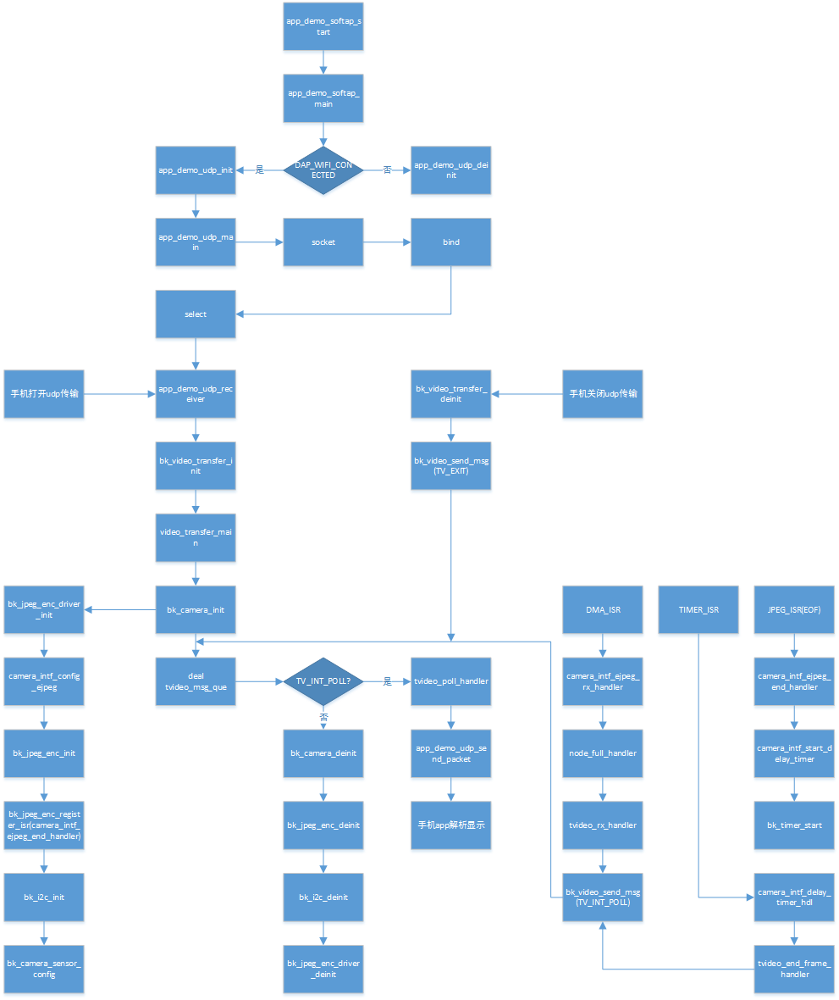

DVP 图传 demo
========================

:link_to_translation:`en:[English]`

1 功能概述
-------------------------------------
	图传的作用主要是将dvp sensor采集的原始数据，经jpeg encode模块压缩编码后，以WiFi连接的方式，将数据发送给手机，手机的图传应用（app）接收到数据后，会对数据包进行解析，然后实时显示编码之后的视频数据流。

2 代码路径
-------------------------------------
	demo路径：``./components/demos/media/video/video_transfer``

3 cli命令简介
-------------------------------------
	demo支持的命令如下表：

	+----------------------------------------+--------------------------+----------------------+
	|             Command                    |      Param               |   Description        |
	+========================================+==========================+======================+
	|                                        | param1:dev_id            |使用的dvp设备类型     |
	|                                        +--------------------------+----------------------+
	| dvp set_cfg param1 param2 param3       | param2:image resolution  |dvp输出的分辨率       |
	|                                        +--------------------------+----------------------+
	|                                        | param3:frame rate        |dvp输出的帧率         |
	+----------------------------------------+--------------------------+----------------------+
	|                                        | param1:connect method    |芯片与手机的连接方式  |
	|                                        +--------------------------+----------------------+
	| video_transfer param1 param2 [param3]  | param2:ssid              |路由的名字            |
	|                                        +--------------------------+----------------------+
	|                                        | param3:ssid_key          |连接的密钥            |
	+----------------------------------------+--------------------------+----------------------+
	| dvp log param1                         | param1:0/1               |使能/关闭图传的log    |
	+----------------------------------------+--------------------------+----------------------+
	| dvp image_save param1                  | param1:0/1               |使能/关闭图传保存图片 |
	+----------------------------------------+--------------------------+----------------------+
	
	demo运行依赖的宏配置：
	
	+--------------------------------------+------------------------+--------------------------------------------+---------+
	|                 NAME                 |      Description       |                  File                      |  value  |
	+======================================+========================+============================================+=========+
	|CONFIG_JPEG_ENCODE                    |配置是否支持硬件编码    |``middleware\soc\bk7256\bk7256.defconfig``  |    y    |
	+--------------------------------------+------------------------+--------------------------------------------+---------+
	|CONFIG_CAMERA                         |配置是否使用dvp camera  |``middleware\soc\bk7256\bk7256.defconfig``  |    y    |
	+--------------------------------------+------------------------+--------------------------------------------+---------+
	|CONFIG_USE_APP_DEMO_VIDEO_TRANSSER    |配置是否使用图传应用    |``middleware\soc\bk7256\bk7256.defconfig``  |    y    |
	+--------------------------------------+------------------------+--------------------------------------------+---------+
	|CONFIG_NET_WORK_VIDEO_TRANSFER        |配置是否支持网络图传    |``middleware\soc\bk7256\bk7256.defconfig``  |    y    |
	+--------------------------------------+------------------------+--------------------------------------------+---------+
	|CONFIG_COMPONENTS_P2P                 |配置是否使用p2p传输     |``middleware\soc\bk7256\bk7256.defconfig``  |    n    |
	+--------------------------------------+------------------------+--------------------------------------------+---------+
	|CONFIG_CAMERA_USE_I2C1                |配置是否使用I2C1通信    |``middleware\soc\bk7256\bk7256.defconfig``  |    y    |
	+--------------------------------------+------------------------+--------------------------------------------+---------+

4 演示介绍
-------------------------------------
	demo执行的步骤如下：
	
	1、准备好dvp摄像头，连接方式如下图所示：
	
		图中位置1所用的摄像头是gc0328c, dev_id=3，支持640*480的分辨率
	
	(一)、只执行app图传命令时，操作如下：
	
	2、顺序发送下面命令：
	
		dvp set_cfg 3 480 20
		
		video_transfer -a test 12345678
		
	3、手机wifi连接上test名字的路由, 密码为: 12345678
	
	4、连接成功后打开图传的app即可。

	上图中位置2用的摄像头是hm1055, dev_id=6, 支持1280*720的分辨率
	
	1、如果用hm1055的摄像头开始图传，顺序发送下面命令：
	
		dvp set_cfg 6 720 15
		
		video_transfer -a test 12345678
		
	2、手机wifi连接上test名字的路由, 密码为: 12345678
	
	3、连接成功后打开图传的app即可。

.. figure:: ../../../../../common/_static/video_transfer_evb.png
    :align: center
    :alt: 图传时板子的连接示意
    :figclass: align-center

    Figure 1. 图传时板子的连接示意

5 详细配置及其说明
-------------------------------------
	1、设置dvp参数：dvp set_cfg param1 param2 param3
	
	param1:0-7, 分别对应下面类型的dvp camera, 当前仅支持3和6.

		PAS6329_DEV             0

		OV_7670_DEV             1

		PAS6375_DEV             2

		GC0328C_DEV             3

		BF_2013_DEV             4

		GC0308C_DEV             5

		HM_1055_DEV             6

		GC_2145_DEV             7
	
	param2:分辨率
	
		GC0328C_DEV：480(640*480)，240(320*240), 272(480*272)
		
		HM_1055_DEV: 720(1280*720)
		
	param3:帧率
	
		GC0328C_DEV：5、10、20、25
		
		HM_1055_DEV：5、10、15、20
	
	2、设置wifi连接方式
	
		1.video_transfer -a ssid key
			
			将开发板作为一个AP，手机去连接这个AP，做法与手机连接其他wifi设备类似。

		2.video_transfer -s ssid key
		
			将开发板作为一个station，去连接手机，手机需要开启wifi热点，此时手机相当于一个路由器。

		3.video_transfer -p ssid key
		
			采用手机直连的方式，与AP类似，做法是在手机上：WLAN-->高级设置-->WLAN直连，搜索到板子的设备后，点击连接。

.. note::

	注意：第一种方式可能存在板子的带宽不够，显示的视频不够清晰；第二种方式，图传的效果最好，因为手机的带宽非常充足；第三种方式当前还未实现。
	
	3、支持动态设置分辨率和帧率，不支持设置更换dvp设备
	
		在退出图传之后，发送dvp set_cfg param1 param2 param3命令，param1不能改动，param2和param3可以修改。
	
	4、图传软件流程

    Figure 2. video transfer function call

	5、图传模块间调用
	
.. figure:: ../../../../../common/_static/video_transfer_message.png
    :align: center
    :alt: video_transfer模块调用
    :figclass: align-center

    Figure 3. video transfer modules communicate
