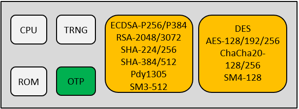

Overview
=====================

:link_to_translation:`zh_CN:[中文]`

BK7236 has a security module BK130, which supports the functions of safe startup, safe debugging, flash encryption and decryption, and is enabled by burning the eFUSE related bit.
BK130 can prevent the key and other sensitive data from being used by unauthorized applications. The internal OTP and ROM allow secure storage of key materials and other secure data,
Support hardware implementation of encryption algorithm.

feature
+++++++++++++++++++++

The BK130 security module has the following features:
 - Crypto algorithm: DES, AES-128/192/256, ChaCha20-128/256, SM4-128
 - Public key accelerator: ECDSA-P256/P384, RSA-2048/3072
 - Hash algorithm: SHA-224/256, SHA-384/512, Poly1305, SM3-512
 - True random number generator (TRNG)
 - Supports secure storage
 - Supports secure boot

bk130  architecture
+++++++++++++++++++++

    BK130 architecture

1. Definition of eFUSE:
++++++++++++++++++++++++++++++++++++++++

eFuse is 32 bytes in total.

 - Byte 0~15   ： Reserved for user
 - Byte 16~23  ： Firmware usage，UID
 - Byte 24~29  ： Firmware usage，MAC
 - Byte 30     ： used for system control
 - Byte 31     ： used for system control

Bit definition of control byte Byte31:
----------------------------------------

 - Bit 7： 1:close the JTAG interface; 0:use the JTAG interface
 - Bit 6： reserve
 - Bit 5： 1: enable FLASH AES encryption; 0: turn off FLASH AES encryption
 - Bit 4： reserve
 - Bit 3： 1:write prohibition of bytes 0:15
 - Bit 2： 1:write prohibition of bytes 16:23
 - Bit 1： 1:write prohibition of bytes 24:29
 - Bit 0： 1:EFUSE all 32 bytes writes are prohibited

Bit definition of control byte Byte30:
----------------------------------------

 - Bit[0] :  Security Boot enable. 1: enable. 0: disable.
 - Bit[1] :  Security Boot printout control.  0: enable.  1: disable
 - Bit[2] :  fast boot.     0: deepsleep fast boot   1: deepsleep sb boot
 - Bit[6:3]: Reserve.

2.OTP space allocation:
++++++++++++++++++++++++++++++++++++++++

    OTPs are divided into four banks:

 - bank0 ： Reserved for user, address range 0x4B004000 -- 0x4B0047FF
 - bank1 ： Firmware usage, address range 0x4B004800 -- 0x4B004FFF
 - bank2 ： For security, address range 0x4B005000 -- 0x4B0057FF
 - bank3 ： For bk130, address range 0x4B005800 -- 0x4B0058FF

bank0：
-------------------------

Users use and manage.

bank1：
-------------------------
Used and managed by firmware.

The bl version, app version, and ecdsa public key are valid when the security function is enabled. When the security function is not used, the space can be used and managed by users.

+------------------+---------------+---------------------+-----------------------------------+
| content          | start address | allocate size(byte) | Description                       |
+==================+===============+=====================+===================================+
| reserve          | 0x4B004800    | 16                  | reserve                           |
+------------------+---------------+---------------------+-----------------------------------+
| OTA aes key      | 0x4B004810    | 40                  | aes key used for OTA upgrade      |
+------------------+---------------+---------------------+-----------------------------------+
| OTA aes IV       | 0x4B004838    | 40                  | aes IV used for OTA upgrade       |
+------------------+---------------+---------------------+-----------------------------------+
| bl version       | 0x4B004860    | 40                  | used for bootloader anti rollback |
+------------------+---------------+---------------------+-----------------------------------+
| app version      | 0x4B004888    | 40                  | used for app anti rollback        |
+------------------+---------------+---------------------+-----------------------------------+
| ecdsa public key | 0x4B0048B0    | 104                 | public key for bootloader to      |
|                  |               |                     | verify the signature of app       |
+------------------+---------------+---------------------+-----------------------------------+
| reserve          | 0x4B004918    |                     | reserve                           |
+------------------+---------------+---------------------+-----------------------------------+

bank2：
-------------------------

When the security function is enabled, the bank2 can only be accessed by hardware and is not visible externally.

+------------------+---------------+---------------------+------------------------------------+
| content          | start address | allocate size(byte) | Description                        |
+==================+===============+=====================+====================================+
| ecdsa public key | 0x4B0048B0    | ecdsa256: 64        | public key for BOOT ROM to verify  |
|                  |               | ecdsa384: 96        | the signature of bootloader        |
+------------------+---------------+---------------------+------------------------------------+
| AES256 key       | 0x4B004918    | 32                  | used for image encryption on flash |
+------------------+---------------+---------------------+------------------------------------+

When the security function is off, the bank2 can be used and managed by users.

bank3：
-------------------------
Used and managed by bk130 module.

