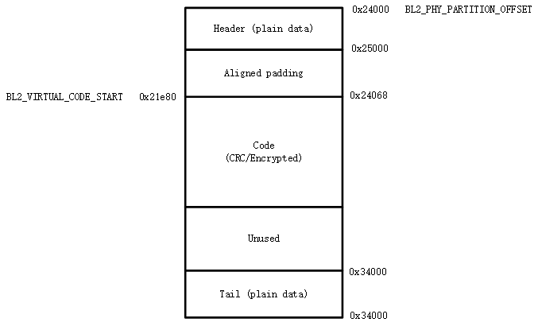

分区配置
========================

概述
-----------------------------

BK7236 支持 CM33 双核架构，在 CPU0 上又隔离出安全与非安全两个世界，
通常，完整的 BK7236 应用通常涉及超过十个不同的 BIN。为简化配置，BK7236
定义了分区配置表 partitions.json 统一规划 FLASH 分区配置以及打包配置。

默认分区配置表为 ``middleware/boards/bk7236/partitions/partitions.json``，
如果默认配置无法满足您的需求，您可以在项目配置目录下定制项目特定的分区配置表。

以项目 ``project/verify`` 为例，如果 ``project/verify/config/partition/partitions.json``
存在，则在构建时会使用项目中的配置替换默认配置。

配置表
-----------------------------

配置示例
++++++++++++++++++++++++++

一个典型的分区配置如下图所示。

.. code::

  {
      "description": "Configuration to merge all images",
      "flash_base_addr" : "0x02000000",
      "cpu_vector_align": "0x80",
      "pack_ota": [ "default" ],
      "pack_app": [ "default" ],
      "partitions": [
          { "partition": "bl1",               "offset": "0x00000000", "size": "128k", "bin": "bl1.bin",                "bin_type": "code" },
          { "partition": "bl1_control",       "offset": "0x00020000", "size": "12k",  "bin": "bl1_control.bin",        "bin_type": "data" },
          { "partition": "primary_manifest",  "offset": "0x00023000", "size": "4k",   "bin": "primary_manifest.bin",   "bin_type": "data" },
          {
            "partition"          : "primary_bl2",
            "offset"             : "0x00024000",
            "size"               : "64k",
            "bin"                : "bl2.bin",
            "bin_type"           : "code",
            "version"            : "0x00010001",
            "load_addr"          : "0x28040000"
          },
          {
            "partition"          : "primary_ns",
            "offset"             : "0x000ad000",
            "size"               : "256k",
            "bin"                : "tfm_ns_signed.bin",
            "bin_type"           : "code",
            "bin_hdr_size"       : "0x1000",
            "bin_tail_size"      : "0x1000"
          },
  }

通用配置字段
++++++++++++++++++

 - ``description`` - 可选项。分区表描述。
 - ``flash_base_addr`` - 可选项，默认为 0x02000000。表示 FLASH 基地址。
 - ``cpu_vector_align`` - 可选项，默认为 0x80。表示 CPU vector 对齐要求，在 cortex-cm33 中，vector 要求 128 字节对齐。
 - ``pack_ota`` - 可选项。用于指示如何生成 ota.bin。
 
   - 未配置时表不生成 ota.bin。
   - 配置成 "default" 时，会将所有以 secondary 为前缀的分区打包。
   - 配置成具体分区列表时，则将相应的分区打包，如 "secondary_bl2, secondary_ns"
     则打包工具会使用 secondary_bl2 与 secondary_ns 两个分区生成 ota.bin。
 - ``pack_app`` - 可选项。与 pack_ota 类似，用于指定如何生成 app.bin。

   - 未配置时表不生成 apps.bin。
   - 配置成 "default" 时，会将所有不是以 secondary 为前缀的分区打包。
   - 配置成具体分区列表时，则将相应的分区打包，如 "primary_bl2, primary_ns"
     则打包工具会使用 secondary_bl2 与 secondary_ns 两个分区生成 ota.bin。
 - ``partitions`` - 必选项。配置具体的分区，至少必须包含一个分区。详情参考单个分区配置。

具体分区配置
++++++++++++++++++++++++++

partitions.json 中的 ``partitions`` 用于配置分区列表，其中每一项为一个具体分区:

 - ``partition`` - 必选项。表示分区名字，必须唯一。
 - ``offset`` - 可选项。表示分区在 FLASH 的物理偏移量。
 
   - 未配置 offset 时，``offset`` 取值为上一个分区结束地址。
   - 首个分区的 offset 必须为 0。
   - 允许相邻两个分区地址之间存在空洞，但不允许出现重叠。
   - offset 对齐需求:
   
     - 任何分区必须 4K 对齐。
     - S/NS 交界处相信的两个分区必须 68K 对齐，否则 MPC 配置时会出现一个 S/NS block 横跨两个分区现象。
 - ``size`` - 必选项。表示分区大小，单位 k/K 表示 Kbytes，m/M 表示 Mbytes，通常建议 4K 对齐。
 - ``bin`` - 可选项。可为数据或者代码。
 - ``bin_type`` - 可选项，默认类型为 "data"。
 
   - 若为 "data"，则表示 bin 为数据，工具不会对 bin 进行额外处理，如加 CRC 等。
   - 若为 "code"，则表示 bin 为代码，工具可能会对 bin 进行额外处理，如加 CRC，做 AES 加密等。
   - 基本原则是，如果 bin 中仅包含数据，则配置成 "data"，否则配置成 "code"。
 - ``version`` - 可选项。表示 bin 的类型，app/ota 打包时会用它生成包头。
 - ``load_addr`` - 可选项。仅当该分区的 bin 需要被加载到 RAM 去执行时才需配置，当前仅用于 primary_bl2 分区的配置。
 - ``bin_hdr_size`` - 可选项。当 BIN 中即包含指令又包含专门
    的控制数据头时，才需要配置，工具将不会对控制头加 CRC。
 - ``bin_tail_size`` - 可选项。当 BIN 中即包含指令又包含专门的控制数据尾时，
    才需要配置，工具将不会对控制尾加 CRC。
 - ``boot_partition`` - 可选项。当前仅用于描述 primary_manifest 与 secondary_manifest 两个分区，表示
   这两个分区所描述的分区，工具会使用这项来生成 manifest 中的 static_addr 与 load_addr。

分区宏代码自动生成
+++++++++++++++++++++++++++

对于每个具体分区，构建系统会自动生成一组宏，以上述示例中的 primary_bl2 分区
为例，自动生成的宏如下：

.. code::

 #define CONFIG_PRIMARY_BL2_PHY_PARTITION_OFFSET       0x24000
 #define CONFIG_PRIMARY_BL2_PHY_PARTITION_SIZE         0x10000
 #define CONFIG_PRIMARY_BL2_PHY_CODE_START             0x24068
 #define CONFIG_PRIMARY_BL2_VIRTUAL_PARTITION_SIZE     0xf0e0
 #define CONFIG_PRIMARY_BL2_VIRTUAL_CODE_START         0x21e80
 #define CONFIG_PRIMARY_BL2_VIRTUAL_CODE_SIZE          0xf060

这些宏会被用到相应分区 BIN 的链接脚本，启动验签，OTA 升级中。

由于这些宏是基于分区名字生成，分区名字与相应的 BIN 存在一一对应的关系：

 - ``primary_app`` 与 ``secondary_app`` 表示 armino 生成的 BIN 所放置的分区。
 - ``primary_bl2`` 与 ``secondary_bl2`` 表示 BL2 生成的 BIN 所放置的分区。
 - ``primary_s`` 与 ``secondary_s`` 表示 TFM_S 生成的 BIN 所放置的分区。
 - ``primary_ns`` 与 ``secondary_ns`` 表示 TFM_NS 生成的 BIN 所放置的分区。

BL2 分区图示如下:

生成宏计算方式:

 - ``CONFIG_PRIMARY_BL2_PHY_PARTITION_OFFSET`` - 分区的起始物理地址为 0x24000，由 partitions.json 定义。
 - ``CONFIG_PRIMARY_BL2_PHY_CODE_START`` - 自动计算生成，为 0x21e80，会加 CRC。
 
   - 偏移 0x24000 处即可放置代码，但需要考虑对齐
   - CRC 对齐，对齐后物理地址为 ((0x24000 + 33)/34)*34 = 0x24002, 虚拟地址为 0x21e20。
   - CPU 向量对齐，CM33 为 128B 对齐， ((0x21e20 + 127)/128)*128 = 0x21e80，相应的物理地址为: 0x24068。
 - ``CONFIG_PRIMARY_BL2_VIRTUAL_CODE_SIZE`` - 自动计算生成，为 0xf060
 
   - 对齐浪费空间为 0x24068 - 0x24000 = 0x68，剩余: 0x10000 - 0x68 = 0xff98
   - 再减 34B 保护字节: 0xff98 - 34 = 0xff76
   - 转虚拟长度： (0xff76/34)*32 = 0xf060

.. important::

  从上述计算可知，partition size 并不能够全部用来放置 code，因为要去掉头，尾，还要考虑
  CRC 与 CPU vector 对齐。如果编译了同来的 bin 大小为 bin_size，建议 partition size 至少要配置:
  (bin_size/32)x34 + hdr_size + tail_size + 128 + 34 + unused_size。 其中 unused_size 为预留给
  未来 bin 增长的空间。在这个基础之后再做 4K 对齐。

Manifest 代码生成
++++++++++++++++++++++++++++

山海提供的 manifest 较复杂，叠加 BL2/TFM 配置之后，变得特别复杂。为简化配置，BK7236 依据配置表
与 bl1 配置项自动生成 manifest 配置。关键点：

 - 解析 manifest 分区中的 ``boot_partition`` 而找到 manifest 所描述的 code 分区，
   然后解析 code 分区配置中的 ``load_addr`` 生成 manifest 中 ``load_addr``。
 - 解析分区中的 ``VIRTUAL_CODE_START`` 生成 ``static_addr``。

预编译 bin
+++++++++++++++++++++++++++

在 debug 时，您可能只想 debug 特定的 bin，例如，您在 armino 构建之外生成了 my.bin，想将 my.bin 与
armino 其他 bin 一起打包，这时可以将 my.bin 放在项目程 verify/spe/config/partition/ 目录下，构建系统
在构建时会将 my.bin copy 到打包目录下，依据 partition.json 设定的规则进行打包。

构建之外打包
+++++++++++++++++++++++++++

待完成。

BootROM 启动分区
++++++++++++++++++++++++++++

BootROM 有两种启动模式，通过 EFUSE 配置来选择启动模式:

 - uart_download 模式，BootROM 跳转到 FLASH 0 地址处执行。
 - 安全启动模式 **该模式会跳转到紧随 primary_manifest 分区**

配置示例
-----------------------------

本节中简写含义：

 - ``BL1`` - Level#1 bootloader，即 BootROM。
 - ``BL2`` - Level#2 bootloader，即 MCUBOOT。
 - ``SB`` - BootROM 安全启动使能。
 - ``NSB`` - BootROM 安全启动关闭。

.. note::

 请直接参考 Armino 中配置项:
 
  - 安全启动: BL1->BL2->TFM_S->TFM_NS
    middleware/boards/bk7236/partitions/partitions.json
  - 走传统下载模式, 启动: BL1->Armino 
    project/verify/config/partitions/partitions.json 走传统下载模式, 启动: BL1->Armino
  - 安全启动: BL1->Armino
    project/verify/config/partitions/partitions.json.armino BL1
  - 安全启动：BL1->BL2->Armino
    project/verify/config/partitions/partitions.json.bl2.armino 

