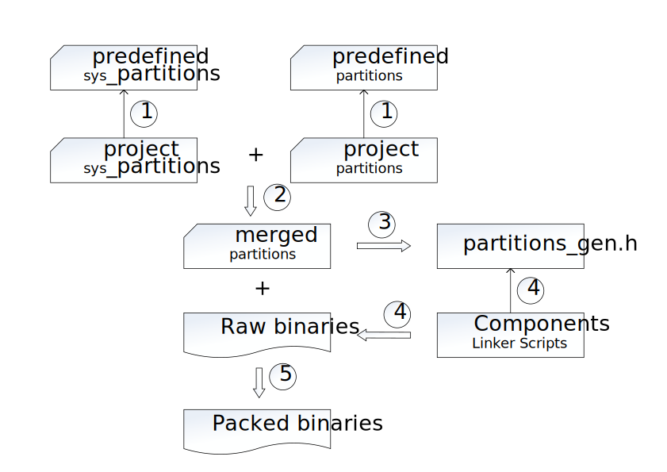
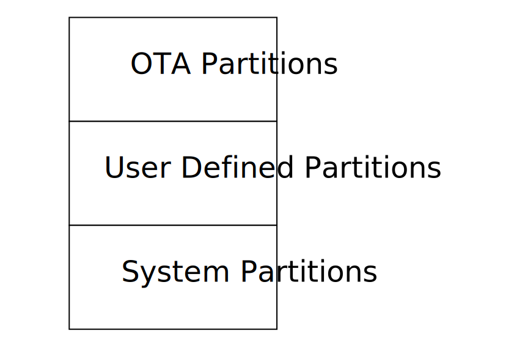
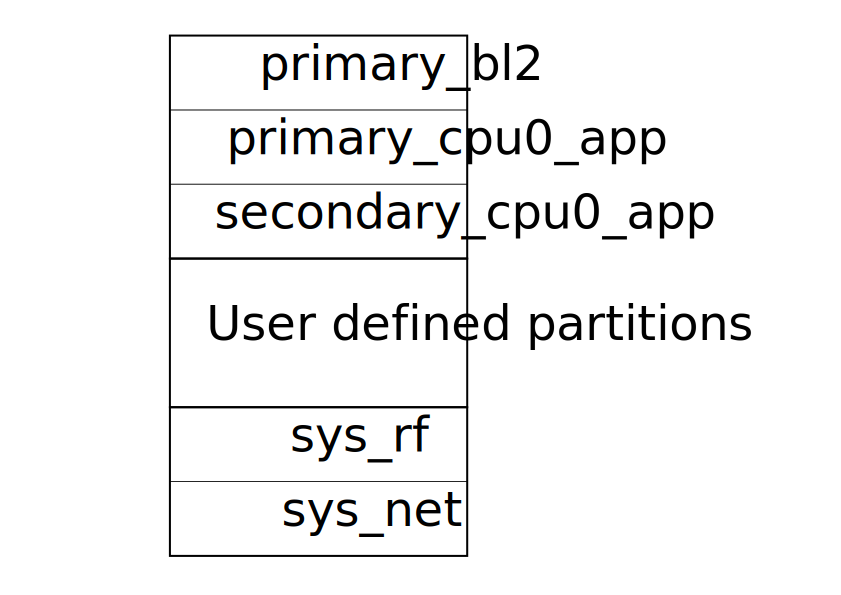

分区设计与配置
========================

.. note::

  本节中 `BL1` 特指固化在芯片中的 BootROM，`BL2` 特指 Bootloader，即 mcuboot。

分区设计目的
----------------------------

BK7236 分区管理主要实现两个目：

 - 提供全局且唯一的 FLASH 分区配置入口，当配置发生变更时，
   仅需变更分区配置表，而无需更改链接脚本及源代码。
 - 将地址管理隐藏在分区表中，用户仅需关注物理分区大小，而无需考虑虚拟地址及对齐问题。

分区设计目的
----------------------------

分区管理以 ``分区配置表`` 为基础，整个过程糅合在构建中。构建时，构建系统会对分区配置表进行二轮扫描，
首轮扫描生成 partitions_gen.h，其内定义各分区偏移及长度，供 Armino 组件及工程链接时用。
次轮扫描主要是依据分区配置对 BIN 进行打包，包括加 CRC，加密，加签，生成 app/ota 包等。

具体的流程如下图所示。

各步骤描述如下：

 - 1 - 如果相应的工程分区配置表存在，则优先使用工程分区配置表，否则使用默认分区配置表：
 
   - 默认分区配置放在 ``middleware/boards/bk7236/partitions`` 中，其中 sys_partitions
     为默认系统分区表，partitions 为默认普通分区表。
   - 工程区配置表放在为工程 config/partition 目录下，名字同默认分区配置表。
 - 2 - 首轮扫描时，合并系统与普通分区表，该表包含 FLASH 全部分区。
 - 3 - 基于合并的分区表，生成 ``partitions_gen.h``，该头文件中最重要的信息是分区的偏移与大小。
 - 4 - 各工程的链接脚本或者组件使用 ``partitions_gen.h`` 的定义进行编译，链接，生成原始的二进制文件。
 - 5 - 构建系统再次扫描分区配置表，依据分区表中的配置调用相应的 CRC，AES 以及加签工程对二进制文件进行
   CRC，AES 及加签处理。

分区规划
----------------------------

如上图所示，BK7236 FLASH 宏观上划分成三大块：

 - ``OTA 区`` - 系统运行代码，OTA 下载及安全启动时签名等控制信息放在这个区。 
 - ``用户区`` - 用于放置用户定义的各类分区。
 - ``系统区`` - 用于放置系统配置信息，如 RF 校准分区等。

下载模式分区规划
++++++++++++++++++++++++++++

上图为支持升级功能的下载模式分区规划。系统上电之后，先由 BL1 跳转到 BL2，然后 BL2 跳转到 CPU0 APP。

.. note::

  如果不需要 OTA 功能，也可以不包含 BL2。

安全启动分区规划
++++++++++++++++++++++++++++

.. figure:: picture/partition_layout_secureboot.svg
    :align: center
    :alt: 8                                                                                           
    :figclass: align-center

当安全启动使能之后，默认配置如上图所示：

 - ``bl1_control`` - 用于 BL1 控制，包括硬件重启时跳转地址配置，OTP 模拟，BL1 调试等。
 - ``primary_manifest`` - 对 ``primary_bl2`` 的加签信息放在这个分区，系统上电后，如果 ``boot_flag`` 为
   ``primary_bl2``，则 BL1 会依据这个分区的内容对 ``primary_bl2`` 进行验签，验签通过才跳转到 BL2。
 - ``secondary_anifest`` - 对 ``secondary_bl2`` 的加签信息放在这个分区，系统上电后，如果 ``boot_flag`` 为
   ``secondary_bl2`` - 则 BL1 会依据这个分区的内容对 ``secondary_bl2`` 进行验签，验签通过才跳转到 BL2。
 - ``primary_bl2`` - BL2 二进制文件，其加签信息放在 ``primary_manifest``。
 - ``secondary_bl2`` - BL2 二进制文件，其加签信息放在 ``secondary_anifest``。
 - ``primary_tfm_s`` - Primary TFM_S 二进制文件。
 - ``primary_cpu0_app`` - Primary CPU0 APP 二进制文件。
 - ``secondary_tfm_s`` - Secondary TFM_S 二进制文件。
 - ``secondary_cpu0_app`` - Secondary CPU0 APP 二进制文件。

系统上电之后，BL1 依据 ``boot_flag`` 的值对

.. note::

  为了支持 BL2 的升级，设计了 ``primary_bl2`` 与 ``secondary_bl2``。如果产品中确定不需要支持 BL2 升级，
  可以去掉 ``secondary_bl2``。

分区合并
----------------------------

假设用户使用默认的系统分区，重新定义普通分区如下。其中 ``boot_mode`` 配置成 ``secureboot``。

.. code::

  {
    "description":   "Secureboot: bl1->bl2->tfm_s->armino cpu0 app",
    "aes_key":       "73c7bf397f2ad6bf4e7403a7b965dc5ce0645df039c2d69c814ffb403183fb18",
    "bl2_slot_type": "single",
    "boot_mode": "secureboot",

    "partitions": 
    [
    { "partition": "primary_bl2",      "size": "128k", "bin": "bl2.bin",   "verifier":  "bl1"},
    { "partition": "secondary_bl2",    "size": "128k", "bin": "bl2.bin",   "verifier":  "bl1"},
    { "partition": "primary_tfm_s",    "size": "512k", "bin": "test1.bin", "verifier":  "bl2"},
    { "partition": "primary_cpu0_app", "size": "2304k","bin": "test2.bin", "verifier":  "bl2"}
    ]
  }

默认系统分区如下：

.. code::

 {
    "partitions": [
    { "partition": "bl1_control",        "size": "12k", "bin": "bl1_control.bin",        "bin_type":  "data", "owner": "secureboot"},
    { "partition": "primary_manifest",   "size": "4k",  "bin": "primary_manifest.bin",   "bin_type":  "data", "owner": "secureboot"},
    { "partition": "secondary_manifest", "size": "4k",  "bin": "secondary_manifest.bin", "bin_type":  "data", "owner": "secureboot"},
    { "partition": "sys_scratch",        "size": "32k", "owner": "secureboot", "security": "s"},
    { "partition": "sys_ps",             "size": "32k", "owner": "secureboot", "security": "s"},
    { "partition": "sys_its",            "size": "32k", "owner": "secureboot", "security": "s"},
    { "partition": "sys_rf",             "size": "4k", "security": "ns"},
    { "partition": "sys_net",            "size": "4k", "security": "ns"}
    ]
 }

合并规则：

 - 会选择 ``owner`` 未配置或者为 ``secureboot`` 的分区与普通分区进行合并。
 - 前三个分区属于 OTA 区中的分区，但因为安全启动必须包含，因此放在系统分区配置表中。合并时会放在合并分区首部。
 - 以 sys 为前缀的分区会合并到合并分区的尾部。

合并后的配置表如下:

.. code::

  {
    "description":   "Secureboot: bl1->bl2->tfm_s->armino cpu0 app",
    "aes_key":       "73c7bf397f2ad6bf4e7403a7b965dc5ce0645df039c2d69c814ffb403183fb18",
    "bl2_slot_type": "single",
    "boot_mode": "secureboot",

    "partitions": 
    [
    { "partition": "bl1_control",        "size": "12k", "bin": "bl1_control.bin",        "bin_type":  "data", "owner": "secureboot"},
    { "partition": "primary_manifest",   "size": "4k",  "bin": "primary_manifest.bin",   "bin_type":  "data", "owner": "secureboot"},
    { "partition": "secondary_manifest", "size": "4k",  "bin": "secondary_manifest.bin", "bin_type":  "data", "owner": "secureboot"},
    { "partition": "primary_bl2",      "size": "128k", "bin": "bl2.bin",   "verifier":  "bl1"},
    { "partition": "secondary_bl2",    "size": "128k", "bin": "bl2.bin",   "verifier":  "bl1"},
    { "partition": "primary_tfm_s",    "size": "512k", "bin": "test1.bin", "verifier":  "bl2"},
    { "partition": "primary_cpu0_app", "size": "2304k","bin": "test2.bin", "verifier":  "bl2"},
    { "partition": "sys_scratch",        "size": "32k", "owner": "secureboot", "security": "s"},
    { "partition": "sys_ps",             "size": "32k", "owner": "secureboot", "security": "s"},
    { "partition": "sys_its",            "size": "32k", "owner": "secureboot", "security": "s"},
    { "partition": "sys_rf",             "size": "4k", "security": "ns"},
    { "partition": "sys_net",            "size": "4k", "security": "ns"}
    ]
  }

分区生成宏
----------------------------

数据分区宏生成
+++++++++++++++++++++++++

分区表中分区，均会在 partitions_gen.h 中生成一组宏。对于数据或者系统分区，仅生成分区偏移及大小，
以 ``sys rf` 与 ``sys net`` 为例：

.. code::

  #define CONFIG_SYS_RF_PHY_PARTITION_OFFSET            0x3fe000
  #define CONFIG_SYS_RF_PHY_PARTITION_SIZE              0x1000
  
  #define CONFIG_SYS_NET_PHY_PARTITION_OFFSET           0x3ff000
  #define CONFIG_SYS_NET_PHY_PARTITION_SIZE             0x1000

代码分区
+++++++++++++++++++++++++

包含 BIN 的代码分区除了要生成数据分区中的分区偏移与大小外，还要生成用于构建 BIN 使用的链接地址。
以 primary_bl2 分区为例，partitions_gen.h 中会生成宏如下：

.. code::

 #define CONFIG_PRIMARY_BL2_PHY_PARTITION_OFFSET       0x24000
 #define CONFIG_PRIMARY_BL2_PHY_PARTITION_SIZE         0x10000
 #define CONFIG_PRIMARY_BL2_PHY_CODE_START             0x24068
 #define CONFIG_PRIMARY_BL2_VIRTUAL_PARTITION_SIZE     0xf0e0
 #define CONFIG_PRIMARY_BL2_VIRTUAL_CODE_START         0x21e80
 #define CONFIG_PRIMARY_BL2_VIRTUAL_CODE_SIZE          0xf060

这些宏被用在 bl2.bin 的链接，bl2 及 OTA 源代码中。

BL2 分区图示如下:

.. figure:: picture/one_partition.png
    :align: center
    :alt: 8                                                                                           
    :figclass: align-center

生成宏计算方式:

 - ``CONFIG_PRIMARY_BL2_PHY_PARTITION_OFFSET`` - 分区的起始物理地址为 0x24000，由 partitions 定义。
 - ``CONFIG_PRIMARY_BL2_PHY_CODE_START`` - 自动计算生成，为 0x21e80，会加 CRC。
 
   - 偏移 0x24000 处即可放置代码，但需要考虑对齐：

     - CRC 对齐，对齐后物理地址为 ((0x24000 + 33)/34)*34 = 0x24002, 虚拟地址为 0x21e20。
     - CPU 向量对齐，CM33 为 128B 对齐， ((0x21e20 + 127)/128)*128 = 0x21e80，相应的物理地址为: 0x24068。
 - ``CONFIG_PRIMARY_BL2_VIRTUAL_CODE_SIZE`` - 自动计算生成，为 0xf060
 
   - 对齐浪费空间为 0x24068 - 0x24000 = 0x68，剩余: 0x10000 - 0x68 = 0xff98
   - 再减 34B 保护字节: 0xff98 - 34 = 0xff76
   - 转虚拟长度： (0xff76/34)*32 = 0xf060

.. important::

  从上述计算可知，并非整个代码分区都能用来放置代码，因为要考虑 CRC 与 CPU vector 对齐。对于使用 BL2
  进行验签的分区还要去掉头尾各 4K 空间（用于放置加签信息）。如果编译了同来的 bin 大小为 bin_size，
  建议 partition size 至少要配置: (bin_size/32)x34 + hdr_size + tail_size + 128 + 34 + unused_size。 
  其中 unused_size 为预留给未来 bin 增长的空间。在这个基础之后再做 4K 对齐。

保留分区
----------------------------

保留分区如下：

 - ``primary_cpu0_app`` - 链接 Armino CPU0 APP 时，使用地址 ``CONFIG_PRIMARY_CPU0_APP_VIRTUAL_CODE_START``。
 - ``primary_tfm_s`` - 链接 tfm_s 时，使用地址 ``CONFIG_PRIMARY_TFM_S_VIRTUAL_CODE_START``。
 - ``primary_bl2`` - 链接 bl2 时，使用地址 ``CONFIG_PRIMARY_BL2_VIRTUAL_CODE_START``。
 - 在默认系统分区中定义的系统分区均为保留分区，如 ``sys_rf``, ``sys_net`` 等，其生成宏会在工程源文件中直接引用。

