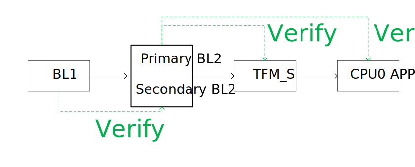
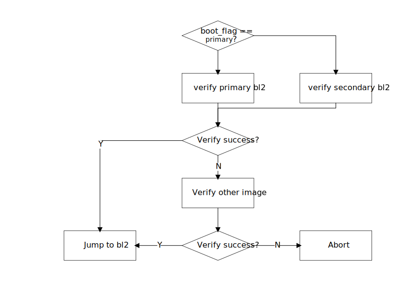
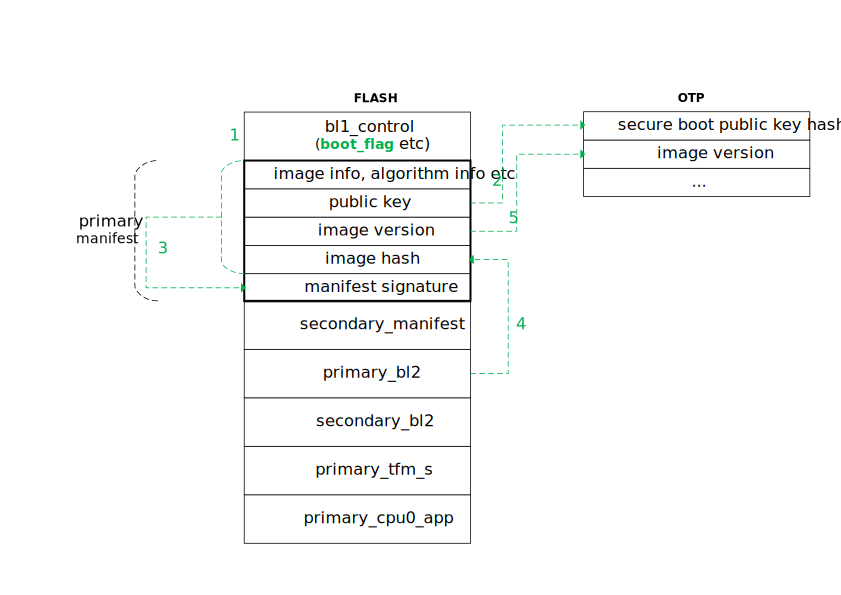
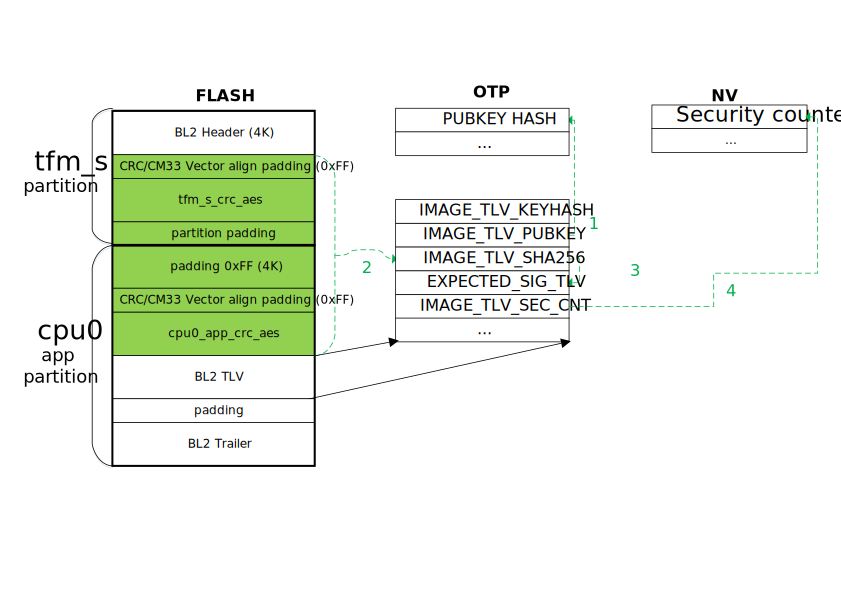

安全启动
======================

安全启动用于对要执行的程序进行校验，只有在确保程序合法且完整时下才允许启动系统，否则启动失败。
安全启动是系统的安全基础。

概述
----------------------

BK7236 支持传统下载模式与安全启动模式。当 EFUSE BIT(3) 为 0 时为传统下载模式，为 1 时为安全启动模式。

如上图所示，BK7236 安全启动分两阶段。系统上电之后，固化在芯片中的 BL1 先对 BL2 验签，验签通过之后跳转到 BL2；
然后 BL2 对其他所有程序进行验签。

BL1 启动流程
----------------------

为支持 BL2 升级，FLASH 中设有 Primary BL2 与 Secondary BL2，并通过存放在 FLASH 中的 boot_flag 来
指示应该优先选择哪份 BL2 进行启动。启动流程如上图所示，当优先的 BL2 验签成功时，从优先的 BL2 启动；
否则偿试对非优先 BL2 进行验签，如果验签成功，则从非优先 BL2 进行启动，并更新 boot_flag；如果两份 BL2
均验签失败，则启动中止。

上图描述了 BL1 对单个 BL2 验签的流程（以 Primary BL2 为例）：

 - 1 - boot_flag 指示优先验签的 BL2 为 primary_bl2，准备对 primary_bl2 进行验签。
 - 2 - BL1 先从 FLASH 固定位置读取 primary_manifest，primary_manifest 放在 primary_manifest 分区，
   其中打包了 BL1 在验签时需要的所有信息，包括加签算法，image HASH 算法，image 版本，公钥等。BL1 先
   读出安全启动公钥，计算出公钥 HASH，然后与固化在 OTP 中的公钥 HASH 进行对比，如果相同，则继续，否则，
   验签失败。
 - 3 - BL1 使用第 2 步中验证合法的公钥对 primary_manifest 进行验签。其中 manifest signature 是对除
   manifest signature 外 primary_manifest 中所有信息的签名。如果验签通过，则继续；否则，验签失败。
 - 4 - BL1 使用 primary_manifest 中指定的 HASH 算法（SHA256）对 primary_bl2 计算 HASH，然后与 primary_manifest
   中的 image hash 进行比较，如果相同则继续，否则，验签失败。
 - 5 - 如果 primary_manifest 中 image version 不小于 OTP 中的 image version，则验签成功，否则，验签失败。

BL2 启动流程
----------------------

BK7236 BL2 为开源 MCUBOOT 1.9.0，因此验签流程保持与官方 MCUBOOT 一致。本节仅对 BK7236 配置特别点及
MCUBOOT 验签流程做概述，如果想了解 MCUBOOT 详细验签流程，或者 MCUBOOT 其他功能，如升级，防回
滚等，可参考 `MCUBOOT 官网 <https://docs.mcuboot.com>`_。

如上图所示，BL2 要验签的对象为 tfm_s.bin 与 app.bin (即 CPU0 APP)，分别放在 tfm_s 与 cpu0_app 两个
FLASH 分区中，构建系统加签步骤为：

 - 首先对 tfm_s.bin/app.bin 进行 AES 加密，加 CRC，形成 tfm_s_crc_aes.bin/cpu0_app_crc_aes.bin。
 - 然后将 tfm_s_crc_aes.bin/cpu0_app_crc_aes.bin 放置在 partition 中，并增加相应的 padding。
 - 接着使用 MCUBOOT 加签工具对合并且 padding 后的 image（见上图浅绿色部分）进行加签。

.. note::

 BK7236 MCUBOOT 加签特别点是不能简单地合并两个 BIN 之后加签，必须先增加 padding，然后再
 合并，这是因为需要考虑 FLASH CRC，增加 padding 的目的是确保 BIN 的起始地址落在 FLASH 的
 CRC 块对齐，且 BIN Vector Table 512 字节对齐上。 

MCUBOOT 的验签流程可概述如下：

 - 1 - 首先读取 BL2 TLV 中的 IMAGE_TLV_PUBKEY 或 IMAGE_TLV_KEYHASH，与 OTP 中 PUBKEY_HASH 对比，如果相同
   则继续，否则验签失败。
 - 2 - 计算合并 IMAGE 的 HASH，与 TLV 中 IMAGE_TLV_SHA256 对比，相同则继续，否则验签失败。
 - 3 - 使用步骤 1 中的公钥，对 TLV 中 EXPECTED_SIG_TLV 进行验签，验签通过则继续，否则失败。
 - 4 - TLV 中 IMAGE_TLV_SEC_CNT 不小 NV 中的 security counter，则验签成功，否则失败。

安全启动配置
----------------------

S1 - 生成密钥
+++++++++++++++++++++

.. important::

  FLASH AES KEY，BL1/BL2 私钥是系统安全的保证，请妥善保管！

BL1 密钥
*********************************

可通过 openssl 生成 BL1 密钥对。

EC256 私钥生成方法::

  openssl ecparam -name secp256r1 -genkey -out ec256_privkey.pem 

EC256 公钥生成方法::

  openssl ec -in ec256_privkey.pem -inform PEM -out ec256_pubkey.pem -pubout

EC521 与 EC256 类似，只需将 name 参数由 secp256r1 改成 secp521r1 即可。

.. note::

 BL1 使用 EC521 验签的时间是 EC256 的 2 倍以上，一般建议使用 EC256。

RSA1024 私钥生成方法::

  openssl genrsa -out rsa1024_privkey.pem 1024

RSA1024 公钥生成方法::

  openssl rsa -in rsa1024_privkey.pem -inform PEM -out rsa1024_pubkey.pem -pubout

RSA2048 与 RSA1024 类似，只需将公钥对长度由 1024 改成 2048 即可。

这一步生成的公钥对需要配置到安全启动配置表与 OTP 中。

BL2 密钥
*********************************

BL2 密钥通过 ./tools/env_tools/mcuboot_tools/imgtool.py 生成：

.. code::

  ./tools/env_tools/mcuboot_tools/imgtool.py keygen -k filename.pem -t rsa-2048

密钥类型还可选择 rsa-3072, ecdsa-p256, or ed25519。还可以通过 -p 选项来对 BL2 密钥进行保护，
-p 选项会提示输入一个密码。通过这种方式生成的 BL2 密钥，后续每次使用时，都要求输入一个密码。

可通过 `MCUBOOT imgtool <https://docs.mcuboot.com/imgtool.html>`_ 进一步了解 MCUBOOT imgtool。

生成密钥之后，还需要将密钥配置到分区表与 OTP 中。可通过配置 `primary_bl2` 分区中的 `verify_algorithm`
来配置签名类型，配置 `primary_bl2` 分区中的 `pubkey` 与 `privkey` 指定生成的公/私钥文件。

这一步生成的公钥对需要配置到安全启动配置表与 OTP 中。

**TODO: 描述将公钥集成到 MCUBOOT or 公钥 HASH 集成到 OTP 中的方法。**

FLASH 密钥
*********************************

FLASH AES 密钥为 64 字节随机数，您可使用任意足够随机的字节作为 FLASH AES KEY，或者通过
Armino 自带工具生成：

.. code::

  ./tools/env_tools/beken_packager/cmake_xts_aes genkey 64 -outfile key.txt

这一步生成的 FLASH AES KEY 需要配置到安全启动配置表与 OTP 中。

S2 - 配置分区表与编译
+++++++++++++++++++++++++++++++++++++

分区配置表中与安全启动相关的配置有：

 - ``aes_key`` - 将步骤 S1 中生成的 FLASH AES KEY 配置到分区表。
 - BL1 key - 将步骤 S1 中生成的 BL1 KEY 配置到分区表，涉及字段 ``bl1_key_type``, ``bl1_pubkey``, ``bl1_privkey``。
 - BL2 key - 将步骤 S1 中生成的 BL2 KEY 配置到分区表，涉及字段 ``bl2_key_type``, ``bl2_pubkey``, ``bl2_privkey``。

请参考 :ref:`分区配置<partitions_config>` 中方法来配置上述配置项。

S3 - 配置 OTP
+++++++++++++++++++++++++++++++++++++

通过 BKFIL 将下述密钥部署到 OTP 中：

 - FLASH AES KEY。
 - BL1 安全启动公钥 HASH。
 - BL2 安全启动公钥 HASH。

请参考 :ref:`OTP EFUSE 配置<provisioning_otp_efuse>` 中方法来配置上述 OTP 项。

S4 - 烧录版本
+++++++++++++++++++++

通过 BKFIL 烧录安全启动代码。

S5 - 使能安全启动
+++++++++++++++++++++

当版本成功烧录后，可以使能安全启动与 FLASH 加密功能。请参考 :ref:`OTP EFUSE 配置<provisioning_otp_efuse>` 中方法来配置上述 OTP 项。

.. important::

  安全启动使能前请确保烧录的版本支持 OTA，这可通过在下载模式下进行验证。

S6 - 使能更多安全开关
++++++++++++++++++++++++++

部署完 S1~S5 之后，可打开更多安全开关，例如关闭 BL1 调试模式，禁用 SPI 等。

.. important::

  在尚未成功在任何板子上部署某个安全启动版本前，建议先不要关闭 BL1 调试模式，通过
  BL1 打印信息可更快定位安全启动失败原因。同时，也建议不要禁用 SPI，因为一旦安全启动
  使能，就无法通过 UART 下载版本，这些，如果安全启动部署失败，还可通过 SPI 烧录版本。
  在确认 S1~S5 准确无误之后再关闭 BL1 调试模式，禁用 SPI 等。

.. note::

  当使用上述步骤在某块板子上成功配置了安全启动之后，可以将步骤 S4~S6 合并成一步，通过
  BKFIL 将安全启动版本，OTP 密钥配置以及 EFUSE 安全开关使能一次性部署到板子上。通常工
  厂部署量产版本时，建议使用合并步骤简化部署流程。
