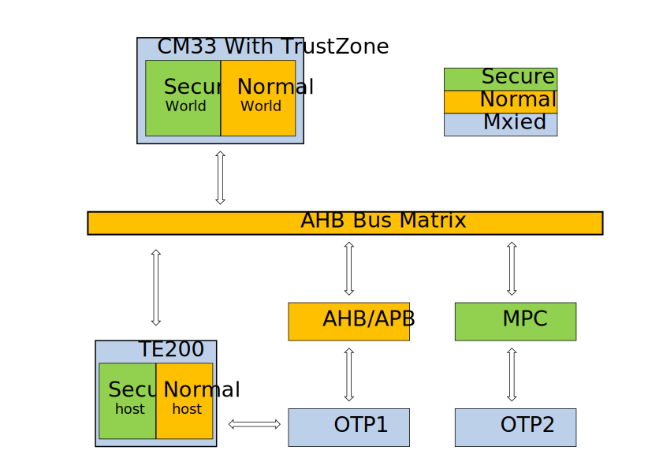

安全引擎
=====================

概述
---------------------

BK7236采用了TE200（TrustEngine-200）作为硬件加速引擎，提供下述安全特性：

 - 高度安全保障。TE200 支持密钥阶梯、生命周期管理和真随机数发生器（TRNG），以提升系统的安全性。
 - 高性能和低功耗的加密/解密操作。这是通过 TE200 内部的加密引擎实现的。
 - 减少安全方面的软件复杂性。TE200 实现了一些安全功能，如生命周期管理，对 OTP1 的访问控制，
   可以减少敏感信息泄漏给非安全主机的风险。

TE200 在系统中位置
---------------------

TE200 在系统中位置如下图所示，

在 BK7236 中，TE200 配置成安全主机与普通主机，其中：

 - 安全主机 - 主要用于 BL1，BL2 中的安全启动，TFM-S 中安全据加/解密，签名/验签等。
 - 普通主机 - 主要用于非安全世界，如 Wi-Fi，TCPIP 通信等应用中的加/解密，签名/验签等。

对于 OTP1 中与安全启动相关的配置信息也是经由 TE200 访问。对于 OTP1 的访问，TE200 实现
了基于生命周期权限管理。

TE200 功能
---------------------

TE200 支持下述特性：

 - 对称加密算法：AES-ECB/CBC/CTR/CBC-MAC/CMAC/CCM/GCM（密钥长度为128位、192位和256位）。
 - 对称加密算法：SM4-ECB/CBC/CTR/CBC-MAC/CMAC/CCM/GCM。
 - 散列算法：SHA1/224/256。
 - 散列算法：SM3。
 - 非对称加密算法：RSA 1024/2048/3072/4096 和 ECCP 192/224/256/384/512/521。
 - 非对称加密算法：SM2。
 - 密钥阶梯用于密钥管理。
 - 生命周期管理。
 - 真随机数发生器。
 - 一次性编程（OTP）。

它符合以下标准：

 - FIPS PUB 180-4：安全散列标准（SHS）
 - FIPS PUB 197：高级加密标准（AES）
 - NIST SP 800-38A：块密码工作模式的推荐方法和技术
 - NIST SP 800-38B：块密码工作模式协议——用于认证的CMAC模式
 - NIST SP 800-38C：块密码工作模式协议——用于认证和保密的CCM模式
 - NIST SP 800-38D：块密码工作模式协议——Galois/Counter Mode（GCM）和GMAC
 - NIST SP 800-90B：用于随机比特生成的熵源协议
 - GB/T 32918-2016：SM2椭圆曲线公钥密码算法
 - GB/T 32905-2016：SM3密码散列算法
 - GB/T 32907-2016：SM4块密码算法

其中：SM2公钥密码、SM3密码散列算法和SM4块密码算法是中国国家标准。
