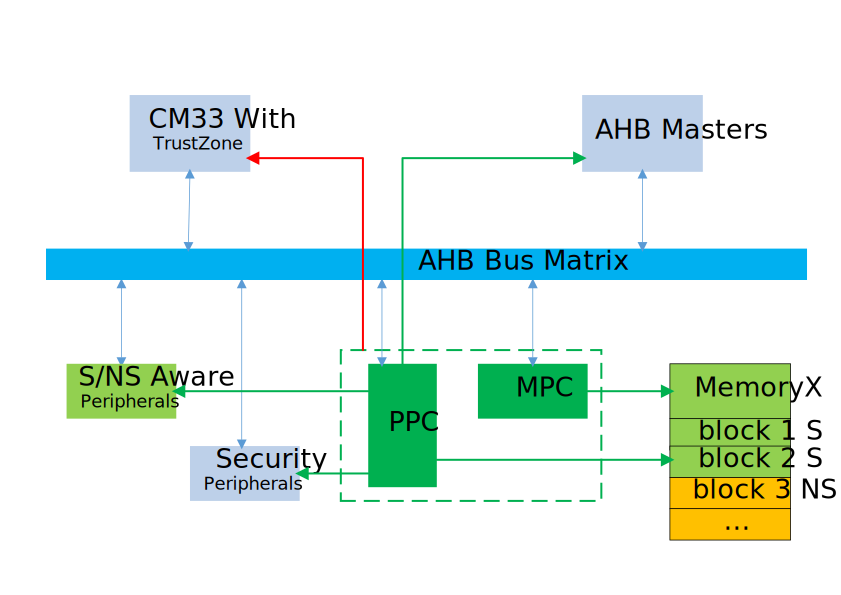
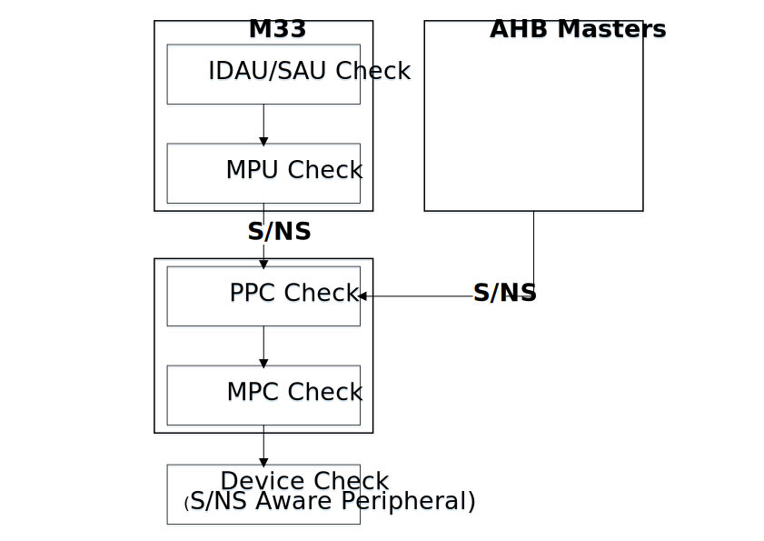
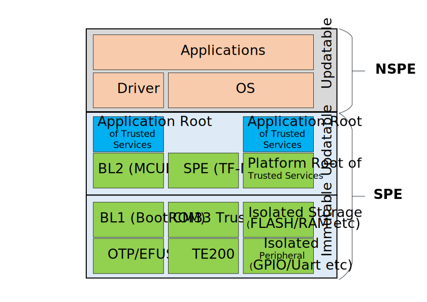

安全概述
=====================

硬件安全架构
----------------------

如上图所示，BK7236 安全以 M33 为基础。M33 通过 TZ 机制新增了一个维度：安全（S）与非安全（NS）。
即，在一个 CPU 核上隔离出两个世界：安全世界（S）与非安全世界（NS）。BK7236 通过 PPC 与 MPC 模块将
M33 中 S/NS 的概念扩展到了整个 SoC 系统。其中 PPC 用于配置总线上设备的 S/NS 及 P/NP；MPC 用于配置
内存设备上不同块的 S/NS 属性。

BK7236 上安全访问规则可以通过下图来概述：

安全访问规则：

 - AHB Master 请求在通过 AHB Master 自身安全规则检查之后，携带 S/NS 信号来到 AHB 总线上：
 
  - Master 为 M33 时，访问地址先经过 IDAU/SAU 审查，审查通过之后再经 MPU 审查，最后才去到总线上。
  - Master 为其他设备时，如果 Master 被 PPC 配置成 S，则为 S 访问，否则为 NS 访问。

 - 从 AHB Master 上过来 S/NS 请求，接下来由 BK7236 安全控制审查：
 
  - 首先是 PPC 审查，一般规则是，NS 仅能访问 PPC 配置为 NS 的外设，S 能访问 S/NS 外设（或者仅能访问 S 外设）。
  - 对于块内存访问，由 MPC 进一步审查，审查规则是，S 请求能访问 S/NS 块，NS 请求仅能访问 NS 块。

 - 通过 PPC/MPC 审查后，访问请求才来到目标外设上：
 
  - 如果目标外设自身体无法识别 S/NS 信号，则直接访问目标外设。
  - 如果目标外设自身能识别 S/NS 信号（S/NS Aware 外设），则目标外设对请求进行最后的安全审查。

其中任何安全审查失败，访问均会中止，并产生安全异常（或者不产生异常，仅仅是访问失效）。

.. note::

  在 BK7236 中，S/NS Aware 外设有 FLASH，DMA，TE200 等。

M33 安全访问
++++++++++++++++++++++

在 CM33 中，CPU 访问地址会先经过 IDAU/SAU 安全检查，检查不通过，则产生安全异常，
检查通过则再由 MPU 进行安全检查，MPU 检查通过后携带 S/NS 信号去到总线矩阵。

在 BK7236 中，IDAU 设置如下图所示：

.. figure:: picture/security_idau.svg
    :align: center
    :alt: 8                                                                                           
    :figclass: align-center

PPC 控制 - 设备安全访问
++++++++++++++++++++++++++++++++++++++++++

PPC 是 BK7236 SoC 外设安全控制中心，它配置外设的 S/NS 和 P/NP 属性。

实现概述如下：

 - 外设 AON_WDT，AON_REG，AON_GPIO，AON_RTC 只有安全属性，没有特权属性，且非法访问时只能返回 RESP 信号，不可配置。
 - AON_GPIO 的安全属性是按每一个管脚配置的。
 - 安全非法访问可产生异常中断。
 - 特权非法访问会产生静默失败操作。
 - 三组地址/数据值比较寄存器，用于支持故障注入攻击，当前用于安全启动中。

从 AHB 总线过来的 S/NS 信号在访问外设时，先经过 PPC 检查，规则如下：

+------+---------+--------+
| AHB  | PPC     | Access |
+======+=========+========+
| S    | S       | **Y**  |
+------+---------+--------+
| S    | NS      | **Y**  |
+------+---------+--------+
| NS   | S       | N      |
+------+---------+--------+
| NS   | NS      | **Y**  |
+------+---------+--------+

MPC 控制 - 块内存安全访问
+++++++++++++++++++++++++++++++++++++++++++++

对于块存储设备，除了通过 PPC 来配置设备级的安全属性之外，还可以进一步通过 MPC 按
块来配置块的安全属性。

MPC 是一个基于块的门控单元，用于检查存储设备的访问的安全属性和地址的安全映射之间的对应关系。
每一个 MPC 主体被划分为多个块，并使用一个表来查询访问地址的安全映射。其工作原理如下：

 - 提供表的最大索引和块的大小。
 - 使用一个表 LUT（lookup table）对每一个块进行安全映射/查询安全映射关系。
 - 门控失败将使访问操作为 RAZ/WI(Read-As-Zero/Write-Ignored)，或者产生一个总线故障(BusFault)。

BK7236 下述设备可通过 MPC 按块配置其安全属性：

+---------+------------+---------+-------------------+------------------+
| Device  | block_size | blk_max | block0 1st bytes  | block0 last byte |
+=========+============+=========+===================+==================+
| PSRAM   | 256KB      | 7       | 0x60000000        | 0x6003ffff       |
+---------+------------+---------+-------------------+------------------+
| QSPI0   | 256KB      | 7       | 0x64000000        | 0x6403ffff       |
+---------+------------+---------+-------------------+------------------+
| QSPI1   | 256KB      | 7       | 0x68000000        | 0x6803ffff       |
+---------+------------+---------+-------------------+------------------+
| FLASH   | 64KB       | 7       | 0x60000000        | 0x6003ffff       |
+---------+------------+---------+-------------------+------------------+
| OTP2    | 256B       | 0       | 0x4b010000        | 0x4b0100ff       |
+---------+------------+---------+-------------------+------------------+

对于块存储设备，安全世界可访问 MPC 安全属性配置为 S 或 NS 的块，但非安全世界
仅能访问 MPC 安全性配置为 NS 的块。具体的访问规则如下表所示：

+------+---------+-------+---------+
| CPU  | Address | Device| Access  |
+======+=========+=======+=========+
| S    | S       | S     | **Y**   |
+------+---------+-------+---------+
| S    | S       | NS    | N       |
+------+---------+-------+---------+
| S    | NS      | S     | N       |
+------+---------+-------+---------+
| S    | NS      | NS    | **Y**   |
+------+---------+-------+---------+
| NS   | S       | S     | N       |
+------+---------+-------+---------+
| NS   | S       | NS    | N       |
+------+---------+-------+---------+
| NS   | NS      | S     | N       |
+------+---------+-------+---------+
| NS   | NS      | NS    | **Y**   |
+------+---------+-------+---------+

AHB 主设备访问规则
+++++++++++++++++++++++++++++++++++++

BK7236 AHB 总线矩阵上有两类 AHB 主设备：

 - 通用 DMA - 为 S/NS Aware 的主设备，访问规则请参考 DMA 安全访问。
 - 其他 AHB 主设备 - 其他 AHB 主设备，其安全属性由 PPC 决定。

AHB 主设备访问请求从 AHB 出来，去到从设备之前，会先经过 PPC，由 PPC 做
安全属性检查后，决定是否允许访问从设备。检查规则请参考 PPC 安全访问。

SPI/QSPI 安全访问
++++++++++++++++++++++++++++++++++++++

SPI/QSPI 外接片外设备访问由 SPI/QSPI 安全属性决定。

FLASH 安全访问
++++++++++++++++++++++

.. figure:: picture/security_flash.svg
    :align: center
    :alt: 8                                                                                           
    :figclass: align-center

如上图所示，BK7236 访问片上 FLASH 有两种方式：

 - 指令口 - 通过 FLASH 控制器访问 FLASH，此时 FLASH 控制器会加/去 CRC，加/解密处理。
 - 数据口 - 通过内部 SPI 直接访问。

当经由数据口访问 FLASH 时，FLASH 作为一个 S/NS Aware 设备，仅当 AHB 总线过来的信号安全
属性与 FLASH 本身安全属性相匹配时才允许访问。

对于 FLASH 数据口，安全世界仅可访问 FLASH 自身配置成 S 的地址空间，但非安全世界
仅能访问FLASH 自身配置成 S 的地址空间。具体的访问规则如下表所示：

+------+---------+-------+---------+
| CPU  | Address | FLASH | Access  |
+======+=========+=======+=========+
| S    | S       | S     | **Y**   |
+------+---------+-------+---------+
| S    | S       | NS    | N       |
+------+---------+-------+---------+
| S    | NS      | S     | N       |
+------+---------+-------+---------+
| S    | NS      | NS    | N       |
+------+---------+-------+---------+
| NS   | S       | S     | N       |
+------+---------+-------+---------+
| NS   | S       | NS    | N       |
+------+---------+-------+---------+
| NS   | NS      | S     | N       |
+------+---------+-------+---------+
| NS   | NS      | NS    | **Y**   |
+------+---------+-------+---------+

.. note::

 FLASH 指令口访问规则请参考块设备访问规则。

DMA 安全访问
++++++++++++++++++++++

DMA 属于 S/NS Aware 的，其安全访问规则如下：

+------+---------+----------+---------+--------+
| DMA  | Channel | SRC      | DST     | Access |
+======+=========+==========+=========+========+
| S    | S       | S or NS  | S or NS | **Y**  |
+------+---------+----------+---------+--------+
| S    | NS      | S        | S or NS | N      |
+------+---------+----------+---------+--------+
| S    | NS      | S or NS  | S       | N      |
+------+---------+----------+---------+--------+
| S    | NS      | NS       | NS      | **Y**  |
+------+---------+----------+---------+--------+
| NS   | NS      | NS       | NS      | **Y**  |
+------+---------+----------+---------+--------+
| NS   | -       | -        | -       | N      |
+------+---------+----------+---------+--------+

软件安全架构
----------------------

BK7236 被隔离成安全世界（SPE）与非安全世界（NSPE）。

安全世界又分不可升级变部分和可升级两部分，其中不可升级部分包括 BL1 和安全硬件，
如 CM33，OTP，安全存储，安全外设，安全引擎等等。可升级部分主要由 BL2，TFM 与
安全服务组成。

非安全世界包括驱动，OS，与各种 Armino 组件及应用。

BL1 - BootROM
++++++++++++++++++++++++++++++++

BK7236 BL1 以安谋公司山海安全套件中的 BootROM 为基础，属于闭源软件。

BL2 - MCUBOOT
++++++++++++++++++++++++++++++++

BL2 采用 MCUBOOT。您可通过 `MCUBOOT 官网 <https://docs.mcuboot.com>`_ 进一步了解 TF-M。

SPE - TF-M
++++++++++++++++++++++++++++++++

SPE 采用开源软件 TF-M 1.6.0。可通过 `TF-M 官网 <https://www.trustedfirmware.org/projects/tf-m/>`_
进一步了解 TF-M。

