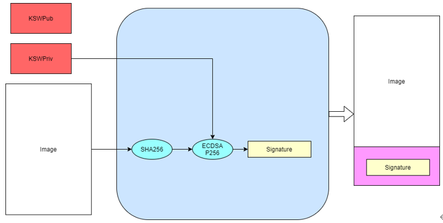

安全功能应用指南
=====================

:link_to_translation:`en:[English]`

设计说明
+++++++++++++++++++++
 BK7237的安全功能基于BK130，实现了security boot与flash加解密等功能。

 - security boot基于BOOT ROM的信任链延申，在BOOT ROM中对bootloader bin进行验签，在bootlaoder bin中对app bin进行验签，保证bootloader和app的真实性+完整性，用于确保只有客户的代码可以在芯片上运行；
 - 使用加解密功能需要使用加密工具对bin文件进行加密，正常启动后硬件会自动解密，保障镜像的机密性。

 使用BK7237的安全功能需要以下五个步骤：

 - 1.镜像签名
 - 2.镜像打包
 - 3.镜像加密
 - 4.添加CRC
 - 5.烧写密钥和efuse使能安全功能

1. 镜像签名
----------------------------------

	当secureboot功能使能之后，BOOT ROM会强制对bootlaoder bin（flash的0x0地址开始）进行验签，只有通过BOOT ROM验签的bootlaoder才能够运行；对app验签在bootlaoder中进行，此功能是否开启可在bootloader中控制。
    客户可以自己生成密钥对对镜像进行签名。

签名算法
********************
		 - ECDSA P256
		 - SHA256

签名指令
********************
	提供签名工具SignTool.exe和脚本，用于生成ECDSA密钥对和镜像签名，相关指令如下表。

+-------------+----------+-------------+--------------------------------------------+
|   Command   |  Options |  Value      | Description                                |
+=============+==========+=============+============================================+
|             | -prikey  | file.der    | File containing ECDSA keypair              |
|             +----------+-------------+--------------------------------------------+
|             | -infile  | infile.img  | Input file with the image to sign          |
|    sign     +----------+-------------+--------------------------------------------+
|             | -outfile | outfile.img | Output file containing the signed image    |
|             +----------+-------------+--------------------------------------------+
|             | -length  | hex         | Size of image for ECDSA process            |
+-------------+----------+-------------+--------------------------------------------+
|             | -type    |BLKey BLKeyC | As binary or C array                       |
|             +----------+-------------+--------------------------------------------+
|   getkey    | -key     | file.der    | File containing ECDSA keypair (or pubkey)  |
|             +----------+-------------+--------------------------------------------+
|             | -outfile | outfile     | Output file containing exported public key |
+-------------+----------+-------------+--------------------------------------------+
|             | -algo    | ecdsa256    | ECDSA bit-length                           |
| genkeypair  +----------+-------------+--------------------------------------------+
|             | -outfile | outfile.der | Output file containing ECDSA keypair       |
+-------------+----------+-------------+--------------------------------------------+
|   version   | To print the current version of this utility                        |
+-------------+---------------------------------------------------------------------+
|    help     | To print this help message                                          |
+-------------+---------------------------------------------------------------------+

签名过程
********************

		 - 运行脚本Signtool_GenKeypair.bat生成ECDSA密钥对。
		 - 运行脚本Signtool_GetKey.bat获取该密钥对中的公钥。
		 - 将bootloader.bin和签名工具放置在同一目录下，运行脚本Signtool_Sign.bat，使用生成的密钥对对镜像签名。

    BK_SignTool

举例说明::

    生成密钥对：SignTool.exe genkeypair -algo ecdsa256 -outfile ecdsa256.der
    获取公钥：SignTool.exe getkey -type BLKeyC -key ecdsa256.der -outfile ecdsa256.c
    镜像签名：SignTool.exe sign -prikey ecdsa256.der -infile bootloader.bin  -outfile bootloader_sign.bin -len 0x10000

.. important::
    ECDSA密钥对生成脚本执行一次即可，生成的密钥对请妥善保管；获取到的公钥ecdsa256.c需要拷贝到project.txt中供第五步密钥烧写使用。

2. 镜像打包
----------------------------------

    镜像打包是根据flash分区文件configuration.json将2个或者多个镜像打包成一个镜像。

镜像打包指令
********************

    提供镜像打包工具cmake_Gen_image.exe用于打包。

+-----------+---------------+--------------------+---------------------------------+
|  Command  |  Options      | Value              | Description                     |
+===========+===============+====================+=================================+
|           | -injsonfile   | configuration.json | input json file                 |
|           +---------------+--------------------+---------------------------------+
|  genfile  | -infile       | xx1.bin xx2.bin    | input bin file                  |
|           +---------------+-------------+----------------------------------------+
|           | -outfile      | all bin            | Output all bin file             |
+-----------+---------------+-------------+----------------------------------------+
|  version  |  To print the current version of this utility                        |
+-----------+----------------------------------------------------------------------+
|  help     | To print this help message                                           |
+-----------+----------------------------------------------------------------------+

.. important::
    镜像可以在签名之后进行打包，也可以在签名、加密和添加CRC完成后再进行打包；
    对没有添加CRC的镜像进行打包，configuration.json文件请使用逻辑地址；
    对添加CRC后的镜像进行打包，configuration.json文件请使用物理地址。

举例说明::

    镜像打包：cmake_Gen_image.exe  genfile -injsonfile configuration.json -infile bootloader_sign.bin app.bin -outfile all.bin

3. 镜像加密
----------------------------------

	镜像加密使用AES-XTS256加密方式，保证镜像的机密性。

加密算法
********************

	AES-XTS256

加密指令
********************

    提供加密工具XTS_AES_encrypt.exe，用于密钥生成和镜像加密。

+-----------+---------------+-------------+--------------------------------------------+
|  Command  |  Options      |  Value      | Description                                |
+===========+===============+=============+============================================+
|           | -outfile      | project.txt | the AES key is saved to project.txt,       |
|           |               |             | including plaintext and ciphertext         |
|  genkey   +---------------+-------------+--------------------------------------------+
|           | -version      | [0 - 9999]  | version of key                             |
+-----------+---------------+-------------+--------------------------------------------+
|           | -keyfile      | project.txt | File containing AES key                    |
|           +---------------+-------------+--------------------------------------------+
|           | -infile       | infile      | Input file with the image to encrypt       |
|  encrypt  +---------------+-------------+--------------------------------------------+
|           | -startaddress | Hex         | encrypt with logical start address         |
|           +---------------+-------------+--------------------------------------------+
|           | -outfile      | outfile     | Output file containing the encrypted image |
+-----------+---------------+-------------+--------------------------------------------+
|  version  |  To print the current version of this utility                            |
+-----------+--------------------------------------------------------------------------+
|  help     | To print this help message                                               |
+-----------+--------------------------------------------------------------------------+

加密过程
********************

 - 运行脚本XTS_AES_encrypt_getkey.bat，生成用于flash加密的密钥；如果当前目录下存在project.txt,则生成的密钥将插入到该文件中且文件名添加version前缀，否则将生成project.txt文件。
 - 将需要加密的镜像和加密工具放置在同一目录下，运行脚本XTS_AES_encrypt.bat完成对镜像的加密。

举例说明::

    生成AES密钥：XTS_AES_encrypt.exe genkey  -version 123 -outfile bk7237.txt
    镜 像 加 密：XTS_AES_encrypt.exe encrypt -infile all.bin -startaddress 0 -keyfile 123_bk7237.txt -outfile all_enc.bin

.. important::
    AES-XTS模式加密结果与被加密文件的地址相关，在需要单独加密app镜像时-startaddress应设置为该镜像的逻辑地址。
    生成的project.txt文本中包含AES密钥的明文和密文，密钥管理者应保护密钥不能泄露，
    使用bk_write.exe烧写密钥时只提供密钥的密文即可，密钥的明文请妥善保存后在project.txt中删除。

4. 添加CRC校验
----------------------------------

    镜像需要添加CRC之后才可以烧写到flash中。上一步镜像加密后会输出对应添加CRC后的版本，可直接用于烧写。
    提供工具cmake_encrypt_crc.exe用于添加CRC。

- 将需要添加CRC镜像和工具放置在同一目录下，运行脚本add_crc.bat即可。

举例说明::

    添加CRC： cmake_encrypt_crc.exe -crc all_enc.bin

5. 烧写密钥和efuse使能安全功能
----------------------------------

.. important::
    *Note：OTP和eFuse只能烧写一次，一但烧写后不可更改，需要谨慎操作！*
    在使能efuse的secure boot和encrypt之前，请确保flash中烧写有经过加签、加密、加CRC后的镜像，否则该芯片将无法更新镜像。

    bk_write.exe会根据配置文件project.txt，将其中的签名的公钥、加密的密钥和eFuse的配置烧写到OTP和eFuse中。

配置文件project.txt的相关配置和烧写过程如下：

     - 1.选择对应的project.txt
     - 2.勾选main bin file，选择all_enc_crc.bin镜像
     - 3.勾选OTP选项，会烧写public_key和aes_key
     - 4.勾选updata eFuse选项，会烧写efuse_cfg和security_boot
     - 5.串口波特率设置为2000000，点击program后上电开始烧写

.. figure:: ../../../../common/_static/OTP_eFuse_write.png
    :align: center
    :alt: secureboot
    :figclass: align-center

    OTP和eFuse烧写

.. important::
    为方便开发和测试人员测试，已将step1-4部署到编译服务器，build/app/project/encrypt路经下会生成all_app_pack_enc_crc.bin可用于step5使能安全功能前烧写，app_pack_enc_crc.bin用于开启安全之后镜像更新。

开启安全后镜像升级方式
+++++++++++++++++++++++++

    开启安全后，bootloader将不能够升级，只能对app镜像进行升级。

     - 方式一：使用bk_write.exe工具将加密、加CRC之后的app镜像烧写到对应的物理分区上。用于烧写的镜像可根据step1-4生成，也可以直接从编译服务器上获取。
     - 方式二: 使用OTA升级方式，和非安全版本升级方式一样，见OTA升级。
