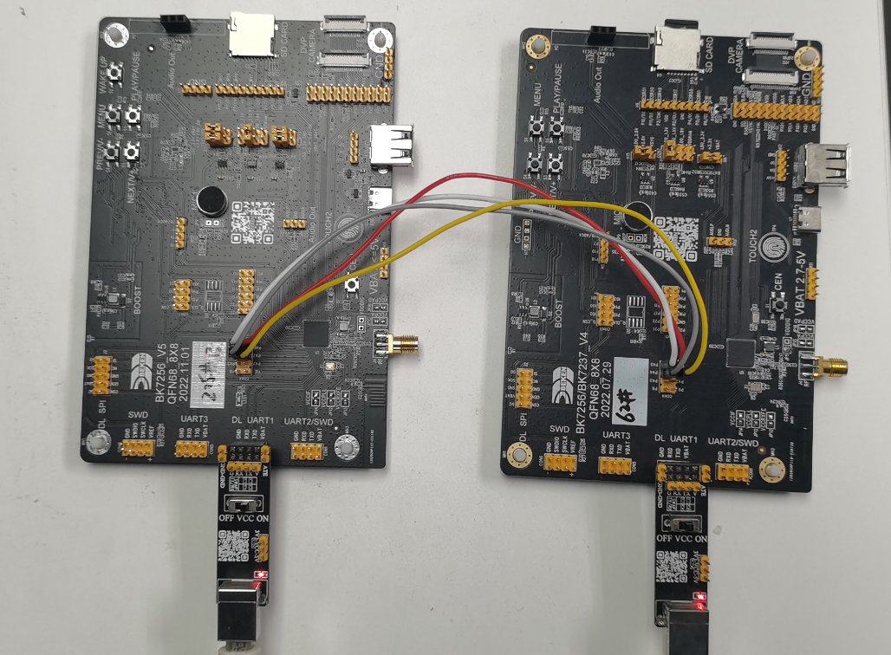

spi
==========================

:link_to_translation:`en:[English]`

1 功能概述
-------------------------------------
	bk7256具有2路SPI控制器，对应三组SPI引脚。介绍SPI接口的cli命令使用。

2 代码路径
-------------------------------------
	demo路径：``components\bk_cli\cli_spi.c``

3 cli命令简介
-------------------------------------

demo运行依赖的宏配置：

	+--------------------------------------+---------------------------+--------------------------------------------+---------+
	|                 NAME                 |      Description          |                  File                      |  value  |
	+======================================+===========================+============================================+=========+
	|CONFIG_SPI_DMA                        | SPI support DMA           | ``middleware\soc\bk7256\bk7256.defconfig`` |    y    |
	+--------------------------------------+---------------------------+--------------------------------------------+---------+
	|CONFIG_SPI_SLAVE                      | support SPI slave mode    | ``middleware\soc\bk7256\bk7256.defconfig`` |    y    |
	+--------------------------------------+---------------------------+--------------------------------------------+---------+
	|CONFIG_SPI_MASTER                     | support SPI master mode   | ``middleware\soc\bk7256\bk7256.defconfig`` |    y    |
	+--------------------------------------+---------------------------+--------------------------------------------+---------+
	|CONFIG_SPI_STATIS                     | support SPI statistic func| ``middleware\soc\bk7256\bk7256.defconfig`` |    y    |
	+--------------------------------------+---------------------------+--------------------------------------------+---------+
	|CONFIG_SPI_SUPPORT_TX_FIFO_WR_READY   | support tx write ready    | ``middleware\soc\bk7256\bk7256.defconfig`` |    y    |
	+--------------------------------------+---------------------------+--------------------------------------------+---------+

demo支持的命令如下表：

	+----------------------------------------+------------------------------------------------+----------------------------------------+
	|             Command                    |            Param                               |              Description               |
	+========================================+================================================+========================================+
	| spi_driver {init|deinit}               | {init|deinit}:                                 |  init/deinit the spi resoure common    |
	+----------------------------------------+------------------------------------------------+----------------------------------------+
	|                                        | {id}:spi id,value range 0 ~ 1                  |                                        |
	| spi {id} init [role] [bit_width]       +------------------------------------------------+                                        |
	|                                        | {role}:master or slave                         | init spi and set working parameters    |
	| [polarity] [phase] [wire_mode]         +------------------------------------------------+                                        |
	|                                        | {bit_width}: support 8 or 16 bits              |                                        |
	| [baud_rate] [bit_order] [dma_mode]     +------------------------------------------------+                                        |
	|                                        | {polarity}: CPOL support 0 or 1                |                                        |
	|                                        +------------------------------------------------+                                        |
	|                                        | {phase}:CPHA support 0 or 1                    |                                        |
	|                                        +------------------------------------------------+                                        |
	|                                        | {wire_mode}: support 3 or 4 wire mode          |                                        |
	|                                        +------------------------------------------------+                                        |
	|                                        | {baud_rate}:spi baud rate                      |                                        |
	|                                        +------------------------------------------------+                                        |
	|                                        | {bit_order}: support LSB or MSB                |                                        |
	|                                        +------------------------------------------------+                                        |
	|                                        | {dma_mode}: support DMA                        |                                        |
	+------------+---------------------------+------------------------------------------------+----------------------------------------+
	|            | baud_rate {value}         | {value}:support baud rate                      |                                        |
	|            +---------------------------+------------------------------------------------+                                        |
	| spi_config | mode {value}              | {value}:spi spi mode 0~3                       |                                        |
	|            +---------------------------+------------------------------------------------+                                        |
	| {id}       | bit_width {value}         | {value}: support 8 or 16 bits                  |   set spi working parameters           |
	|            +---------------------------+------------------------------------------------+                                        |
	|            | wire_mode {value}         | {value}:support 3 or 4 wire mode               |                                        |
	|            +---------------------------+------------------------------------------------+                                        |
	|            | bit_order {value}         | {value}:support LSB or MSB                     |                                        |
	+------------+---------------------------+------------------------------------------------+----------------------------------------+
	|                                        | {id}:spi id,value range 0 ~ 1                  |                                        |
	| spi {id} {read|write}                  +------------------------------------------------+                                        |
	|                                        | {read|write}: read|write operation             | read specified length of data through  |
	| {length}                               +------------------------------------------------+ spi                                    |
	|                                        | {length}: length to be read|write              |                                        |
	+----------------------------------------+------------------------------------------------+----------------------------------------+

SPI 支持的波特率如下：

   ::

	static const uint32_t s_spi_clk_list[] = {
	26000000, /**< DIV1 */
	13000000, /**< DIV2 */
	6500000,  /**< DIV4 */
	5200000,  /**< DIV5 */
	3250000,  /**< DIV8 */
	2600000,  /**< DIV10 */
	2000000,  /**< DIV13 */
	1625000,  /**< DIV16 */
	1300000,  /**< DIV20 */
	1040000,  /**< DIV25 */
	1000000,  /**< DIV26 */
	};

SPI模式和极性、相位的对应关系

	+--------------------+-------------------+-----------------------+
	|     Command        |      CPOL         |         CPHA          |
	+====================+===================+=======================+
	| 0[00]              | 0                 |  0                    |
	+--------------------+-------------------+-----------------------+
	| 0[01]              | 0                 |  1                    |
	+--------------------+-------------------+-----------------------+
	| 0[10]              | 1                 |  0                    |
	+--------------------+-------------------+-----------------------+
	| 0[11]              | 1                 |  1                    |
	+--------------------+-------------------+-----------------------+

4 演示介绍
-------------------------------------

  1、bk7256开发板在con4中将SPI引出，使用2块bk7256开发板，按照下图进行连接

    Figure 1. 将2块开发板通过SPI对接

对应的GPIO：

	+-----------------+-------------------+
	|     GPIO        |      FUNC         |
	+=================+===================+
	| P44             | SCK               |
	+-----------------+-------------------+
	| P45             | CSN               |
	+-----------------+-------------------+
	| P46             | MOSI              |
	+-----------------+-------------------+
	| P47             | MISO              |
	+-----------------+-------------------+

2、启动开发板，对2块开发板分别输入初始化命令，分别设置为master和slave

master： spi 0 init master 8 1 1 4 10000000 MSB 1  //主机输入命令

   ::

	[15:47:52.552]发→◇spi_driver init

	[15:47:52.567]收←◆spi_driver init
	cli:I(87880284):spi driver init
	$
	[15:47:52.661]收←◆
	$
	[15:50:51.443]发→◇spi 0 init master 8 1 1 4 10000000 MSB 1
	□
	[15:50:51.443]收←◆spi 0 init master 8 1 1 4 10000000 MSB 1
	hal:I(88059168):spi select src_clk xtal
	cli:I(88059168):spi init, spi_id=0

slave： spi 0 init master 8 1 1 4 10000000 MSB 1  //从机输入命令

   ::

	[15:47:48.942]发→◇spi_driver init
	[15:47:48.957]收←◆spi_driver init
	cli:I(1085932):spi driver init
	$
	[15:47:49.051]收←◆
	$
	[15:52:33.910]发→◇spi 0 init slave 8 1 1 4 10000000 MSB 1
	□
	[15:52:33.910]收←◆spi 0 init slave 8 1 1 4 10000000 MSB 1
	hal:I(1370886):spi select src_clk xtal
	cli:I(1370888):spi init, spi_id=0

3、 从机进入接收状态，主机发送数据

slave：spi 0 read 1024

master：spi 0 write 1024

   ::

	[15:54:01.239]发→◇spi 0 write 1024
	□
	[15:54:01.255]收←◆spi 0 write 1024
	cli:I(88248974):spi write bytes, spi_id=0, data_len=1024

	$cli:I(88248984):spi Tx finish! UART send OK!

4、从机接收到数据

   ::

	I(1458228):spi read, spi_id=0, size:1024
	cli:I(1458228):recv_buffer[0]=0x0
	cli:I(1458230):recv_buffer[1]=0x1
	cli:I(1458230):recv_buffer[2]=0x2
	cli:I(1458230):recv_buffer[3]=0x3
	......
	cli:I(1458230):recv_buffer[3]=0xff