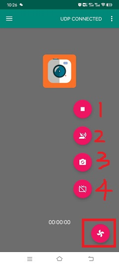

DVP Video_transfer
========================

:link_to_translation:`en:[English]`

1 功能概述
-------------------------------------
	图传的作用主要是将dvp/uvc sensor采集的原始数据，经jpeg encode模块压缩编码后，以WiFi连接的方式，将数据发送给手机，手机的图传应用（app）接收到数据后，会对数据包进行解析，然后实时显示编码之后的视频数据流。

2 代码路径
-------------------------------------
	demo路径：``./components/demos/media/video/video_transfer/video_transfer.c``

3 cli命令简介
-------------------------------------
	demo支持的命令如下表：

	+----------------------------------------+--------------------------+----------------------+
	|             Command                    |      Param               |   Description        |
	+========================================+==========================+======================+
	|                                        | param1:connect method    |芯片与手机的连接方式  |
	|                                        +--------------------------+----------------------+
	|                                        | param2:ssid              |路由的名字            |
	| video_transfer param1 param2 param3    +--------------------------+----------------------+
	|                                        | param3:ssid_key          |连接的密钥            |
	|                                        +--------------------------+----------------------+
	|                                        | param4:camera_type       |摄像头类型和输出类型  |
	|     param4 param5 param6               +--------------------------+----------------------+
	|                                        | param5:resolution        |摄像头输出分辨率      |
	|                                        +--------------------------+----------------------+
	|                                        | param6:frame_rate        |摄像头输出帧率        |
	+----------------------------------------+--------------------------+----------------------+
	| video_transfer start                   | param:NULL               |开始图传              |
	+----------------------------------------+--------------------------+----------------------+
	| video_transfer stop                    | param:NULL               |停止图传              |
	+----------------------------------------+--------------------------+----------------------+

	demo运行依赖的宏配置：

	+--------------------------------------+------------------------+--------------------------------------------+---------+
	|                 NAME                 |      Description       |                  File                      |  value  |
	+======================================+========================+============================================+=========+
	|CONFIG_JPEGENC_HW                     |配置是否支持硬件编码    |``middleware\soc\bk7237\bk7237.defconfig``  |    y    |
	+--------------------------------------+------------------------+--------------------------------------------+---------+
	|CONFIG_DVP_CAMERA                     |配置是否使用dvp camera  |``middleware\soc\bk7237\bk7237.defconfig``  |    y    |
	+--------------------------------------+------------------------+--------------------------------------------+---------+
	|CONFIG_USE_APP_DEMO_VIDEO_TRANSSER    |配置是否使用图传应用    |``middleware\soc\bk7237\bk7237.defconfig``  |    y    |
	+--------------------------------------+------------------------+--------------------------------------------+---------+
	|CONFIG_NET_WORK_VIDEO_TRANSFER        |配置是否支持网络图传    |``middleware\soc\bk7237\bk7237.defconfig``  |    y    |
	+--------------------------------------+------------------------+--------------------------------------------+---------+
	|CONFIG_COMPONENTS_P2P                 |配置是否使用p2p传输     |``middleware\soc\bk7237\bk7237.defconfig``  |    n    |
	+--------------------------------------+------------------------+--------------------------------------------+---------+
	|CONFIG_DVP_CAMERA_I2C_ID              |配置是否使用I2C通信     |``middleware\soc\bk7237\bk7237.defconfig``  |    y    |
	+--------------------------------------+------------------------+--------------------------------------------+---------+

4 演示介绍
-------------------------------------
	demo执行的步骤如下：

	1、准备好dvp摄像头，连接方式如图1所示：

		图中位置1所用的摄像头是gc0328c(20-pin), 支持输出的分辨率有很多类型，例如640X480, 480X272, 320X480等，另外图中位置2也是dvp摄像头的接口(24-pin)

	2、顺序发送下面命令：(分辨率和帧率可以省略，默认640X480和20)

		video_transfer -a test 12345678

		如果测试dvp摄像头的图传: video_transfer -a test 12345678 dvp_jpg 640X480 25

		如果测试dvp摄像头h264的图传: video_transfer -a test 12345678 dvp_h264 640X480 20 (需要dvp支持h264格式的压缩数据输出，app支持h264数据解码)

		如果测试uvc摄像头的图传: video_transfer -a test 12345678 uvc_jpg 640X480 20

		如果测试uvc摄像头h264的图传: video_transfer -a test 12345678 uvc_h264 640X480 20 (需要uvc支持h264格式的压缩数据输出，app支持h264数据解码)

	3、手机wifi连接上test名字的路由, 密码为: 12345678

	4、连接成功后打开图传的app即可，图2为app示意图，app操作如图3-6所示。

	以下流程以板子作为softap为例，介绍apk的使用，在手机连接到板子使能的ap后：

	5.图3为app的主界面

		其中，选择1可以看到图4

		- 1：设置菜单；
		- 2：更新apk和回退apk菜单；

	6.图4为设置界面菜单

		其中：

		- 1：为设置界面如图5所示；
		- 2：为返回主界面按钮；

	7.图5为真正的设置界面

		其中，设置说明如下，设置完成后返回图3主界面

		- 1：设置解决方案，当前支持video_transfer和doorbell，此处选择video_transfer；
		- 2：设置数据传输模式，当前仅支持UDP，默认选择UDP；
		- 3：设置对端的ip地址，ap模式下默认为``192.168.0.1``不用修改，sta模式下设置为对端的ip地址；
		- 4：设置摄像头类型，当前支持DVP和UVC，根据自己使用摄像头类型进行设置；
		- 5：设置摄像头的输出分辨率；
		- 6：设置LCD输出的分辨率，根据自己使用的LCD屏幕分辨率进行设置；

	5.图6为功能使能设置界面

		其中，功能使能说明如下所示：

		- 1：开关视频图传；
		- 2：开关语音；
		- 3：拍照开关，当前暂不支持；
		- 4：开关LCD屏幕显示；

.. note::

	在图4中设置对端IP地址，当板子为softap时，默认为``192.168.0.1``，当板子作为staion时，手机和板子连接同一个ap，填入的IP地址可以通过命令``ip``获得。
	另外该app还支持手机图传功能，即命令``video_transfer -a|s ssid key``，但是必须将图4步骤1设置为``video_transfer``模式。
	apk的下载地址如下：http://dl.bekencorp.com/apk/RealtimeVideo.apk

.. figure:: ../../../../../common/_static/video_transfer_evb.png
    :align: center
    :alt: sensor connect evb
    :figclass: align-center

    Figure 1. sensor connect evb

.. figure:: ../../../../../common/_static/RealtimeVideo_app.jpg
    :align: center
    :alt: RealtimeVideo_app
    :figclass: align-center

    Figure 2. doorbell apk

.. figure:: ../../../../../common/_static/RealtimeVideo_set0.jpg
    :align: center
    :alt: RealtimeVideo_app_screen
    :figclass: align-center

    Figure 3. RealtimeVideo_app Main screen

.. figure:: ../../../../../common/_static/RealtimeVideo_set1.jpg
    :align: center
    :alt: RealtimeVideo_app_set_menu
    :figclass: align-center

    Figure 4. RealtimeVideo_app Set menu

.. figure:: ../../../../../common/_static/RealtimeVideo_set2.jpg
    :align: center
    :alt: RealtimeVideo_app_set
    :figclass: align-center

    Figure 5. RealtimeVideo_app set

    Figure 6. RealtimeVideo_function set

5 详细配置及其说明
-------------------------------------
	1、设置参数：video_transfer -s|a ssid [key] [camera_type] [ppi] [fps]

	上述参数[]包括的可以省略，camera_type默认是dvp摄像头，且输出的是JPEG数据；ppi默认是640X480；fps默认是25帧

	-s|a: 设备作为station或softap.

	ssid: station或softap的名字.

	key: station或softap的连接密码，可选填

	camera_type: 参考 ``media_camera_type_t``
		- "dvp_jpg"表示：使用dvp摄像头，且输出的是JPEG数据；
		- "dvp_h264"表示：使用dvp摄像头，且输出的是H264数据，当前BK7256系列芯片不支持
		- "uvc_jpg"表示：使用uvc摄像头，且输出的是JPEG数据；
		- "uvc_h264"表示：使用uvc摄像头，且输出的是H264数据；

	ppi:分辨率，表示摄像头期望输出的分辨率，参考：``media_ppi_t``.

		GC0328C: 640X480, 480X272, 480X320

		HM_1055: 1280X720

		GC2145: 1280X720, 800X600, 640X480

	fps:帧率，表示摄像头期望输出的帧率，参考：``sensor_fps_t``

		GC0328C：5、10、20、25

		HM_1055：5、10、15、20

		GC2145: 10、15、20、25

	2、设置wifi连接方式

		1.video_transfer -a ssid key

		- 将开发板作为一个AP，手机去连接这个AP，做法与手机连接其他wifi设备类似。

		2.video_transfer -s ssid key

		- 将开发板作为一个station，去连接手机，手机需要开启wifi热点，此时手机相当于一个路由器。

		3.video_transfer -p ssid key

		- 采用手机直连的方式，与AP类似，做法是在手机上：WLAN-->高级设置-->WLAN直连，搜索到板子的设备后，点击连接。

.. note::

	注意：第一种方式可能存在板子的带宽不够，显示的视频不够清晰；第二种方式，图传的效果最好，因为手机的带宽非常充足；第三种方式当前还未实现。

	3、支持动态设置分辨率和帧率，不支持设置更换dvp设备

		- 在退出图传之后，发送video_transfer -s|a ssid [key] [camera_type] [ppi] [fps]命令，只能改动camera_type，ppi和fps。

	4、可测试的方案
		- dvp图传：video_transfer -a name_test 12345678
		- dvp图传：video_transfer -s name_station key dvp_jpg 640X480 25
		- uvc图传：video_transfer -s name_station key uvc_jpg 800X480 20
		- uvc图传：video_transfer -s name_station key uvc_h264 800X480 20
		- 支持关闭图传后，再次发送上面的进行摄像头参数的重设，包括摄像头类型、输出分辨率、和帧率。

	5、图传软件流程

.. figure:: ../../../../../common/_static/video_transfer_function_call.png
    :align: center
    :alt: video_transfer软件流程
    :figclass: align-center

    Figure 7. video transfer function call

	6、图传模块间调用

.. figure:: ../../../../../common/_static/video_transfer_message.png
    :align: center
    :alt: video_transfer模块调用
    :figclass: align-center

    Figure 8. video transfer modules communicate
