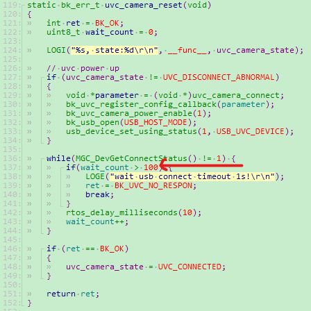
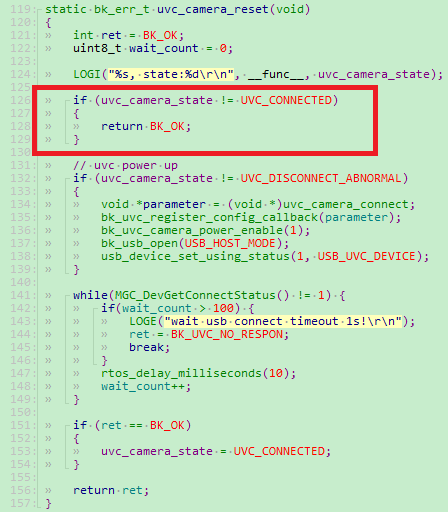

UVC&UAC User Guide
========================

:link_to_translation:`zh_CN:[中文]`

Summarize
------------------

	Current chip supported UVC&UAC specifications:

+-----------+------------------+--------------------+-------------------+---------------+---------------+----------------+-----------------------------+--------------------------------+
|  USB type |  work voltage    |    USB protocol    |  device protocol  |     speed     |  encode type  |  resolution    |  endpoint `wMaxPacketSize`  |            remark              |
+===========+==================+====================+===================+===============+===============+================+=============================+================================+
|    UVC    |        5.0v      |     USB 1.1/2.0    |    UVC 1.1/1.5    |   Full-Speed  |  H264/MJPEG   | lower 1280*720 |            1024             |  MJPEG cannot output DRI mask  |
+-----------+------------------+--------------------+-------------------+---------------+---------------+----------------+-----------------------------+--------------------------------+
|    UAC    |        5.0v      |     USB 1.1/2.0    |      UAC 1.0      |   Full-Speed  |      ALL      |        N       |            1024             |                                |
+-----------+------------------+--------------------+-------------------+---------------+---------------+----------------+-----------------------------+--------------------------------+

UVC common problems and solutions
------------------------------------------

1. The UVC camera cannot be opened

1.1 If the UVC camera is not powered on or the voltage is lower than the minimum operating voltage, the connection fails.

	- LOG display:``wait usb connect timeout 1s!``;
	- Suggestion: Check whether the UVC is plugged in, whether there is a virtual connection, and whether the UVC is successfully powered on. Use a multimeter to measure whether the VCC voltage is lower than the minimum voltage. The UVC&UAC coexistence may require 5.0V.

1.2 If the UVC is powered on slowly, the internal capacitor charge and discharge time is long, and the connection fails.

	- LOG display:``wait usb connect timeout 1s!``;
	- Suggestion: Increase the UVC enumeration waiting period. The current default timeout period is 1s. Can increase the timeout time 1 s appropriately, the location of the specific changes following figure 1: ``middleware/driver/camera/uvc_sensor_devices.c``, 100 appropriate change bigger.

    Figure 1. uvc timeout

1.3 UVC If the voltage is unstable and jitter, the connection will be reconnected after the connection fails, or repeated switching may occur.

	- LOG display:``wait usb connect timeout 1s!``, ``camera_uvc_connect_state_change_task_entry``, related log;
	- Suggestion: Slightly increase the UVC power supply voltage. This phenomenon may occur in UVC&UAC coexistence scenarios, such as raising the voltage to 5.0V.

1.4 If the UVC does not support power check, the connection may be disconnected.

	-LOG Displays:

::

	uvc_device:W(4146):uvc_camera_reset, state:2
	UVC:I(4148):UVC_DisConnect
	USB:I(4152):USB WAS OPENED
	uvc_device:E(5162):wait usb connect timeout 1s!
	uvc_device:E(5162):uvc state: -16901

- Suggestion: try to comment out to review on electrical logic, specific modification scheme as follows in figure 2:`` meddleware/driver/camera/uvc_sensor_devices.c``, increase the code inside the box. This logic hot swap will also enter, so it is recommended to modify the above problem.

    Figure 2. uvc_ldo power check

1.5 UVC If a resolution that is not supported by the UVC is configured, the UVC fails to be opened.

	- LOG displays:``uvc not support this resolution!``;
	- Suggestion: Configure the resolution for the UVC based on the supported enumeration.

2. UVC image application effect is poor

2.1 Some UVC firmware will add padding bits to ensure 4-byte alignment of the output data, but it may cause low LCD display frame rate.

	- LOG shows:``JPG: 15 (449, 0), dec, 15 (109, 0), LCD: 53 [375], FPS: 15 [108], wifi: 0 [0], wifi_read: [0]``. Where the value of fps (15) is not equal to the value of jpg (15), and the second value in dec parentheses is not 0;
	- Suggestion: Find the UVC manufacturer and ask it to modify the firmware without adding padding bits.
	- Suggestion: This scheme is not universal, but can also solve the problem. If the difference between the actual decoding length and the original JPEG image data length is less than a certain threshold, such as 5, we can consider the image decoding is successful. The specific modification scheme is shown in Figure 3 below:``meddleware/driver/jpeg_dec/jpeg_dec_driver.c``.

.. figure:: ../../../../common/_static/jpeg_dec_error.png
    :alt: jpegdec_error
    :figclass: aligned-center

    Figure 3. jpegdec error

2.2 If there is wrong data in the UVC packet source data, but it conforms to the JPEG format, so it can be decoded and displayed

	- Effect display: image transmission display or LCD decoding shows the first pattern, etc., the image does not meet expectations.
	- Suggestion: Negotiate with the manufacturer to modify the firmware

2.3 If the UVC packet sending does not comply with the protocol and there is no UVC packet header, the image will be abnormal.

	- LOG Displays:``jpg: 15[449, 0], dec: 15[109, 0], lcd: 53[375], fps: 15[108], wifi: 0[0], wifi_read: [0]``, where the value of jpg is irregular, and the decoding display is basically not a picture.
	- Suggestion: Negotiate with the manufacturer to modify the firmware.