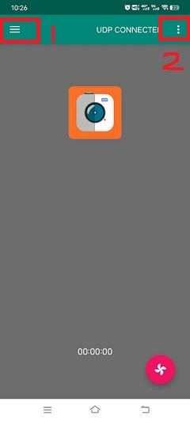
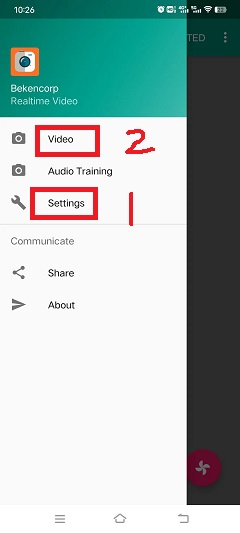
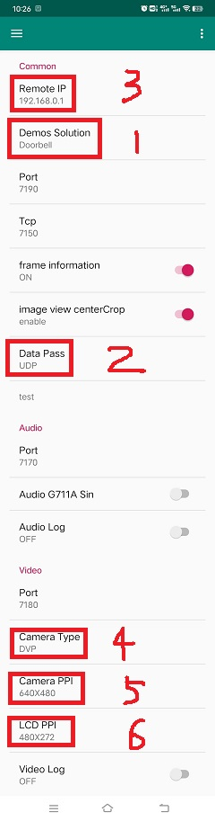
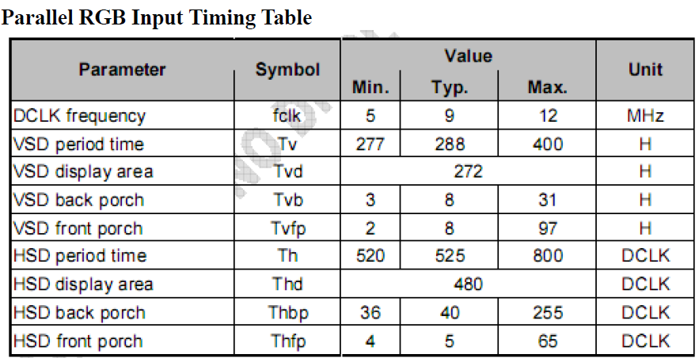

DOORBELL
==========================

:link_to_translation:`zh_CN:[Chinese]`

1 Overview
---------------------------------------
	The main function of the doorbell is the joint module, real-time image acquisition, display screen, sound acquisition and communication.

2 Code Path
---------------------------------------
	The path of demos: ./components/media/cli/media_cli.c``, ``./components/media/camera/camera_act.c``, ``./components/media/transfer/transfer_act.c``, ``./components/media/lcd/lcd_act.c``

3 Client command
---------------------------------------
	The commands support by doorbell

	+----------------------------------------+--------------------------------+---------------------------------------+
	|             Command                    |            Param               |              Description              |
	+========================================+================================+=======================================+
	|                                        | param1:softap_ssid             | setup a softap and set name           |
	| ap param1 param2                       +--------------------------------+---------------------------------------+
	|                                        | param2:softap_key              | set softap connect key                |
	+----------------------------------------+--------------------------------+---------------------------------------+
	|                                        | param1:station_ssid            | connect a station and set name        |
	| sta param1 param2                      +--------------------------------+---------------------------------------+
	|                                        | param2:station_key             | set station connect key               |
	+----------------------------------------+--------------------------------+---------------------------------------+
	|                                        | param1:3                       | open doorbell function                |
	| doorbell param1 [param2]               +--------------------------------+---------------------------------------+
	|                                        | param2:if open uvc, choosable  | set open/disopen uvc 1/0              |
	+----------------------------------------+--------------------------------+---------------------------------------+
	| media dvp open [param]                 | param:dvp resolution, choosable| set sensor resolution, and open dvp   |
	+----------------------------------------+--------------------------------+---------------------------------------+
	| media dvp close                        | NULL                           | close dvp sensor                      |
	+----------------------------------------+--------------------------------+---------------------------------------+
	| media lcd open [param]                 | param1:display size            | lcd display size, default:480X272     |
	+----------------------------------------+--------------------------------+---------------------------------------+
	| media lcd close                        | NULL                           | close lcd function, and jpeg decode   |
	+----------------------------------------+--------------------------------+---------------------------------------+
	| media capture param                    | param:xxx.jpg                  | capture save to sdcard, and set name  |
	+----------------------------------------+--------------------------------+---------------------------------------+
	| media uvc open [param]                 | param:uvc resolution, choosable| set sensor resolution, and open uvc   |
	+----------------------------------------+--------------------------------+---------------------------------------+
	| media uvc close                        | NULL                           | close uvc sensor                      |
	+----------------------------------------+--------------------------------+---------------------------------------+

	The macro configuration that the demo runs depends on:

	+--------------------------------------+------------------------+--------------------------------------------+---------+
	|                 NAME                 |      Description       |                  File                      |  value  |
	+======================================+========================+============================================+=========+
	|CONFIG_DOORBELL                       |support DOORBELL        |``middleware\soc\bk7256\bk7256.defconfig``  |    y    |
	+--------------------------------------+------------------------+--------------------------------------------+---------+
	|CONFIG_JPEG_ENCODE                    |suport hw jpeg ecoder   |``middleware\soc\bk7256\bk7256.defconfig``  |    y    |
	+--------------------------------------+------------------------+--------------------------------------------+---------+
	|CONFIG_CAMERA                         |suport use dvp camera   |``middleware\soc\bk7256\bk7256.defconfig``  |    y    |
	+--------------------------------------+------------------------+--------------------------------------------+---------+
	|CONFIG_CAMERA_USE_I2C1                |suport use I2C1         |``middleware\soc\bk7256\bk7256.defconfig``  |    y    |
	+--------------------------------------+------------------------+--------------------------------------------+---------+
	|CONFIG_AUDIO                          |support audio function  |``middleware\soc\bk7256\bk7256.defconfig``  |    y    |
	+--------------------------------------+------------------------+--------------------------------------------+---------+
	|CONFIG_LCD                            |support LCD function    |``middleware\soc\bk7256\bk7256.defconfig``  |    y    |
	+--------------------------------------+------------------------+--------------------------------------------+---------+
	|CONFIG_USB_UVC                        |support UVC camera      |``middleware\soc\bk7256\bk7256.defconfig``  |    y    |
	+--------------------------------------+------------------------+--------------------------------------------+---------+

4 Demo introduction
-------------------------------------
	The steps performed by the demo are as follows:

	1. Prepare dvp camera or UVC camera, LCD screen (rgb or 8080):

	2. Start a softap:
		ap doorbell_test 1234567890

	3. Connect the mobile phone to this app

	4. Send the doorbell command:

		doorbell

	5. The mobile app (RealtimeVideo) setting sequence and process are shown in the following figure:

	6. If you need to display it on the LCD screen

		media lcd open

5 App usage process
--------------------------
	The following process takes the board as a softap as an example to introduce the use of apk, after the mobile phone is connected to the ap enabled by the board:

	1. Figure 1 is a schematic diagram of the app

	2. Figure 2 is the main interface of the app

		Among them, choose 1 to see Figure 3.

		- 1: Settings menu;
		- 2: Update apk and rollback apk menu;

	3. Figure 3 is the setting interface menu

		Among them:

		- 1: For the setting interface as shown in Figure 4;
		- 2: button to return to the main interface;

	4. Figure 4 is the real setting interface

		Among them, the setting instructions are as follows, after the setting is completed, return to the main interface of Figure 2

		- 1: Set the solution, currently support video_transfer and doorbell, select doorbell here;
		- 2: Set the data transmission mode, currently supports UDP and TCP, and UDP is selected by default;
		- 3: Set the ip address of the peer, the default is ``192.168.0.1`` in ap mode, and it is not required to be modified, and in sta mode, it is set to the ip address of the peer;
		- 4: Set the camera type, currently supports DVP and UVC, set according to the type of camera you use;
		- 5: Set the output resolution of the camera;
		- 6: Set the resolution of the LCD output, according to the LCD screen resolution you use;

	5. Figure 5 is the function enable setting interface

		Among them, the function enable description is as follows:

		- 1: Switch video image transmission;
		- 2: switch voice;
		- 3: Photo switch, currently not supported;
		- 4: Switch LCD screen display;

.. note::

	Set the peer IP address in Figure 4. When the board is softap, the default is ``192.168.0.1``. When the board is used as a staion, the mobile phone and the board are connected to the same ap,
	and the filled IP address can be passed through the command `` ip`` to get.
	In addition, the app also supports the function of mobile phone image transfer, that is, the command ``video_transfer -a|s ssid key``, but step 1 in Figure 4 must be set to ``video_transfer`` mode.

    Figure 1. doorbell apk

    Figure 2. RealtimeVideo_app Main screen

    Figure 3. RealtimeVideo_app Set menu

    Figure 4. RealtimeVideo_app set

.. figure:: ../../../../common/_static/app_set3.jpg
    :align: center
    :alt: RealtimeVideo_function_set
    :figclass: align-center

    Figure 5. RealtimeVideo_function set

6 Add LCD Adapt
-----------------------------------------

The doorbell project can add new screens according to the needs of users to meet different product needs. For the new driver screen driver code,
please refer to ``./middleware/driver/lcd`` Add lcd_xxx.c under the path, such as lcd_st7282.c;

	The main configuration process of the newly added driver code is as follows:

	1) For RGB screen, hsync/vsync proch needs to be modified according to lc

::

	static const lcd_rgb_t lcd_rgb =
	{
		.clk = LCD_20M,          //lcd 工作合适的时钟
		.data_out_clk_edge = NEGEDGE_OUTPUT, //rgb输出数据时钟边沿

		.hsync_back_porch = 40, 
		.hsync_front_porch = 5, 
		.vsync_back_porch = 8,  
		.vsync_front_porch = 8, 
	};
	

    Figure 6. rgb sync params config

2) Induction interface

If the brightness of the screen, the user needs to control the hollow output of the PWM by the PWM control ratio

::

	static void lcd_backlight_open(void)
	{
	#if CONFIG_PWM
		lcd_driver_backlight_init(LCD_RGB_PWM_BACKLIGHT, 100);
	#endif
	}

	static void lcd_set_backlight(uint8_t percent)
	{
	#if CONFIG_PWM
		pwm_period_duty_config_t config = {0};

		if (percent > 100)
		{
			percent  = 100;
		}

		config.period_cycle = 100;
		config.duty_cycle = percent;

		bk_pwm_set_period_duty(LCD_RGB_PWM_BACKLIGHT, &config);
	#endif
	}

If the backlight control of the screen is controlled by GPIO (such as GPIO34) port:

::

	static void lcd_gc9503v_backlight_io_init(void)
	{
		gpio_dev_unmap(34);
		bk_gpio_set_capacity(34, 0);
		BK_LOG_ON_ERR(bk_gpio_enable_output(34));
		BK_LOG_ON_ERR(bk_gpio_pull_down(34));
	}

	static void gc9503v_lcd_backlight_open(void)
	{
		BK_LOG_ON_ERR(bk_gpio_pull_up(34));
		// pull up gpio34, enable lcd backlight control
		bk_gpio_set_output_high(34);
	}

	static void gc9503v_lcd_backlight_close(void)
	{
		bk_gpio_set_output_low(34);
	}

3) Initialize screen structure parameters

A screen similar to lcd_st7282 does not need to be initialized, and its structure parameters are initialized as follows:

::

	const lcd_device_t lcd_device_st7282 =
	{
		.id = LCD_DEVICE_ST7282, //screen ID num
		.name = "st7282", //screen name
		.type = LCD_TYPE_RGB565, //screen interface type
		.ppi = PPI_480X272, //screen resolution
		.rgb = &lcd_rgb, //Parameter configuration of RGB screen
		.backlight_open = lcd_backlight_open,//register backlight initialization
		.backlight_set = lcd_set_backlight, //Register the light adjustment function
		.init = NULL, //no need to initialize
		.backlight_close = lcd_backlight_close,//register to close the backlight function
		.lcd_off = NULL, //The screen has no off command or off pin
	};

The screen resolution is undefined and needs to be defined in ``./include/driver/media_types.h``.
The newly added screen ID needs to be defined in ``./include/driver/lcd_types.h``, as follows:

::

	typedef enum {
	LCD_DEVICE_UNKNOW,
	LCD_DEVICE_ST7282,  /**< 480X270  RGB */
	LCD_DEVICE_HX8282,  /**< 1024X600 RGB  */
	LCD_DEVICE_GC9503V, /**< 480X800 RGB  */
	LCD_DEVICE_ST7796S, /**< 320X480 MCU  */
	LCD_DEVICE_NT35512,
	} lcd_device_id_t;

The screen structure needs to be defined in ``./middleware/driver/lcd/lcd_driver.c`` and declared in ``./middleware/driver/lcd/lcd_device.h``:

::

	const lcd_device_t *lcd_devices[] =
	{
		&lcd_device_st7282,
		&lcd_device_hx8282,
		&lcd_device_st7796s,
		&lcd_device_gc9503v,
		&lcd_device_nt35512
	};

	extern const lcd_device_t lcd_device_st7282;
	extern const lcd_device_t lcd_device_hx8282;
	extern const lcd_device_t lcd_device_st7796s;
	extern const lcd_device_t lcd_device_gc9503v;
	extern const lcd_device_t lcd_device_nt35512;

A screen similar to lcd_gc9503v needs to be initialized, and the initialization function needs to be registered in its structure:

::

	.init = lcd_gc9503v_init,

The lcd_gc9503v_init function is generally provided by the screen manufacturer. It needs the hardware interface to simulate the SPI or I2C interface,
so it is necessary to initialize the GPIO and adapt the corresponding SPI or I2C protocol according to the initialization command.
Currently, the SPI3-wire and 4-wire protocols have been adapted in the SDK.

::

	void lcd_spi_init_gpio(void)
	{
		gpio_dev_unmap(LCD_SPI_RST);
		bk_gpio_set_capacity(LCD_SPI_RST, 0);
		BK_LOG_ON_ERR(bk_gpio_disable_input(LCD_SPI_RST));
		BK_LOG_ON_ERR(bk_gpio_enable_output(LCD_SPI_RST));

		gpio_dev_unmap(LCD_SPI_CLK_GPIO);
		bk_gpio_set_capacity(LCD_SPI_CLK_GPIO, 0);
		BK_LOG_ON_ERR(bk_gpio_disable_input(LCD_SPI_CLK_GPIO));
		BK_LOG_ON_ERR(bk_gpio_enable_output(LCD_SPI_CLK_GPIO));

		gpio_dev_unmap(LCD_SPI_CSX_GPIO);
		bk_gpio_set_capacity(LCD_SPI_CSX_GPIO, 0);
		BK_LOG_ON_ERR(bk_gpio_disable_input(LCD_SPI_CSX_GPIO));
		BK_LOG_ON_ERR(bk_gpio_enable_output(LCD_SPI_CSX_GPIO));

		gpio_dev_unmap(LCD_SPI_SDA_GPIO);
		bk_gpio_set_capacity(LCD_SPI_SDA_GPIO, 0);
		BK_LOG_ON_ERR(bk_gpio_disable_input(LCD_SPI_SDA_GPIO));
		BK_LOG_ON_ERR(bk_gpio_enable_output(LCD_SPI_SDA_GPIO));

		bk_gpio_set_output_high(LCD_SPI_CLK_GPIO);
		bk_gpio_set_output_high(LCD_SPI_CSX_GPIO);
		delay_us(200);
	}

So far, the adaptation of the screen driver has been completed.

The next simple adaptation is to ensure that the user enters a command or passes a parameter (screen resolution or name), and the corresponding device can be found in the SDK:

1) Obtain the judgment of the LCD device name, and add the judgment of the new screen name in media_cli.c

::

	char * get_string_to_name(char *string, char * pre)
	{
		char* value = pre;
		if (os_strcmp(string, "nt35512") == 0)
		{
			value = "nt35512";
		}
		
		.....
		
		if (os_strcmp(string, "nt35510") == 0)
		{
			value = "nt35510";
		}
		
		......

		return value;
	}

2) Obtain the judgment of the pixels of the LCD device, and add the judgment of new pixels in media_cli.c

::

	uint32_t get_string_to_ppi(char *string, uint32_t pre)
	{
		uint32_t value = pre;

		if (os_strcmp(string, "1280X720") == 0)
		{
			value = PPI_1280X720;
		}

		.....

		if (os_strcmp(string, "480X854") == 0)
		{
			value = PPI_480X854;
		}

		return value;
	}

So far, the adaptation of the screen driver and the adaptation of calling parameters are completed.

Then you can use the new screen display!

::

	lcd_open_t lcd_open;
	lcd_open.device_ppi = 480X800;
	lcd_open.device_name = "nt35512";
	ret = media_app_lcd_open(&lcd_open);

7 Add camera configuration
-----------------------------
	The cameras used in the application process are not only those currently supported, but also need to be adapted to other dvp cameras or uvc cameras.
	The following is a separate description of how to adapt to the two different types of cameras.

	1. Adaptation of dvp camera

	The dvp camera configures the output of the camera through I2C communication, mainly to configure the value of the sensor register to achieve the expected image effect (resolution, frame rate, etc.)

		1) Refer to the driver code: ``middleware/driver/camera/dvp_gc0328c.c``, first you need to adapt the parameter structure of the dvp camera: ``dvp_sensor_config_t``;

::

		typedef struct
		{
			char *name; /**< camera name */
			media_ppi_t def_ppi; /**< The default resolution of the camera, generally used resolution */
			sensor_fps_t def_fps; /**< The camera's default frame rate, usually the commonly used frame rate*/
			uint16 id; /**< camera type (enumeration value, you need to add it yourself), refer to the enumeration type sensor_id_t */
			uint8 clk; /**< The input MCLK specified by the camera protocol, and this MCLK is separated from the CLK of the JPEG module and needs to be configured by yourself */
			/**@example
			* JPEG_96M_MCLK_24M: Indicates that the camera protocol stipulates that the MCLK input is 24MHz, 
			and the clock of the JPEG module is 96MHz at this time, and 96MHz can be divided by four to get 24MHz
			* It should also be noted that the working clock of JPEG is divided in CLK (480MHz and 320MHz), the frequency division coefficient range F=[0, 15],
			the frequency division calculation formula JPEG_CLK=CLK/(1+F);
			* JPEG only supports frequency division: 0:4 frequency division, 1:6 frequency division, 2:2 frequency division, 3:3 frequency division
			**/
			uint16 address; /**< The address of the camera through the I2C configuration register, generally the datasheet will tell */
			uint16 fps_cap; /**< The camera supports the configured frame rate, and outputs different frame rates according to requirements */
			uint16 ppi_cap; /**< The camera supports the configured resolution, and outputs different resolutions according to different scenarios */
			bool (*detect)(const dvp_camera_i2c_callback_t *cb); /**< The camera function is automatically detected, which is to read whether the camera ID (such as CHIP_ID) is consistent with the current camera*/
			int (*init)(const dvp_camera_i2c_callback_t *cb); /**< Configure the camera initialization register table, other adjustments (such as: resolution, frame rate, white balance, etc.) must be based on this */
			int (*set_ppi)(const dvp_camera_i2c_callback_t *cb, media_ppi_t ppi); /**< Set the camera resolution register table, generally support different resolution output */
			int (*set_fps)(const dvp_camera_i2c_callback_t *cb, sensor_fps_t fps); /**< The register for setting the camera frame rate, generally supports the output of different frame rates */
			int (*power_down)(const dvp_camera_i2c_callback_t *cb); /**< set register to configure camera enable */
			int (*dump_register)(const dvp_camera_i2c_callback_t *cb, media_ppi_t ppi); /**< Debug interface, view all register configuration values ​​*/
			void (*read_register)(bool enable); /**< Enable the register check interface, check the value of the configuration register is consistent with the expected value during the configuration process*/
		} dvp_sensor_config_t;

2) Refer to the enable camera driver code: ``middleware/driver/camera/dvp_camera.c``, in the function: ``bk_dvp_camera_driver_init()``,
it may be necessary to add the MCLK input configuration of the new camera;

::

		switch (current_sensor->clk)
		{
			case JPEG_96M_MCLK_16M:
				jpeg_config.sys_clk_div = 4;
				jpeg_config.mclk_div = 1;
				break;

			case JPEG_96M_MCLK_24M:
				jpeg_config.sys_clk_div = 4;
				jpeg_config.mclk_div = 0;
				break;

			case JPEG_120M_MCLK_20M:
				jpeg_config.sys_clk_div = 3;
				jpeg_config.mclk_div = 1;
				break;

			case JPEG_120M_MCLK_30M:
				jpeg_config.sys_clk_div = 3;
				jpeg_config.mclk_div = 0;
				break;

			default:
				break;
		}

.. note::
		Note: 480MHz is selected by default in the above JPEG gaze, and there is currently no open SDK interface to configure and select 480MHz or 320MHz.
		If you need to choose 320MHz, please refer to the JPEG driver code: ``middleware/driver/jpeg_enc/jpeg_driver.c``.

::

		static void jpeg_power_config_set(const jpeg_config_t *config)
		{
			sys_drv_set_jpeg_clk_sel(1);//0:320MHz, 1:480MHz
			sys_drv_set_clk_div_mode1_clkdiv_jpeg(config->sys_clk_div);
			sys_drv_set_jpeg_disckg(1);
			bk_pm_clock_ctrl(PM_CLK_ID_JPEG, CLK_PWR_CTRL_PWR_UP);
		}

2. Adaptation of uvc camera

	The only thing that uvc needs to adapt to is the resolution it supports. The resolution of uvc output is ever-changing.
	Currently, only some conventional resolutions are adapted. If customers have special resolutions, they need to add them by themselves.

		1) Currently, customers are not supported to add new resolutions independently, and they will be modified later,
		because the current addition of new resolutions requires developers to give customers a new libusb.a file. Replace the path: ``components/bk_libs/bk7256_app/libs /libusb.a``

		2) After replacing the new libusb.a file, refer to the header file: ``include/driver/media_types.h``,
		the parameters in the enumeration type ``media_ppi_t`` need to be added, if not.

3. Add a new resolution to the command line

	If you need to use the cli command that comes with doorbell, you need to make the newly added resolution take effect, otherwise skip this step

	Refer to the doorbell command line: ``components/media/cli/media_cli.c``, adapt the new command, add a new resolution in the function: ``get_string_to_ppi()``;

8 LCD Rotate
-----------------------------------------------------

When the pixels of the screen and the picture are opposite, for example, the screen is 480X800 and the camera is 800X480, the image can be rotated and displayed.
Rotated images are currently adapted as follows:

Because the rotation is a block rotation, in order for each row/column to be rotated, the set rotation block unit must be divisible by the length and width of the image.

	+---------------------------+-----------------------+----------------------------------------------------+
	|LCD parameters (W X H)     |img param(W X H)       |Rotate param (W X H)                                |
	+===========================+=======================+====================================================+
	|320X480                    |480X320                |block_width=160,block_height=40                     |
	+---------------------------+-----------------------+----------------------------------------------------+
	|480X800                    |800X480                |block_width=160,block_height=40                     |
	+---------------------------+-----------------------+----------------------------------------------------+
	|480X854                    |864X480                |block_width=108,block_height=40                     |
	+---------------------------+-----------------------+----------------------------------------------------+

.. Attention::

	 The width of the camera resolution must be divisible by 16 (864/16), and the height must be divisible by 8 (480/8). Otherwise hardware decoding will fail.

If the newly added camera needs to be rotated and displayed on the screen, the user needs to make the following modifications in ``components/media/lcd_cal.c``

1. Add the length and width of each rotation to the rotation array

::

	const block_ppi_t block_ppi_aray[] = {
		{108, 40},
		{160, 40},

		{MAX_BLOCK_WIDTH, MAX_BLOCK_HEIGHT}
	};

.. Attention::
	 The maximum size of the array cannot exceed  MAX_BLOCK_WIDTH(160) and  MAX_BLOCK_HEIGHT(80).

2. Then select or add the corresponding local block rotation according to the pixels of the incoming image

::

	switch ((src_width << 16) | src_height)
	{
		case PPI_864X480:
			block_width = block_ppi_aray[0].width;
			block_height = block_ppi_aray[0].height;
			block_size = block_width * block_height * 2;
			break;

		default:
			block_width = block_ppi_aray[1].width;
			block_height = block_ppi_aray[1].height;
			block_size = block_width * block_height * 2;
			break;
	};

