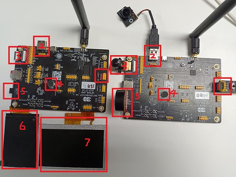

MEDIA_TRA
==========================

:link_to_translation:`zh_CN:[中文]`

1 Function overview
-------------------------------------
	Multimedia mutual transmission function, two-way audio transmission between the two boards, video is one for collecting video images, and the other is responsible for receiving and displaying on the LCD screen

2 code paths
------------------------------------
	demo path：``project/av_client/main/av_client_main.c``, ``project/av_server/main/av_server_main.c``, ``components/demos/media/doorbell``, ``components/demos/media/av_demo``

3 Introduction to cli commands
-------------------------------------
	The commands supported by the demo are as follows:

	+----------------------------------------+--------------------------------+---------------------------------------+
	|             Command                    |            Param               |              Description              |
	+========================================+================================+=======================================+
	|                                        | param1:camera_type             | set the camera type used              |
	|                                        +--------------------------------+---------------------------------------+
	|                                        | param2:camera_ppi              | set the camera output resolution      |
	|    doorbell udp_c [param1] [param2]    +--------------------------------+---------------------------------------+
	|           [param3] [param4]            | param3:LCD ppi                 | LCD screen support resolution         |
	|                                        +--------------------------------+---------------------------------------+
	|                                        | param4:LCD name                | LCD screen name                       |
	+----------------------------------------+--------------------------------+---------------------------------------+
	|                                        | param3:LCD ppi                 | LCD screen support resolution         |
	|  doorbell udp_s [param1] [param2]      +--------------------------------+---------------------------------------+
	|                                        | param4:LCD name                | LCD screen name                       |
	+----------------------------------------+--------------------------------+---------------------------------------+
	|   av_udp_test param                    | param:current chip role        | udp transfer play client or server    |
	+----------------------------------------+--------------------------------+---------------------------------------+

	demo运行依赖的宏配置：

	+--------------------------------------+------------------------+--------------------------------------------+---------+
	|                 NAME                 |      Description       |                  File                      |  value  |
	+======================================+========================+============================================+=========+
	|CONFIG_DOORBELL                       |support DOORBELL        |``middleware\soc\bk7256\bk7256.defconfig``  |    y    |
	+--------------------------------------+------------------------+--------------------------------------------+---------+
	|CONFIG_JPEGENC_HW                     |support hw jpeg ecoder  |``middleware\soc\bk7256\bk7256.defconfig``  |    y    |
	+--------------------------------------+------------------------+--------------------------------------------+---------+
	|CONFIG_DVP_CAMERA                     |support use dvp camera  |``middleware\soc\bk7256\bk7256.defconfig``  |    y    |
	+--------------------------------------+------------------------+--------------------------------------------+---------+
	|CONFIG_DVP_CAMERA_I2C_ID              |support use I2C ID      |``middleware\soc\bk7256\bk7256.defconfig``  |    y    |
	+--------------------------------------+------------------------+--------------------------------------------+---------+
	|CONFIG_AUDIO                          |support audio function  |``middleware\soc\bk7256\bk7256.defconfig``  |    y    |
	+--------------------------------------+------------------------+--------------------------------------------+---------+
	|CONFIG_LCD                            |support LCD function    |``middleware\soc\bk7256\bk7256.defconfig``  |    y    |
	+--------------------------------------+------------------------+--------------------------------------------+---------+
	|CONFIG_USB_UVC                        |support UVC camera      |``middleware\soc\bk7256\bk7256.defconfig``  |    y    |
	+--------------------------------------+------------------------+--------------------------------------------+---------+
	|CONFIG_AV_DEMO                        |support av transfer     |``middleware\soc\bk7256\bk7256.defconfig``  |    y    |
	+--------------------------------------+------------------------+--------------------------------------------+---------+

4 Presentation Introduction
-------------------------------------
	The steps performed by the demo are as follows:

	1. Prepare dvp camera or UVC camera, LCD screen (rgb or 8080), speak, and the connection configuration is shown in Figure 1 below

	2. Compile two versions:
		- make bk7256 PROJECT=av_client
		- make bk7256 PROJECT=av_server

	3. Burn and run

		Because the video is unidirectional, one board is responsible for capturing the image and sending it to another board via UDP, and the other board receives the image data, decodes it and displays it on the LCD screen.
		Therefore, plug in the board that the camera is responsible for collecting, burn the version compiled by av_client, and burn the version compiled by av_server with LCD screen, and it will run automatically after power-on.

	4. Description of Figure 1
		- 1: Serial port power supply
		- 2: USB&UVC camera interface
		- 3: DVP camera interface
		- 4: MIC acquisition
		- 5: speak interface
		- 6: 320*480 8080 screen
		- 7:480*272 RGB screen

    Figure 1. av transfer demo

.. note::

	For this method of running the case, UVC (resolution of 640*480) is used by default, and LCD is used by default (resolution of 480*272).

5 The use of cli commands
---------------------------
	The above demo needs to compile two versions, and it has been integrated, no need to enter any command, the default power-on will run the two-way intercom function.
	Currently, customers are also supported to send their own commands to realize the function of two-way intercom. The compiled version: make bk7256;

	1. Definition of macro
		- For the BK7256 version, the macro CONFIG_AV_DEMO is closed by default on the library, and it needs to be manually opened before compiling, and then compiling;

	2. The role definition of the board
		- ap ssid key channel: start softap on the board connected to the screen, customize ssid, key and channel, as shown in the 56#B board above
		- sta ssid key: start the station on the board connected with the camera, and connect the ap, as shown in the picture above 122#B board

	3. Turn on two-way voice
		- 56#B: av_udp_test server
		- 122#B: av_udp_test client

	4. Turn on video transmission
		- 56#B: doorbell udp_s 480X272

			480X272 is the resolution of the corresponding LCD

		- 122#B: doorbell udp_c uvc|dvp 640X480

			uvc|dvp: Indicates the camera type of the application, dvp or uvc, only one is supported at a time, if not written, the default is dvp;

			640X480: Indicates the resolution of the camera output, other resolutions are also supported, if not written, the default is 640X480;

