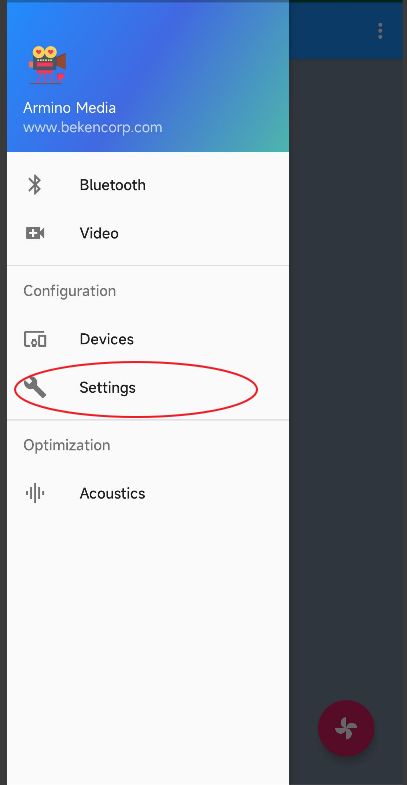
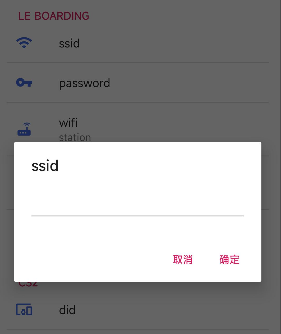
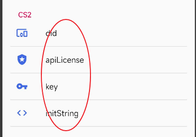
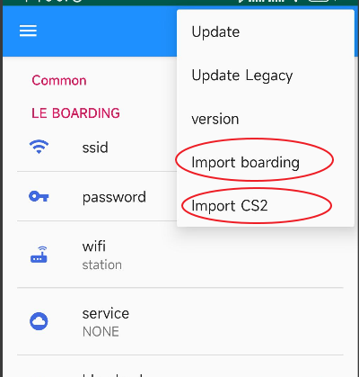
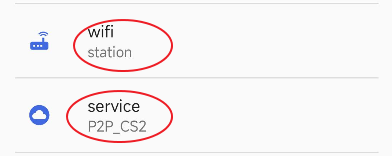
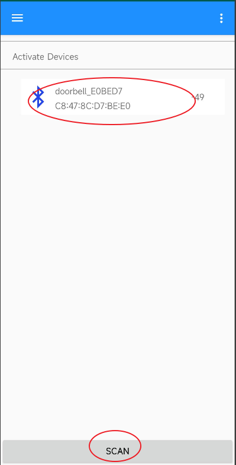
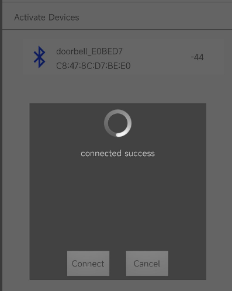
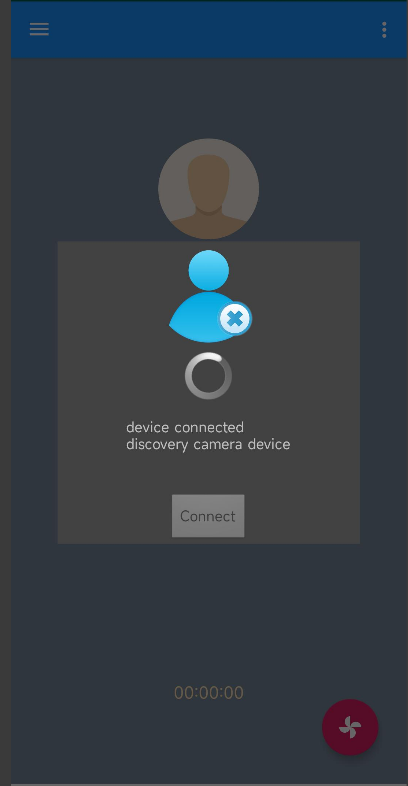
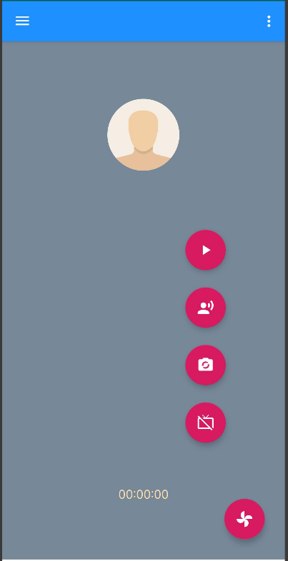
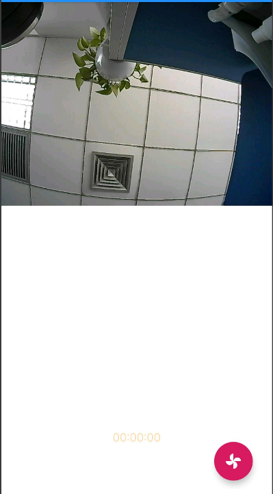

CS2 P2P
========================

:link_to_translation:`zh_CN:[中文]`

1 Function Overview
-------------------------------------
	CS2 P2P Doorbel project demo

2 Code Path
-------------------------------------
	demo path：``./projects/media/doorbell/main/src/doorbell_cs2_service.c``

	app download: http://dl.bekencorp/apk/ArminoMedia.apk

3 Cli Overview
-------------------------------------
	Using an APP to control the network config

4 Project Introduction
-------------------------------------

    1.Config wifi ssid/password
	
    open the lef navigation page
	

    Figure 1.

	
    2.fill in ssid and password in the settings interface
	

	
    Figure 2.
	
	
    3.config cs2 information on the settings page
	

	
    Figure 3.
	
    4.Additionally, we can quickly configurte through JSON text

``{ssid: "xxxxx", password: "xxxxx", cs2_did: "XXXXXX-000000-XXXXXX", cs2_api_license: "XXXXXX", cs2_key: "XXXXXX", cs2_init_string: "XXXXXXXXXXXXXXXXXXXXXXXXXXXXXXXXXXXXXXXXXX"}``
	
    5.click the button on the right menu bar to quickly generate configuration information
	

	
    Figure 4.
	
    6.select distributution network information

	
    Figure 5.
	

    7.sercahr for the doorbell device and config the network information
	
	

	
    Figure 6.
	
	
	

	
    Figure 7.
	
    8.connect to the device
	

	
    Figure 8.
	
    9. config the camera/lcd devices
	
.. figure:: ../../../../../common/_static/doorbell/db_09.png
    :align: center
    :alt: setting09
    :figclass: align-center
	
    Figure 9.
	
    10.open camera/lcd
	

	
    Figure 10.
	

	
    Figure 11.
	