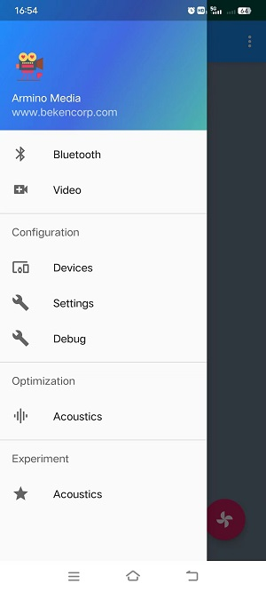
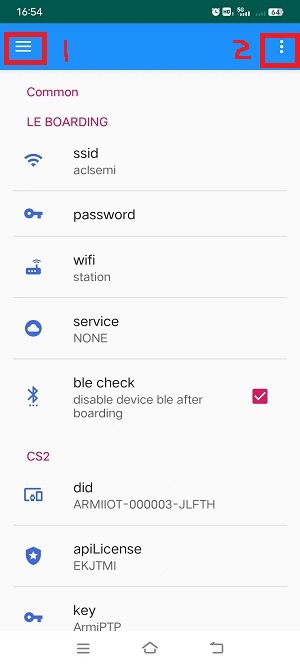
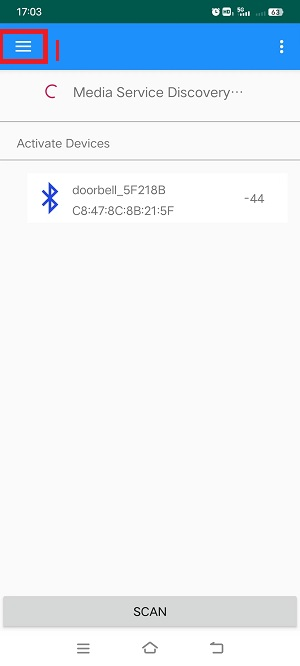
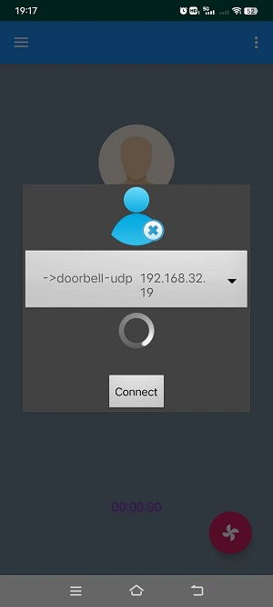
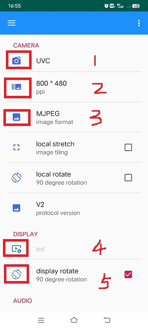
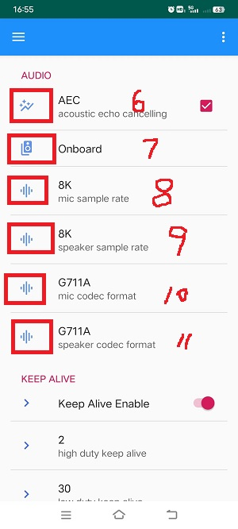
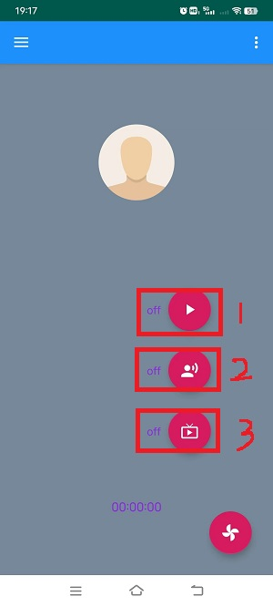

CS2 P2P
========================

:link_to_translation:`zh_CN:[中文]`

1 Function Overview
-------------------------------------
This function is based on LAN UDP/TCP doorbell demonstration project.

2 Code Path
-------------------------------------
UDP-demo:``./projects/media/doorbell/main/src/doorbell_udp_service.c``

TCP-demo:``./projects/media/doorbell/main/src/doorbell_tcp_service.c``

apk: http://dl.bekencorp/apk/ArminoMedia.apk

3 Introduction to cli commands
-------------------------------------
This function mainly relies on APP to use the configuration, and does not require cli command auxiliary control for the time being

4. Compile the command
-------------------------------------
Compile the PROJECT command: make bk7256 PROJECT=meida/doorbell

4 Presentation
-------------------------------------

.. note::
	The current apk only developed Android system, and then use the APK for network transmission before you need to turn on Bluetooth.

1. Set the router distribution information, as shown in the following figure:

.. figure:: ../../../../../common/_static/ArminoMedia_main_interface.jpg
    :align: center
    :alt: ArminoMedia-main interface
    :figclass: align-center

    Figure 1.main interface

2. Select the position of 1 in the main interface to arrive at the setting interface, as shown below:

    Figure 2.main Setting interface

3. Select:``Settings``, to arrive at the network configuration interface, as shown in the following picture:

    Figure 3.network setting interface

3.1 Many configuration types can be distinguished here:

	- Select:``wifi``, in the figure above, there are two options of "station/soft ap", indicating that the device is used as: station or softap.
	- Select:``servece``, in the figure above, select "P2P_CS2";

3.2 Selecting the position of 2 in the network configuration interface, the following figure is displayed:

	- Position 1, QR Code: indicates that the two-dimensional code scanner is opened. Generally, cs2_p2p configuration information can be scanned from the two-dimensional code;
	- Position 2, Import CS2: indicates that the configuration information identified by scanning two-dimensional code is imported. After import, the corresponding information in:``cs2``, in the interface of the figure will be automatically filled in;
	- Location 3: Import boarding: indicates that the configuration is added to boarding.

    Figure 3.2.cs2 set network interface

3.3 Select the position of 1 in the figure above to reach the main interface, and select:``Bluetooth``, to execute Bluetooth distribution network, and reach the Bluetooth distribution network interface, as shown below:

    Figure 3.3.bluetooth set network interface

4. select in the figure above:``SCAN``, scan to the broadcast issued by the board, the default broadcast name is:``doorbell_xxx``, if there are multiple in the network, you can find through the Bluetooth address, select the broadcast, a dialog box will pop up, select:``Connect``.

	- After the connection is successful, still select the position of 1 in the figure above to reach the main interface;
	- Then select:``Video`` to reach the main interface;
	- Then select the position of 2 in the main interface, similar to a small fan icon, a dialog box will pop up, select:``Connect``, wait for the connection to succeed, as shown below;

    Figure 4.device connet interface

- Still select the position of 1 in the main interface, arrive at the main interface, select:``Devices``, arrive at the device configuration interface of:``Devices``, as shown in the following picture:

    Figure 5.device setting interface

5. In the device configuration interface, you can configure "camera", "DISPALY" and "AUDIO".

	- As shown in Figure 1, select the type of camera to open: DVP/UVC;
	- As shown in Figure 2, select the output resolution of the camera and select the resolution supported by the camera;
	- In the position of Figure 3, select the format of the APK to receive video data: MJPEG/H264;
	- In the position shown in Figure 4, select the LCD screen type to be opened, which needs to match the LCD screen connected on the board;
	- For the position shown in Figure 5, select whether to rotate 90° when it is displayed on the LCD screen. This option is not selected by default.
	- In the position shown in Figure 6, select whether to support AEC echo cancellation (default).
	- For the position in Figure 7, select the source of the audio data received by the APK: Onboard/UAC, indicating Onboard audio /UAC audio, and onboard by default.
	- For the position in Figure 8, select MIC sampling rate: 8K/16K, 8K is selected by default;
	- For the position in Figure 9, select Speaker sample rate: 8K/16K. By default, 8K is selected.
	- For the position in Figure 10, select MIC encoding mode: G711A/PCM/G711U, the default choice; G711A;
	- For the position in Figure 11, select Speaker encoding mode: G711A/PCM/G711U (default); G711A;

6. select the top corner "三", arrive at the main interface, and select:``Video``, in the main interface, arrive at the main interface, and select the small fan icon in the lower right corner, three buttons pop up, as shown in the following picture:

    Figure 6.open/close setting interface

- In the position of 1 in the figure above, switch the video function;
- Position 2 in the figure above, switch the audio function;
- Position 3 in the figure above, switch the screen display function;
