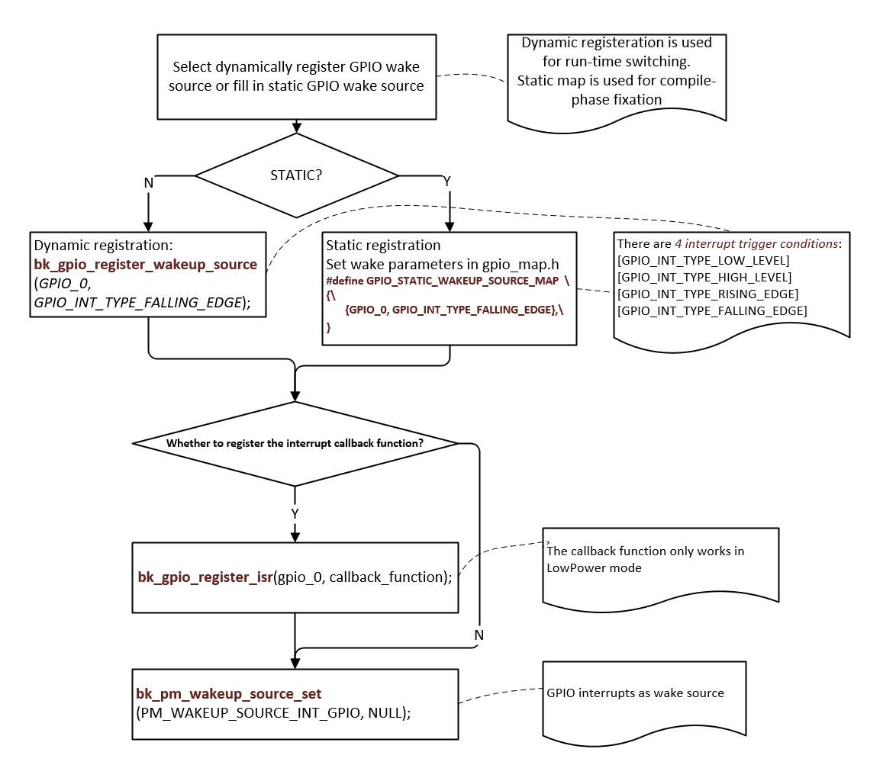

GPIO
================

:link_to_translation:`en:[English]`

Beken chip supports abundant GPIO pins, some GPIOs can't be used by the application:

 - In most Beken chips, UART2 is enabled by default and GPIO 0 and GPIO 1 are used by UART2.
 - Some GPIOs may be used by specific peripheral device, the application can't use the GPIOs used by that device if the device is enabled by software. E.g. in BK7271, the SPI-1 can use GPIO 2/3/4/5, the application can't use GPIO 2/3/4/5 if SPI-1 is enabled by the software, the application can still use GPIO 2/3/4/5 if the SPI-1 is disabled by software.
 - Some GPIO groups may be used by specific peripheral device, the application can't use that GPIO group if the device chooses that GPIO group and the device is enabled by software. E.g. SPI-3 can use GPIO 30/31/32/33 or GPIO GPIO 36/37/38/39, if the software enable the SPI-3 and configure it to use the first GPIO group (GPIO 30/31/32/33), the application can't use GPIO 30/31/32/33, but the application can still use 2nd GPIO group (GPIO 36/37/38/39) if they are not used by other devices. The application can use both group if SPI-3 is NOT enabled and other devices also don't use them.

If the GPIOs are already used by the periperal devices, the GPIO API, such as :cpp:func:`bk_gpio_set_config` will return GPIO_ERR_INTERNAL_USED.

Generally speaking, the GPIO user can take following steps to use the GPIO:

 - Read the chip hardware datasheet to gain overview about how the peripheral use the GPIOs
 - Check the enabled peripheral device in your application and find out the GPIOs used by the devices
 - Always check the return value of GPIO API, make sure it's not GPIO_ERR_INTERNAL_USED

.. note::

  If peripheral is enabled after the application configure it's GPIO, we have no way to detect the GPIO conflict between the application and peripheral usage, the application need to pay attention to it.

GPIO MAP Config
------------------
  gpio_map.h

  GPIO is configured according to the MAP(GPIO_DEFAULT_DEV_CONFIG) during driver initialization. Each row in the map contains nine elements.
  The 9 elements are as follows:
	  - gpio_id:Corresponding PIN number starting from 0
	  - second_func_en:Whether to enable the secondary function
	  - second_func_dev:Select the second function of the PIN
	  - io_mode:Select the IO operating mode, input\output\high resistance
	  - pull_mode:Select IO level pull up or pull down
	  - int_en:Whether to turn on interrupt
	  - int_type:Select trigger interrupt condition, high/low/rise/fall
	  - low_power_io_ctrl:Low power whether to maintain the output level
	  - driver_capacity:Driver ability selection, a total of four levels 

.. note::

  gpio_map.h must be configured. GPIO configuration varies with product types. 

Example: 

Configure GPIO_0 to function [GPIO_DEV_I2C1_SCL] and GPIO_1 to function [GPIO_DEV_I2C1_SDA]:
	+---------+-------------------------+-------------------+-----------------+------------------+-----------------+------------------------+---------------------------------+-----------------------+
	| gpio_id |     second_func_en      |  second_func_dev  |    io_mode      |     pull_mode    |     int_en      |        int_type        |          low_power_io_ctrl      |    driver_capacity    |
	+=========+=========================+===================+=================+==================+=================+========================+=================================+=======================+
	| GPIO_0  | GPIO_SECOND_FUNC_ENABLE | GPIO_DEV_I2C1_SCL | GPIO_IO_DISABLE | GPIO_PULL_DISABLE| GPIO_INT_DISABLE| GPIO_INT_TYPE_LOW_LEVEL| GPIO_LOW_POWER_DISCARD_IO_STATUS| GPIO_DRIVER_CAPACITY_3|
	+---------+-------------------------+-------------------+-----------------+------------------+-----------------+------------------------+---------------------------------+-----------------------+
	| GPIO_1  | GPIO_SECOND_FUNC_ENABLE | GPIO_DEV_I2C1_SDA | GPIO_IO_DISABLE | GPIO_PULL_DISABLE| GPIO_INT_DISABLE| GPIO_INT_TYPE_LOW_LEVEL| GPIO_LOW_POWER_DISCARD_IO_STATUS| GPIO_DRIVER_CAPACITY_3|
	+---------+-------------------------+-------------------+-----------------+------------------+-----------------+------------------------+---------------------------------+-----------------------+
	 
	 - PS:GPIO is turned off by default when the second function is used (io_mode is [GPIO_IO_DISABLE]). I2C needs more driving capability (driver_capacity is [GPIO_DRIVER_CAPACITY_3]).

GPIO_0 is set to high resistance(Default state):
	+---------+-------------------------+-------------------+-----------------+------------------+-----------------+------------------------+---------------------------------+-----------------------+
	| gpio_id |     second_func_en      |  second_func_dev  |    io_mode      |     pull_mode    |     int_en      |        int_type        |          low_power_io_ctrl      |    driver_capacity    |
	+=========+=========================+===================+=================+==================+=================+========================+=================================+=======================+
	| GPIO_0  | GPIO_SECOND_FUNC_DISABLE| GPIO_DEV_INVALID  | GPIO_IO_DISABLE | GPIO_PULL_DISABLE| GPIO_INT_DISABLE| GPIO_INT_TYPE_LOW_LEVEL| GPIO_LOW_POWER_DISCARD_IO_STATUS| GPIO_DRIVER_CAPACITY_0|
	+---------+-------------------------+-------------------+-----------------+------------------+-----------------+------------------------+---------------------------------+-----------------------+
	  
	  - PS:Disable all config

GPIO_0 is set to input key and falling edge to trigger the interrupt:
	+---------+-------------------------+-----------------+-----------------+----------------+----------------+--------------------------+----------------------------------+-----------------------+
	| gpio_id |     second_func_en      |  second_func_dev|    io_mode      |    pull_mode   |     int_en     |         int_type         |          low_power_io_ctrl       |    driver_capacity    |
	+=========+=========================+=================+=================+================+================+==========================+==================================+=======================+
	| GPIO_0  | GPIO_SECOND_FUNC_DISABLE| GPIO_DEV_INVALID|GPIO_INPUT_ENABLE| GPIO_PULL_UP_EN| GPIO_INT_ENABLE|GPIO_INT_TYPE_FALLING_EDGE| GPIO_LOW_POWER_DISCARD_IO_STATUS | GPIO_DRIVER_CAPACITY_0|
	+---------+-------------------------+-----------------+-----------------+----------------+----------------+--------------------------+----------------------------------+-----------------------+
	  
	  - PS:Turn off the second function related. There are 4 interrupt trigger conditions:[GPIO_INT_TYPE_LOW_LEVEL],[GPIO_INT_TYPE_HIGH_LEVEL],[GPIO_INT_TYPE_RISING_EDGE],[GPIO_INT_TYPE_FALLING_EDGE].

GPIO_0 acts as a low power wake-up source:
	+---------+-------------------------+-----------------+-----------------+----------------+----------------+--------------------------+----------------------------------+-----------------------+
	| gpio_id |     second_func_en      |  second_func_dev|    io_mode      |    pull_mode   |     int_en     |         int_type         |          low_power_io_ctrl       |    driver_capacity    |
	+=========+=========================+=================+=================+================+================+==========================+==================================+=======================+
	| GPIO_0  | GPIO_SECOND_FUNC_DISABLE| GPIO_DEV_INVALID|GPIO_INPUT_ENABLE| GPIO_PULL_UP_EN| GPIO_INT_ENABLE|GPIO_INT_TYPE_FALLING_EDGE| GPIO_LOW_POWER_DISCARD_IO_STATUS | GPIO_DRIVER_CAPACITY_0|
	+---------+-------------------------+-----------------+-----------------+----------------+----------------+--------------------------+----------------------------------+-----------------------+
	  
	  - PS:low_power_io_ctrl is [GPIO_LOW_POWER_KEEP_INPUT_STATUS], int_type is [GPIO_INT_TYPE_RISING_EDGE] or [GPIO_INT_TYPE_FALLING_EDGE];

GPIO API Status
------------------

+----------------------------------------------+---------+------------+
| API                                          | BK7256  | BK7256_cp1 |
+==============================================+=========+============+
| :cpp:func:`bk_gpio_driver_init`              | Y       | Y          |
+----------------------------------------------+---------+------------+
| :cpp:func:`bk_gpio_driver_deinit`            | Y       | Y          |
+----------------------------------------------+---------+------------+
| :cpp:func:`bk_gpio_enable_output`            | Y       | Y          |
+----------------------------------------------+---------+------------+
| :cpp:func:`bk_gpio_disable_output`           | Y       | Y          |
+----------------------------------------------+---------+------------+
| :cpp:func:`bk_gpio_enable_input`             | Y       | Y          |
+----------------------------------------------+---------+------------+
| :cpp:func:`bk_gpio_disable_input`            | Y       | Y          |
+----------------------------------------------+---------+------------+
| :cpp:func:`bk_gpio_enable_pull`              | Y       | Y          |
+----------------------------------------------+---------+------------+
| :cpp:func:`bk_gpio_disable_pull`             | Y       | Y          |
+----------------------------------------------+---------+------------+
| :cpp:func:`bk_gpio_pull_up`                  | Y       | Y          |
+----------------------------------------------+---------+------------+
| :cpp:func:`bk_gpio_pull_down`                | Y       | Y          |
+----------------------------------------------+---------+------------+
| :cpp:func:`bk_gpio_set_output_high`          | Y       | Y          |
+----------------------------------------------+---------+------------+
| :cpp:func:`bk_gpio_set_output_low`           | Y       | Y          |
+----------------------------------------------+---------+------------+
| :cpp:func:`bk_gpio_get_input`                | Y       | Y          |
+----------------------------------------------+---------+------------+
| :cpp:func:`bk_gpio_set_config`               | Y       | Y          |
+----------------------------------------------+---------+------------+
| :cpp:func:`bk_gpio_register_isr`             | Y       | Y          |
+----------------------------------------------+---------+------------+
| :cpp:func:`bk_gpio_enable_interrupt`         | Y       | Y          |
+----------------------------------------------+---------+------------+
| :cpp:func:`bk_gpio_disable_interrupt`        | Y       | Y          |
+----------------------------------------------+---------+------------+
| :cpp:func:`bk_gpio_set_interrupt_type`       | Y       | Y          |
+----------------------------------------------+---------+------------+

Application Example
------------------------------------

DEMO1:
	  GPIO_0 as wake-up source for DeepSleep or LowPower, pseudo code description and interpretation.

    Figure 1. GPIO as wake-up source for DeepSleep or LowPower

GPIO API Reference
---------------------

.. include:: ../../_build/inc/gpio.inc

GPIO API Typedefs
---------------------
.. include:: ../../_build/inc/gpio_types.inc

