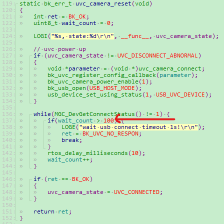
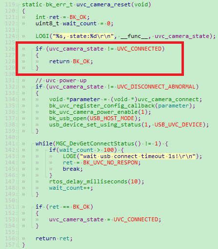
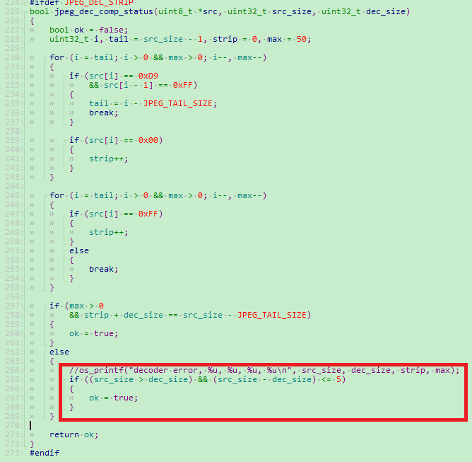

UVC&UAC使用指南
==================

:link_to_translation:`en:[English]`

概述
------------------
	当前芯片支持的UVC&UAC规格：

+-----------+---------------+---------------+----------------+---------------+------------+--------------+------------------------+-----------------+
|  USB类型  |   工作电压    |    USB协议    |    设备协议    |     速度      |  编码协议  |    分辨率    |  端点`wMaxPacketSize`  |       备注      |
+===========+===============+===============+================+===============+============+==============+========================+=================+
|    UVC    |       5.0v    |  USB 1.1/2.0  |  UVC 1.1/1.5   |   Full-Speed  | H264/MJPEG | 低于1280*720 |         1024           |  不支持DRI字段  |
+-----------+---------------+---------------+----------------+---------------+------------+--------------+------------------------+-----------------+
|    UAC    |       5.0v    |  USB 1.1/2.0  |   UAC 1.0      |   Full-Speed  |    ALL     |      N       |         1024           |                 |
+-----------+---------------+---------------+----------------+---------------+------------+--------------+------------------------+-----------------+

UVC常见问题与解决方案
-----------------------

1、UVC摄像头打不开

1.1 UVC摄像头如果未成功上电，或者电压低于最小工作电压，会出现连接失败。

	- LOG显示：``wait usb connect timeout 1s!``;
	- 建议：检查UVC没插上与否，是否有虚接，是否上电成功，可以用万用表测量一下VCC电压值是否小于最小电压，UVC&UAC共存可能需要5.0V。

1.2 UVC如果上电慢，本身内部电容充放电时间比较久，会出现连接失败。

	- LOG显示：``wait usb connect timeout 1s!``;
	- 建议：加大UVC枚举等待时间，当前默认超时时间为1s。可以适当加大这个1s的timeout时间，具体修改的位置如下图1：``middleware/driver/camera/uvc_sensor_devices.c``，将100适当改大即可。

    Figure 1. uvc timeout

1.3 UVC如果电压不稳定抖动，会出现连接失败后重连，也可能会出现重复开关。

	- LOG显示：``wait usb connect timeout 1s!``， ``camera_uvc_connect_state_change_task_entry``，相关log；
	- 建议：稍微加大UVC供电压，这种现象可能出现再UVC&UAC共存场景，比如将电压抬高置5.0V。

1.4 UVC如果不支持电源检查，可能会出现连接后断开。

	- LOG显示:

::

	uvc_device:W(4146):uvc_camera_reset, state:2
	UVC:I(4148):UVC_DisConnect
	USB:I(4152):USB WAS OPENED
	uvc_device:E(5162):wait usb connect timeout 1s!
	uvc_device:E(5162):uvc state: -16901

- 建议：可以尝试注释掉重新检查上电的逻辑，具体修改方案如下图2：``meddleware/driver/camera/uvc_sensor_devices.c``，增加方框内代码即可。这个逻辑热插拔也会进入，所以建议出现上面的问题，一并修改。

    Figure 2. uvc_ldo power check

1.5 UVC如果配置其不支持的分辨率，会出现打开失败。

	- LOG显示：``uvc not support this resolution!``；
	- 建议：根据枚举打印支持的分辨率配置给UVC。

2、UVC图像应用效果差

2.1 有些UVC固件内部会增加填充位，保证输出的数据4字节对齐，但是有可能造成LCD显示帧率低。

	- LOG显示:``jpg: 15[449, 0], dec: 15[109, 0], lcd: 53[375], fps: 15[108], wifi: 0[0], wifi_read: [0]``。其中fps的值（15）不等于jpg的值（15）,dec中括号的第二个值不为0；
	- 建议：找到UVC生产厂家，让其修改固件不要添加填充位。
	- 建议：这个方案不具有通用性，也可以解决该问题，如果实际解码长度和JPEG原始图像数据长度的差值小于某个阈值，比如5，我们可以认为这张图像解码是成功的，具体修改方案如下图3：``meddleware/driver/jpeg_dec/jpeg_dec_driver.c``。

    Figure 3. jpegdec error

2.2 如果UVC发包源数据中出现错误数据，但其符合JPEG格式，因此可以解码显示

	- 效果显示：图传显示或者LCD解码显示出先花纹等，图像不符合预期。
	- 建议：找生产厂家协商，修改固件

2.3 如果UVC发包不符合协议，没有UVC包头，也会造成图像异常问题。

	- LOG显示：``jpg: 15[449, 0], dec: 15[109, 0], lcd: 53[375], fps: 15[108], wifi: 0[0], wifi_read: [0]``,其中jpg的值不规律，且解码显示基本不出图。
	- 建议：找生产厂家协商，修改固件。