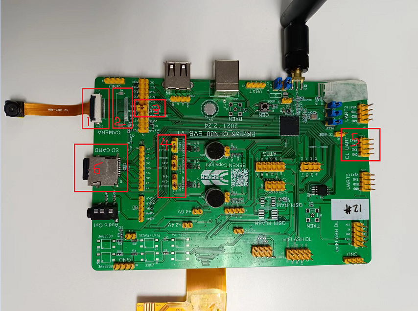

DVP 拍照 demo
========================

:link_to_translation:`en:[English]`

1 功能概述
-------------------------------------
	拍照的作用主要是将dvp sensor采集的一帧原始数据，经jpeg encode模块压缩编码后，存储到SDCard上。

2 代码路径
-------------------------------------
	demo路径：``./components/demos/media/video/dvp_capture``

3 cli命令简介
-------------------------------------
	demo支持的命令如下表：

	+----------------------------------------+--------------------------+----------------------+
	|             Command                    |      Param               |   Description        |
	+========================================+==========================+======================+
	|                                        | param1:dev_id            |使用的dvp设备类型     |
	|                                        +--------------------------+----------------------+
	| dvp set_cfg param1 param2 param3       | param2:image resolution  |dvp输出的分辨率       |
	|                                        +--------------------------+----------------------+
	|                                        | param3:frame rate        |dvp输出的帧率         |
	+----------------------------------------+--------------------------+----------------------+
	| dvp init                               | 无                       |初始化dvp相关传输功能 |
	+----------------------------------------+--------------------------+----------------------+
	| dvp capture param1                     | param1:file_id           |保存图片的名字前缀    |
	+----------------------------------------+--------------------------+----------------------+
	| dvp deinit                             | 无                       |释放dvp的相关传输功能 |
	+----------------------------------------+--------------------------+----------------------+
	
	demo运行依赖的宏配置：
	
	+--------------------------------------+------------------------+--------------------------------------------+---------+
	|                 NAME                 |      Description       |                  File                      |  value  |
	+======================================+========================+============================================+=========+
	|CONFIG_JPEG_ENCODE                    |配置是否支持硬件编码    |``middleware\soc\bk7256\bk7256.defconfig``  |    y    |
	+--------------------------------------+------------------------+--------------------------------------------+---------+
	|CONFIG_CAMERA                         |配置是否使用dvp camera  |``middleware\soc\bk7256\bk7256.defconfig``  |    y    |
	+--------------------------------------+------------------------+--------------------------------------------+---------+
	|CONFIG_USE_APP_DEMO_VIDEO_TRANSSER    |配置是否使用图传应用    |``middleware\soc\bk7256\bk7256.defconfig``  |    y    |
	+--------------------------------------+------------------------+--------------------------------------------+---------+
	|CONFIG_NET_WORK_VIDEO_TRANSFER        |配置是否支持网络图传    |``middleware\soc\bk7256\bk7256.defconfig``  |    y    |
	+--------------------------------------+------------------------+--------------------------------------------+---------+
	|CONFIG_COMPONENTS_P2P                 |配置是否使用p2p传输     |``middleware\soc\bk7256\bk7256.defconfig``  |    n    |
	+--------------------------------------+------------------------+--------------------------------------------+---------+
	|CONFIG_CAMERA_USE_I2C1                |配置是否使用I2C1通信    |``middleware\soc\bk7256\bk7256.defconfig``  |    y    |
	+--------------------------------------+------------------------+--------------------------------------------+---------+

4 演示介绍
-------------------------------------
	demo执行的步骤如下：
	
	1、准备好dvp摄像头，连接方式如下图所示：

	2、顺序发送如下命令

		fatfstest M 1

		dvp set_cfg 3 480 20
		
		dvp init
		
		dvp capture 1(file_id)
		
		dvp deinit

    Figure 1. dvp拍照时的连接示意
		
5 详细配置及其说明
----------------------------------
	1、设置dvp参数：dvp set_cfg param1 param2 param3
	
	param1:0-7, 分别对应下面类型的dvp camera, 当前仅支持3和6.

		PAS6329_DEV             0

		OV_7670_DEV             1

		PAS6375_DEV             2

		GC0328C_DEV             3

		BF_2013_DEV             4

		GC0308C_DEV             5

		HM_1055_DEV             6

		GC_2145_DEV             7
	
	param2:分辨率
	
		GC0328C_DEV：480(640*480)，240(320*240), 272(480*272)
		
		HM_1055_DEV: 720(1280*720)
		
	param3:帧率
	
		GC0328C_DEV：5、10、20、25
		
		HM_1055_DEV：5、10、15、20
		
	2、拍照命令：dvp save_image file_id
	
		file_id：范围(0-255)

.. note::

	注意：上面的拍照命令支持连续拍照，但是file_id每次都需要变化，不能每张图像的id都一致。
