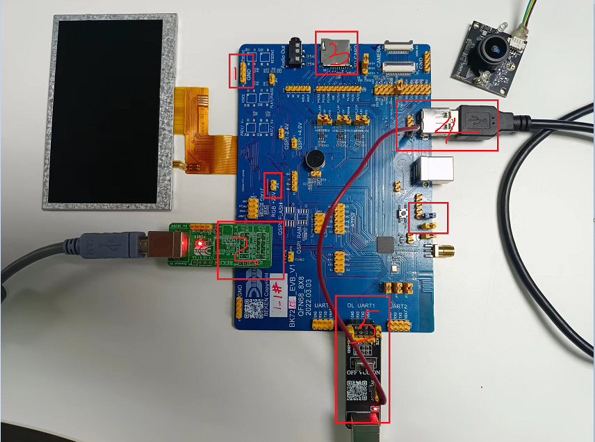

UVC 拍照 demo
========================

:link_to_translation:`en:[English]`

1 功能概述
-------------------------------------
	拍照的作用主要是将UVC sensor采集的一帧原始数据，存储到SDCard上。

2 代码路径
""""""""""""""""""""""""
	demo路径：``./components/media/``

3 cli命令简介
-------------------------------------
	demo支持的命令如下表：

	+----------------------------------------+--------------------------+----------------------+
	|             Command                    |      Param               |   Description        |
	+========================================+==========================+======================+
	| media uvc open [psram]                 | param:分辨率,可选        |打开uvc摄像头         |
	+----------------------------------------+--------------------------+----------------------+
	| media capture param                    | param:照片名字           |拍照存SD卡            |
	+----------------------------------------+--------------------------+----------------------+
	| media uvc close                        | 无                       |关闭uvc摄像头         |
	+----------------------------------------+--------------------------+----------------------+

	demo运行依赖的宏配置：
	
	+--------------------------------------+------------------------+----------------------------------------------------+---------+
	|                 NAME                 |      Description       |                      File                          |  value  |
	+======================================+========================+====================================================+=========+
	|CONFIG_USB_HOST                       |配置是否支持usb host    |``properties\soc\bk7256_cp1\bk7256_cp1.defconfig``  |    y    |
	+--------------------------------------+------------------------+----------------------------------------------------+---------+
	|CONFIG_USB_UVC                        |配置是否支持把uvc       |``properties\soc\bk7256_cp1\bk7256_cp1.defconfig``  |    y    |
	+--------------------------------------+------------------------+----------------------------------------------------+---------+

4 演示介绍
-------------------------------------
	demo执行的步骤如下：
	
	1、准备好uvc摄像头，连接方式如下图所示：
	
	2、顺序发送下面命令：
	
		fatfstest M 1
		
		media uvc open
		
		media capture 123.jpg
		
		media uvc close
		

    Figure 1. uvc屏显时板子的连接示意

5 详细配置及其说明
-------------------------------------
	1、显示初始化说明：uvc display_init param1 param2 param3 param4
	
	1)media uvc open [param]
	
		[param]:可选参数，不写默认使用的是640*480的分辨率。
	
		支持的参数是由uvc设备本身决定，可选：1280X720, 640X480, 800X480, 480X320.
	
	2)media caputre param
	
		param:xxx.jpg, 存储照片的名字

.. note::

	注意：上面的拍照命令支持连续拍照。
