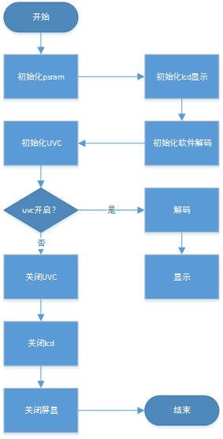
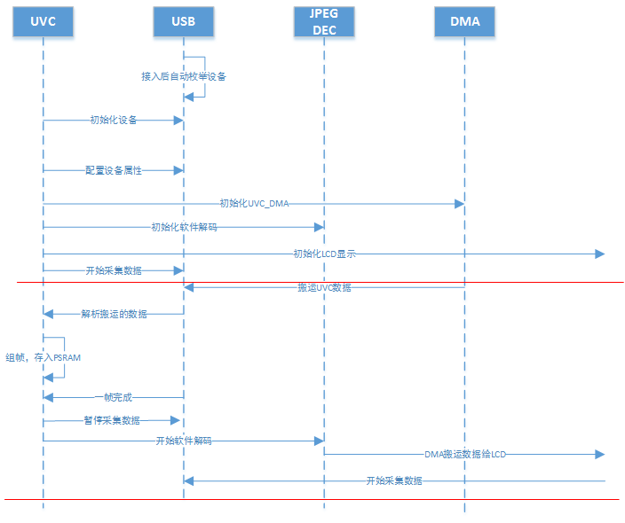

UVC 屏显 demo
========================

:link_to_translation:`en:[English]`

1 功能概述
-------------------------

	UVC屏显将USB camera采集的图像信息，经过其内部的ISP模块编码后，再由软件解码，最后实时的显示到RGB屏幕上。

2 代码路径
-------------------------------------
	demo路径：``./components/media``

3 cli命令简介
-------------------------------------
	demo支持的命令如下表：

	+----------------------------------------+--------------------------+----------------------+
	|             Command                    |      Param               |   Description        |
	+========================================+==========================+======================+
	| media uvc open [psram]                 | param:分辨率,可选        |打开uvc摄像头         |
	+----------------------------------------+--------------------------+----------------------+
	| media lcd open [param]                 | param:分辨率,可选        |打开LCD显示           |
	+----------------------------------------+--------------------------+----------------------+
	| media uvc close                        | 无                       |关闭uvc摄像头         |
	+----------------------------------------+--------------------------+----------------------+
	| media lcd close                        | 无                       |关闭LCD显示           |
	+----------------------------------------+--------------------------+----------------------+

	demo运行依赖的宏配置：
	
	+--------------------------------------+------------------------+--------------------------------------------+---------+
	|                 NAME                 |      Description       |                      File                  |  value  |
	+======================================+========================+============================================+=========+
	|CONFIG_USB_HOST                       |配置是否支持usb host    |``properties\soc\bk7256\bk7256.defconfig``  |    y    |
	+--------------------------------------+------------------------+--------------------------------------------+---------+
	|CONFIG_USB_UVC                        |配置是否支持把uvc       |``properties\soc\bk7256\bk7256.defconfig``  |    y    |
	+--------------------------------------+------------------------+--------------------------------------------+---------+

4 演示介绍
-------------------------------------
	demo执行的步骤如下：
	
	1、准备好uvc摄像头，屏幕显示为RGB屏幕，连接方式如下图所示：
	
	2、顺序发送下面命令：
	
		media uvc open
		
		media lcd open
		
		media lcd close
		
		media uvc close

.. figure:: ../../../../../common/_static/uvc_display_evb.png
    :align: center
    :alt: uvc屏显时板子的连接示意
    :figclass: align-center

    Figure 1. uvc屏显时板子的连接示意

5 详细配置及其说明
-------------------------------------
	1、显示初始化说明：
	
	1)media uvc open [param]
	
		[param]:可选参数，不写默认使用的是640*480的分辨率。
	
		支持的参数是由uvc设备本身决定，可选：1280X720, 640X480, 800X480, 480X320.
	
	2)media lcd open [param]
	
		[param]:可选参数，不写默认使用的是480*272的分辨率。
	
		支持的参数是由LCD设备本身决定，可选：480X272, 320X480, 1024X600, 480X800

	2、UVC屏显得软件调用流程

    Figure 2. uvc_display function call

	3、图传的模块间调用

    Figure 3. uvc_display modules communicate
	