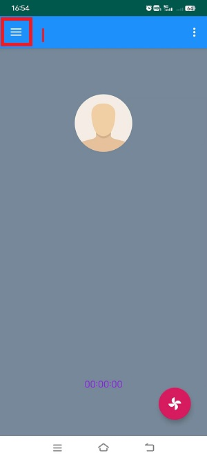
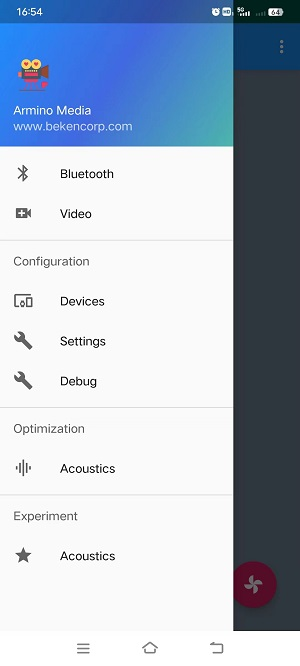
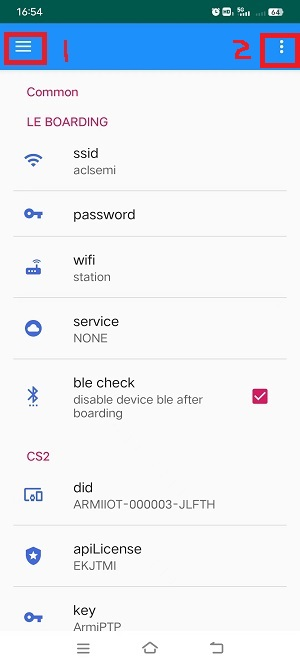
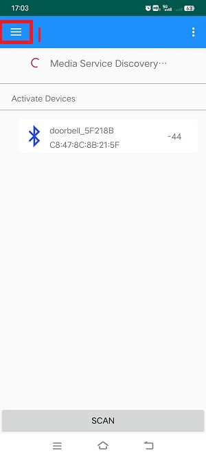
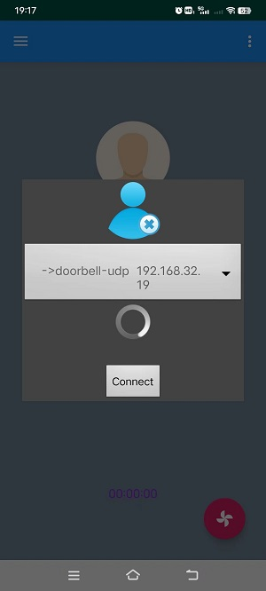
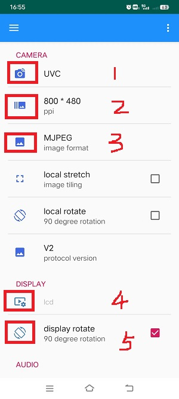
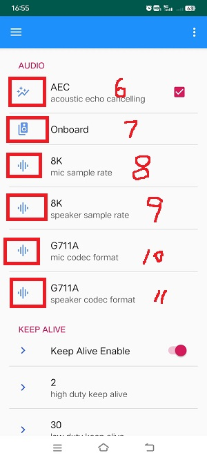

Lan UDP/TCP
========================

:link_to_translation:`en:[English]`

1 功能概述
-------------------------------------
	本功能是，基于局域网的UDP/TCP门铃演示工程。

2 代码路径
-------------------------------------
	UDP-demo路径：``./projects/media/doorbell/main/src/doorbell_udp_service.c``

	TCP-demo路径：``./projects/media/doorbell/main/src/doorbell_tcp_service.c``

	apk下载路径：http://dl.bekencorp/apk/ArminoMedia.apk

3 cli命令简介
-------------------------------------
	本功能主要依靠APP去使用配置，暂时不需要cli命令辅助控制

4.编译命令
-------------------------------------
	编译工程命令：make bk7256 PROJECT=meida/doorbell

5 演示介绍
-------------------------------------

.. note::
	当前apk只开发了安卓系统，再用该APK进行网络传输之前需要打开蓝牙。

1、设置路由器配网信息，步骤如下图所示:

    Figure 1.主界面

2、选择主界面中1的位置，到达设置界面，如下图所示：

    Figure 2.主设界面

3、选择：``Settings``，到达网络配置界面，如下图所示：

    Figure 3.网络配置界面

3.1 这里可以区分很多种配置类型：

	- 如上图中选择：``wifi``，有"station/soft ap"两种选择，表示设备作为：station或者softap。
		- 假设选择"station"，上图中：``ssid``，表示板子连接路由器的ssid（名字），而：``password``，表示连接路由器的密码，并且手机的wifi也需要连接到这个路由器；
		- 假设选择"soft ap"，上图中：``ssid``，表示板子作为softap时的ssid（名字），而：``password``，表示连接板子需要的密码，手机的wifi也需要连接到softap；
	- 假设上图中选择：``wifi``，选择的是``station``，并且名字和密码已经配置了正确的值。
	- 上图中选择：``servece``，有"NONE/P2P_CS2/LAN_UDP/LANTCP", 如果我们选择用UDP传输则，选择"LAN_UDP"；如果选择用TCP传输，则选择"LAN_TCP"，这里默认选择是无效的"NONE"，需要配置成"LAN_UDP/LANTCP";

3.2 选择上图中1的位置，达到主设界面，并选择：``Bluetooth``，去执行蓝牙配网，到达蓝牙配网界面，如下图所示：

    Figure 4.蓝牙配网界面

4、选择上图中：``SCAN``，扫描到板子发出的广播，默认广播名字是：``doorbell_xxx``，如果网络中有多个，可以通过蓝牙地址找到，选择该广播，会弹出对话框，选择：``Connect``。

	- 连接成功后，仍然选择上图中1的位置，到达主设界面；
	- 然后选择：``Video``，到达主界面；
	- 然后选择主界面中2的位置，类似一个小风扇图标，会弹出对话框，选择：``Connect``，等待连接成功，如下图所示；

    Figure 5.设备连接界面

- 仍然选择主界面中1的位置，到达主设界面，选择：``Devices``，到达"Devices"设备配置界面，如下图所示：

    Figure 6.设备配置界面

5、在设备配置界面中可以配置"camera"、"DISPALY"和"AUDIO"。

	- 上图1的位置，选择打开的摄像头类型：DVP/UVC；
	- 上图2的位置，选择摄像头输出分辨率，选择打开摄像头支持的分辨率；
	- 上图3的位置，选择APK接收视频数据的格式：MJPEG/H264；
	- 上图4的位置，选择需要打开的LCD屏幕类型，需要与板子上连接的LCD屏幕相匹配；
	- 上图5的位置，选择在LCD屏幕上显示时，是否需要旋转90°，默认不选；
	- 上图6的位置，选择是否支持AEC回声消除功能，默认选择；
	- 上图7的位置，选择APK接收音频数据的来源：Onboard/UAC，表示是：板载音频/UAC音频，默认Onboard；
	- 上图8的位置，选择MIC采样率：8K/16K，默认选择8K；
	- 上图9的位置，选择Speaker采样率：8K/16K，默认选择8K；
	- 上图10的位置，选择MIC编码方式：G711A/PCM/G711U，默认选择；G711A;
	- 上图11的位置，选择Speaker编码方式：G711A/PCM/G711U，默认选择；G711A;

6、选择有上角"三"，到达主设界面，并在主设界面选择：``Video``，到达主界面，并选择右下角小风扇图标，弹出三个按钮，如下图所示：

    Figure 7.开关配置主界面

- 上图中1的位置，开关视频功能；
- 上图中2的位置，开关音频功能；
- 上图中3的位置，开关屏幕显示功能；

