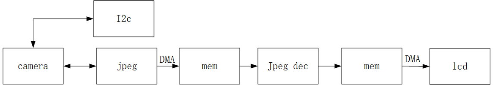
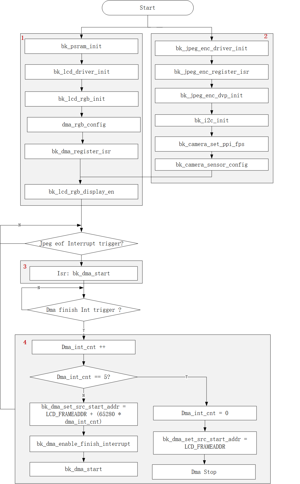

Lcd_display(Camera_lcd_display)
=================================

:link_to_translation:`en:[English]`

概述
""""""""""""""""""""""""""

	lcd displey video 主要是用LCD显示图像的功能，可以显示不同类型的camera采集的视频。

API参考
""""""""""""""""""""""""""
	Video涉及的模块API接口的详细说明请参考同网页/api-reference/multi_media目录。

video显示硬件环境
""""""""""""""""""""""""""

Video功能是一个集多个模块功能的应用场景，主要用到的硬件模块包括：

 - LCD_Display
 - JPEG_DEC
 - JPEG_ENC
 - DVP camera(GC0308C_DEV)
 - UVC（USB Camera）
 - I2c
 - DMA
 - USB

关于DVP 和UVC支持的camera类型请参考"API用例参考->DVP_Camera及配置"

LCD 显示原理
""""""""""""""""""""""""""

LCD 显示YUV图像原理
---------------------------

YUV数据是直接可以被LCD显示的数据类型，jpeg输出配置为YUV模式输出，将直接将camera采集的YUV数据保存到内存中。

.. figure:: ../../../_static/lcd_disp_yuv_simple.png
    :align: center
    :alt: 
    :figclass: align-center

    Figure 1. LCD display YUV data

LCD 显示JPEG图像原理
***************************

JPEG数据不可以直接LCD显示，需要先经过解压缩，然后再显示。

    Figure 2. LCD display jpeg data

LCD显示YUV图像软件实现
""""""""""""""""""""""""""

显示流程大致可以分为4个步骤：

1)	配置RGB LCD

2)	配置JPEG_ENC和camera

3)	处理JPEG_ENC完成一帧压缩的中断回调

4)	处理DMA搬数到LCD屏幕的中断回调

    Figure 3. lcd yuv display video

LCD显示JPEG图像软件实现
""""""""""""""""""""""""""

显示流程大致可以分为6个步骤：

1)	配置RGB LCD

2)	配置JPEG_ENC和camera

3)	配置JPEG_DEC

4)	处理JPEG_ENC完成一帧压缩的中断回调

5)	处理JPEG_DEC完成一帧解压的中断回调

6)	处理DMA搬数到LCD屏幕的中断回调

.. figure:: ../../../_static/lcd_disp_jpeg.png
    :align: center
    :alt: 
    :figclass: align-center

    Figure 4. lcd jpeg display video

