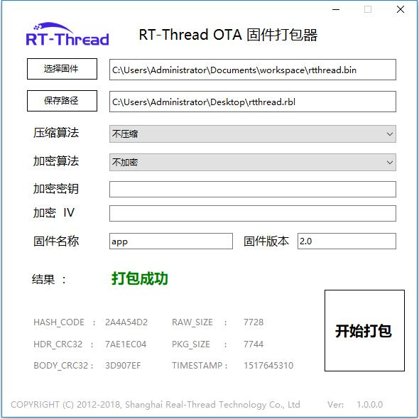

# RT-Thread OTA 固件打包器

编译器编译出来的应用程序 `rtthread.bin` 属于原始固件，并不能用于 RT-Thread OTA 的升级固件，需要用户使用 `RT-Thread OTA 固件打包器` 打包生成 `.rbl` 后缀名的固件，然后才能进行 OTA 升级。

`RT-Thread OTA 固件打包器` 如下图所示：

## 使用方法

用户可以根据需要，选择是否对固件进行加密和压缩，提供多种压缩算法和加密算法支持，基本操作步骤如下：

- 选择待打包的固件
- 选择生成固件的位置
- 选择压缩算法
- 选择加密算法 (暂未开放)
- 配置加密密钥 (不加密则留空)
- 配置加密 IV (不加密则留空)
- 填写固件名称 (Flash 应用程序分区名称，这里必须为 `app`)
- 填写固件版本
- 开始打包
- OTA 升级

固件打包过程中有 `固件名称` 的填写，这里注意需要填入 Flash 分区表中应用程序分区的名称，这里必须在 `固件名称` 里填入 `app`。 

具体的 OTA 升级指南参考 [OTA 用户手册](../OTA_Using_Manual.md) `OTA_Using_Manual.md`。
